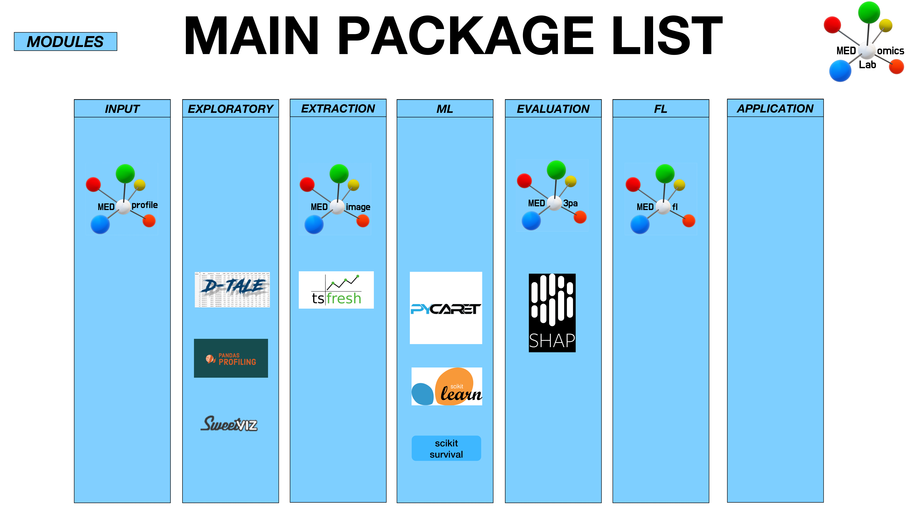
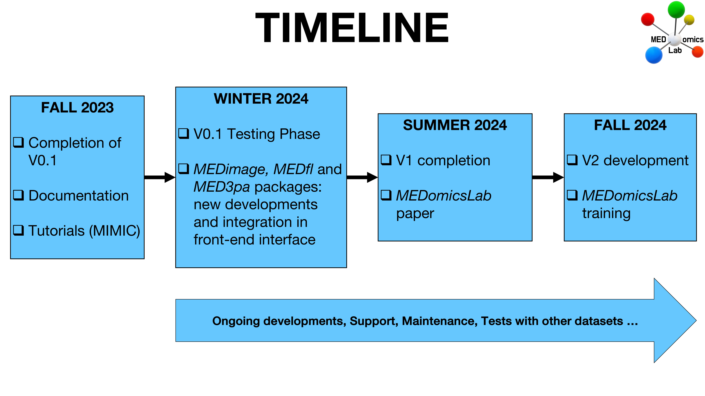

# 👋 Welcome!

Welcome to MEDomicsLab! Here you'll find all the documentation you need to get up and running with our application.

We would like to thank the [_**Unité de Soutien SSA Québec (USSAQ)**_](https://ssaquebec.ca/en/) for their support and funding throughout the MEDomicsLab project. For more information about USSAQ's mission and vision, please visit the following page: [_**USSAQ Vision and Mission**_](https://ssaquebec.ca/en/the-unit/vision-and-mission/)_**.**_

<figure><figcaption></figcaption></figure>

## An overview of MEDomicsLab

<figure><figcaption></figcaption></figure>

<figure><figcaption></figcaption></figure>

<figure><figcaption></figcaption></figure>

<figure><figcaption></figcaption></figure>

<figure><figcaption></figcaption></figure>

<figure><figcaption></figcaption></figure>

<figure><figcaption></figcaption></figure>

## Conclusions

* **We envision the MEDomicsLab platform to become a tool that will improve the synergy among medical AI research teams by:**
  * Empowering clinicians to design their own experiments (front-end)&#x20;
  * Allowing computer scientists to quickly adapt experiments (front-end)&#x20;
  * Refining the previously designed experiments (back-end)
* **Different levels of complexity/flexibility of usage include:**
  * Built-in pipelines in a user-friendly interface (front-end)&#x20;
  * Customizable pipelines with setting options (front-end)&#x20;
  * Code generation (front-end)&#x20;
  * Modular code libraries in Python (back-end)
* We invite partners to follow the developments on [our GitHub](https://github.com/MEDomics-UdeS/MEDomicsLab) and to prepare for the [testing phase ](test-with-mimic/)in the Winter 2024 semester (\~1 hour per week).

## Want to dive right in?

Feeling like an eager beaver? Jump in to the quick start docs and get making your first experiment:


[quick-start.md](quick-start.md)

