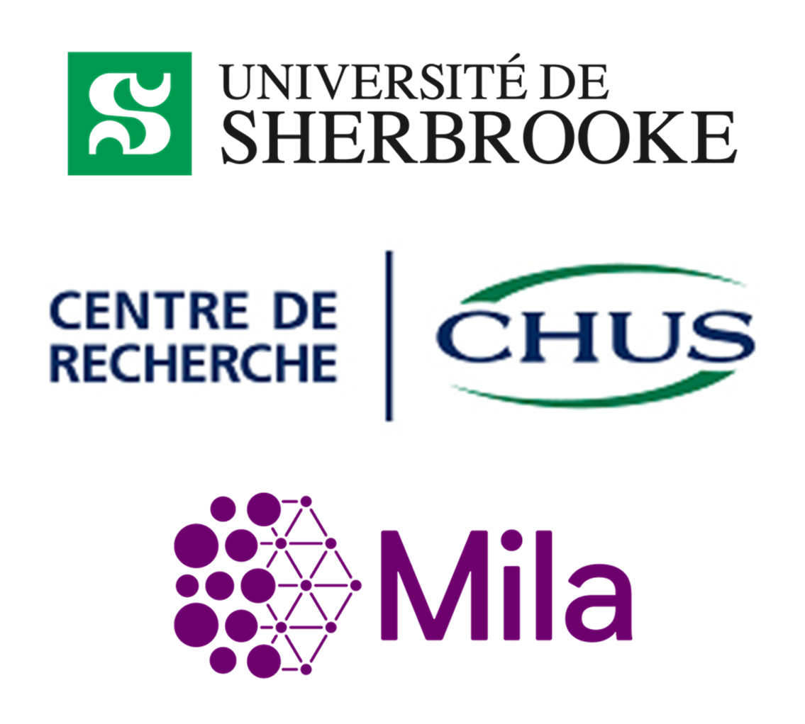
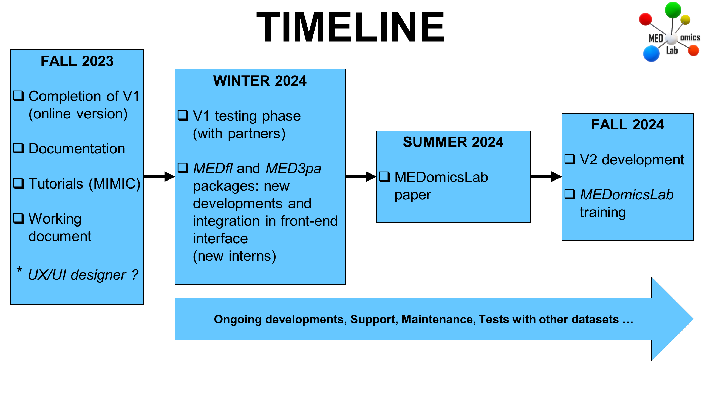

# 👋 Welcome!

Welcome to MEDomicsLab! Here you'll find all the documentation you need to get up and running with our application.

## Our platform overview

### 🫡 Co-leaders&#x20;

<table data-card-size="large" data-view="cards"><thead><tr><th align="center"></th><th align="center"></th><th></th><th data-type="content-ref"></th><th align="center"></th><th data-hidden data-card-cover data-type="files"></th></tr></thead><tbody><tr><td align="center"></td><td align="center"><h2><strong>Martin Vallières, PhD</strong></h2></td><td>
Assistant Professor

Department of Computer Science

Université de Sherbrooke

Researcher – CRCHUS

Canada CIFAR AI Chair, Mila
</td><td><a href="https://www.medomics-udes.org/fr/">https://www.medomics-udes.org/fr/</a></td><td align="center"></td><td></td></tr><tr><td align="center"></td><td align="center"><h2>Olivier Morin, PhD</h2></td><td>
Associate Professor

Department of Radiation Oncology

University California San Francisco  
</td><td><a href="https://www.medomics.ai/">https://www.medomics.ai/</a></td><td align="center"></td><td></td></tr></tbody></table>

### 👩‍💻 Development team&#x20;

<table data-column-title-hidden data-view="cards" data-full-width="false"><thead><tr><th align="center"></th><th></th><th></th></tr></thead><tbody><tr><td align="center"></td><td><h2>Guillaume Blain</h2></td><td>
Research Assistant

Université de Sherbrooke
</td></tr><tr><td align="center"></td><td><h2>Andréanne Allaire</h2></td><td>
Research Assistant

Université de Sherbrooke
</td></tr><tr><td align="center"></td><td><h2>Brahim Fakri</h2></td><td>
Research Assistant

Université de Sherbrooke
</td></tr><tr><td align="center"></td><td><h2>Mahdi Ait Lhaj Loutfi</h2></td><td>
MSc + Research Assistant

Université de Sherbrooke
</td></tr><tr><td align="center"></td><td><h2>Nicolas Longchamps</h2></td><td>
Research Assistant

Université de Sherbrooke
</td></tr><tr><td align="center"></td><td><h2>Sarah Denis</h2></td><td>
Research Professional

Université de Sherbrooke
</td></tr><tr><td align="center"></td><td><h2>Hithem Lamri</h2></td><td>
Collaborator

Formerly at Université de Sherbrooke
</td></tr></tbody></table>

### 🤝Partners

<table data-view="cards"><thead><tr><th align="center"></th><th data-hidden data-card-target data-type="content-ref"></th></tr></thead><tbody><tr><td align="center"></td><td><a href="https://www.medomics.ai/">https://www.medomics.ai/</a></td></tr><tr><td align="center"></td><td><a href="https://ssaquebec.ca/">https://ssaquebec.ca/</a></td></tr><tr><td align="center"></td><td><a href="https://ssaquebec.ca/">https://ssaquebec.ca/</a></td></tr><tr><td align="center"></td><td><a href="https://reseau1quebec.ca/">https://reseau1quebec.ca/</a></td></tr></tbody></table>

### MEDomicsLab !? what does it mean ?

<figure><figcaption></figcaption></figure>

### Main goal

<figure><figcaption></figcaption></figure>

### Overview

<figure><figcaption></figcaption></figure>

### Our current scope

<figure><figcaption></figcaption></figure>

### Workflow

<figure><figcaption></figcaption></figure>

### Main package list

<figure><figcaption></figcaption></figure>

### Timeline

<figure><figcaption></figcaption></figure>

### Conclusions

* **We envision the MEDomicsLab platform to become a tool that will improve the synergy among medical AI research teams by:**
  * Empowering clinicians to design their own experiments (front-end)&#x20;
  * Allowing computer scientists to quickly adapt experiments (front-end)&#x20;
  * Refining the previously designed experiments (back-end)
* **Different levels of complexity/flexibility of usage include:**
  * Built-in pipelines in a user-friendly interface (front-end)&#x20;
  * Customizable pipelines with setting options (front-end)&#x20;
  * Code generation (front-end)&#x20;
  * Modular code libraries in Python (back-end)
* We invite partners to follow the developments on [our GitHub](https://github.com/MEDomics-UdeS/MEDomicsLab) and to prepare for the [testing phase ](./#want-to-be-part-of-the-testing-phase)in the Winter 2024 semester (\~1 hour per week).

## Want to be part of the testing phase?

Click here :point\_right: [join-the-testing-phase.md](forms/join-the-testing-phase.md "mention")

**People who already joined** :see\_no\_evil:&#x20;



## Want to dive right in?

Feeling like an eager beaver? Jump in to the quick start docs and get making your first experiment:


[quick-start.md](quick-start.md)

