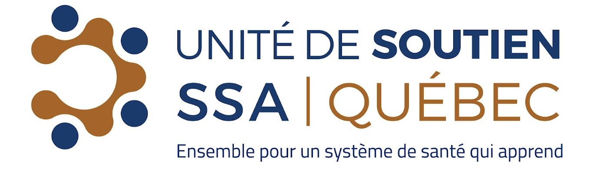
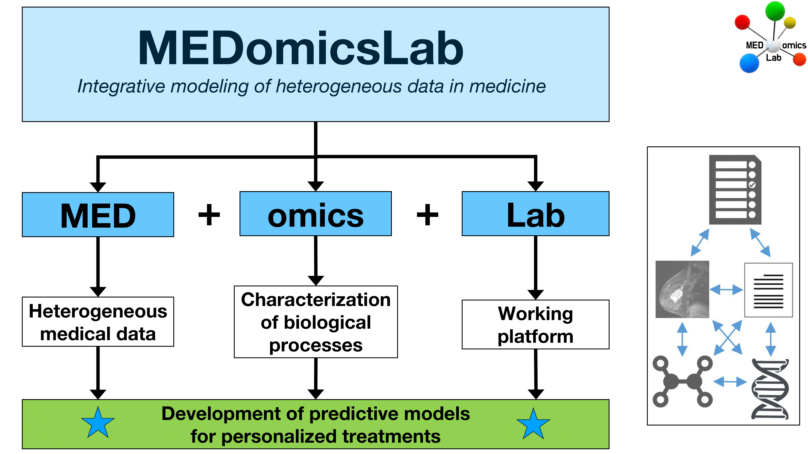
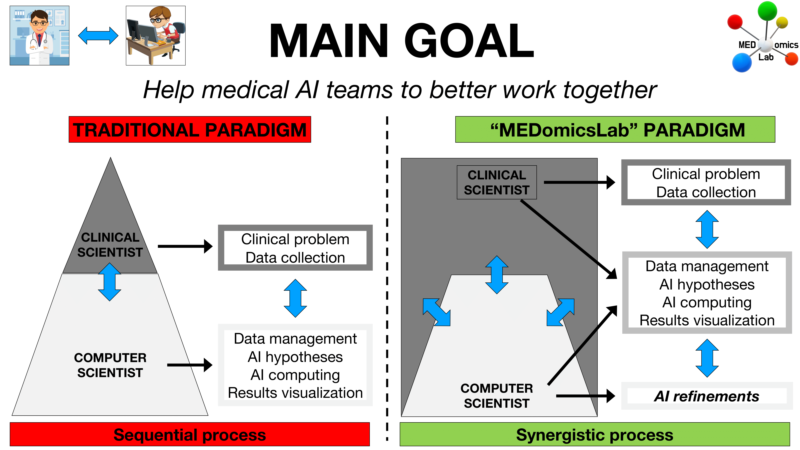
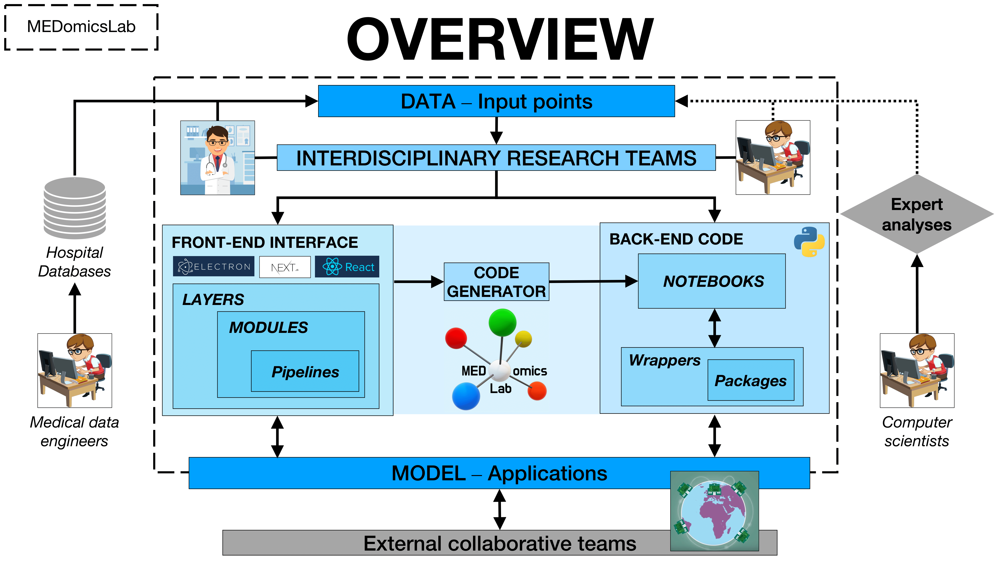
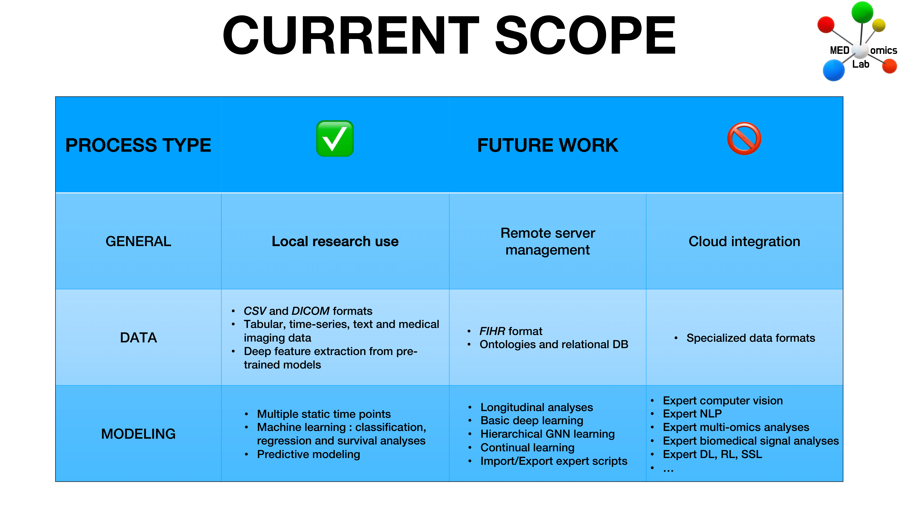

# 👋 Welcome!

Welcome to MEDomicsLab! Here you'll find all the documentation you need to get up and running with our application.

We would like to thank the [_**Unité de Soutien SSA Québec (USSAQ)**_](https://ssaquebec.ca/en/) for their support and funding throughout the MEDomicsLab project. For more information about USSAQ's mission and vision, please visit the following page: [_**USSAQ Vision and Mission**_](https://ssaquebec.ca/en/the-unit/vision-and-mission/)_**.**_

<figure><figcaption></figcaption></figure>

## An overview of MEDomicsLab

<figure><figcaption></figcaption></figure>

<figure><figcaption></figcaption></figure>

<figure><figcaption></figcaption></figure>

<figure><figcaption></figcaption></figure>

<figure><figcaption></figcaption></figure>

<figure><figcaption></figcaption></figure>

## Why MEDomicsLab?

_We envision the MEDomicsLab platform to become a tool that will improve the synergy among medical AI research teams by offering:_

<table data-view="cards"><thead><tr><th></th><th></th><th></th><th data-hidden data-card-cover data-type="files"></th></tr></thead><tbody><tr><td><strong>Unified dashboard</strong>: A central hub where users can manage datasets, train predictive models and run various experiment without switching between tools.</td><td></td><td></td><td><a href=".gitbook/assets/dashboard.png">dashboard.png</a></td></tr><tr><td><strong>No-Code Experiment Design:</strong> Easy-to-use, no-code options for setting up, customizing, and refining experiments, enabling a wider range of users to work effectively.</td><td></td><td></td><td><a href=".gitbook/assets/simpleClick.png">simpleClick.png</a></td></tr><tr><td><strong>Customizable Graphical Pipelines:</strong> Available customization options, allowing tailored pipelines to fit unique project requirements.</td><td></td><td></td><td><a href=".gitbook/assets/pipeLines.svg">pipeLines.svg</a></td></tr><tr><td><strong>Code Generation:</strong> Convert your experiment pipelines into editable code for deeper customization, and seamless collaboration with computer scientists. A better knowledge-sharing by transforming visual workflows into a coding framework</td><td></td><td></td><td><a href=".gitbook/assets/generationIcon.png">generationIcon.png</a></td></tr><tr><td><strong>Python Modular Library Access:</strong> Access to Python-based modular libraries on the back-end, for those who wish to dive deeper into custom code and experimental setups.</td><td></td><td></td><td><a href=".gitbook/assets/ModularIcon.png">ModularIcon.png</a></td></tr><tr><td><strong>Open Source:</strong> Our software program is readily accessible and can be modified or enhanced by anyone.</td><td></td><td></td><td><a href=".gitbook/assets/OpenSourceIcon.png">OpenSourceIcon.png</a></td></tr></tbody></table>

## Supported operating systems

All common operating systems are supported!

<table data-view="cards"><thead><tr><th></th><th></th><th></th></tr></thead><tbody><tr><td></td><td><em>Windows 10 and 11</em></td><td></td></tr><tr><td></td><td></td><td></td></tr><tr><td></td><td></td><td></td></tr></tbody></table>

## Documentation guide


Please note that the documentation varies by application version, and you can select your desired version in the top left corner. For example, to check out the testing phase documentation you must switch to V0.


* [**Quick start**](quick-start.md): Get started quickly with step-by-step instructions to download, install, and set up the app on your computer, tailored for your operating system.
* [**Overview**](overview.md): Explore a quick overview of the app's core features and functionalities.
* [**Tutorials**](tutorials/): Access comprehensive tutorials with videos, images, and detailed guides to help you master every module of the app.
* [**Contributing**](contributing/): Join our community and make a difference—learn how you can contribute to enhancing MEDomicsLab.
* [**Troubleshooting**](troubleshooting.md): Find solutions to common issues and keep your app running smoothly.
* [**FAQ**](faq.md): Get answers to frequently asked questions to streamline your experience.
* [**About Us**](about-us.md): Meet the team, discover our affiliations, and learn about the sponsors behind MEDomicsLab.

## Want to dive right in?

Feeling like an eager beaver? Jump in to the quick start docs and get making your first experiment:


[quick-start.md](quick-start.md)

