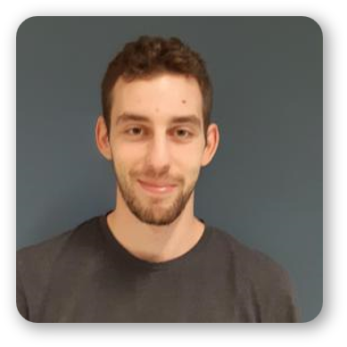
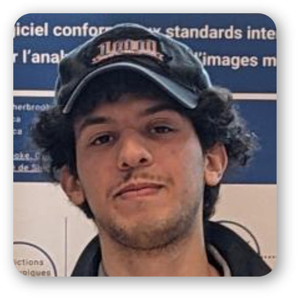
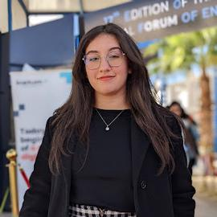
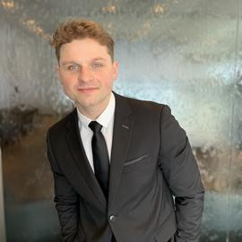
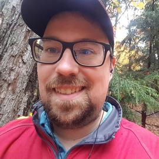
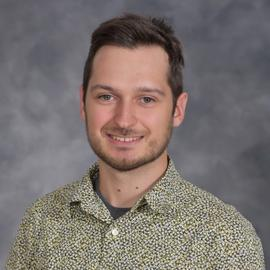
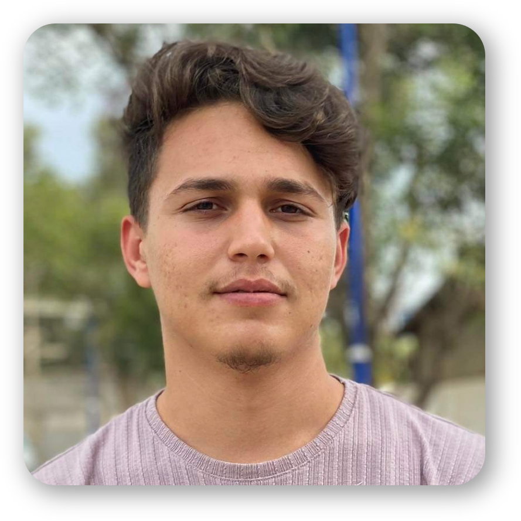
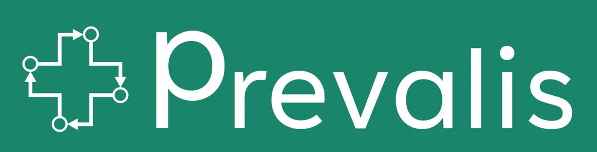

# 🤓 About us

## :pilot: Co-leaders

<table data-card-size="large" data-view="cards" data-full-width="false"><thead><tr><th align="center"></th><th align="center"></th><th></th><th data-type="content-ref"></th><th align="center"></th><th data-hidden data-card-cover data-type="files"></th></tr></thead><tbody><tr><td align="center"></td><td align="center"><h2><strong>Martin Vallières, PhD</strong></h2></td><td>
Associate Professor,

Medical Physics Unit, Gerald Bronfman Department of Oncology, 

McGill University

Investigator — Research Institute of the McGill University Health Centre
 Investigator — Lady Davis Institute for Medical Research
 Associate Academic Member — Mila - Quebec AI Institute
</td><td><a href="https://www.medomicslab.com/">https://www.medomicslab.com/</a></td><td align="center">
<figure><figcaption></figcaption></figure>
</td><td></td></tr><tr><td align="center"></td><td align="center"><h2>Olivier Morin, PhD</h2></td><td>
Associate Professor

Department of Radiation Oncology

University California San Francisco  
</td><td><a href="https://www.medomics.ai/">https://www.medomics.ai/</a></td><td align="center"></td><td></td></tr></tbody></table>

## 👩‍💻 Development team

<table data-column-title-hidden data-view="cards" data-full-width="false"><thead><tr><th align="center"></th><th></th><th></th><th></th><th></th></tr></thead><tbody><tr><td align="center"></td><td><h2>Guillaume Blain</h2></td><td><h4>Developer</h4></td><td>
Research Assistant

Université de Sherbrooke
</td><td> </td></tr><tr><td align="center"></td><td><h2>Nicolas Longchamps</h2></td><td><h4>Developer</h4></td><td>
Research Assistant

Université de Sherbrooke
</td><td> </td></tr><tr><td align="center"></td><td><h2>Brahim Fakri</h2></td><td><h4>Project Manager</h4></td><td>
Research Assistant

Université de Sherbrooke
</td><td> </td></tr><tr><td align="center"></td><td></td><td><h3>Mahdi Ait Lhaj Loutfi</h3></td><td>
Research Professional

Université de Sherbrooke
</td><td> </td></tr><tr><td align="center"></td><td><h3>Mariem Kallel</h3></td><td>M. Sc. Student Software Engineering</td><td>Université de Sherbrooke</td><td> </td></tr><tr><td align="center"></td><td></td><td><h3>Charles-Olivier Ipperciel</h3></td><td>Research Assistant</td><td>Université de Sherbrooke  </td></tr><tr><td align="center"></td><td></td><td><h3>Cedrik Lampron</h3></td><td>Research Assistant</td><td>Université de Sherbrooke  </td></tr><tr><td align="center"></td><td></td><td><h3>Ouael Nedjem Eddine SAHBI</h3></td><td>M. Sc. Student Software Engineering</td><td>Université de Sherbrooke   </td></tr><tr><td align="center"></td><td></td><td><h3>Olivier Lefebvre</h3>
Ph. D. Student Computer Science

Université de Sherbrooke  
</td><td></td><td></td></tr></tbody></table>

## 👩‍💻 Former contributors

<table data-column-title-hidden data-view="cards" data-full-width="false"><thead><tr><th align="center"></th><th></th><th></th><th></th></tr></thead><tbody><tr><td align="center"></td><td><h3>Sarah Denis</h3></td><td>
Research Professional

Formelty at Université de Sherbrooke
</td><td> </td></tr><tr><td align="center"></td><td><h3>Andréanne Allaire</h3></td><td>
Research Assistant

Université de Sherbrooke
</td><td></td></tr><tr><td align="center"></td><td><h3>Hithem Lamri</h3></td><td>
Collaborator

Formerly at Université de Sherbrooke
</td><td></td></tr><tr><td align="center"></td><td></td><td><h3>Lyna Hiba Chikouche</h3>
Intern

Université de Sherbrooke  
</td><td></td></tr><tr><td align="center"></td><td></td><td><h3>Ludmila Amriou</h3>
Intern

Université de Sherbrooke  
</td><td></td></tr></tbody></table>

## 🤝Partners

<table data-view="cards"><thead><tr><th align="center"></th><th data-hidden data-card-target data-type="content-ref"></th></tr></thead><tbody><tr><td align="center"></td><td><a href="https://www.medomics.ai/">https://www.medomics.ai/</a></td></tr><tr><td align="center"></td><td><a href="https://ssaquebec.ca/">https://ssaquebec.ca/</a></td></tr><tr><td align="center"></td><td><a href="https://ssaquebec.ca/">https://ssaquebec.ca/</a></td></tr><tr><td align="center"></td><td><a href="https://reseau1quebec.ca/">https://reseau1quebec.ca/</a></td></tr></tbody></table>
