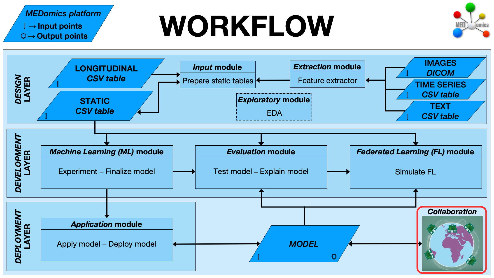

# Collaboration

### Scene Sharing

Within the Learning Module, users can **export a scene locally as a JSON file**. This feature allows complete machine learning workflows—represented as interactive interface configurations—to be **saved, shared, and reloaded** across different users and systems.

By exporting a scene, Momi users can capture every aspect of their experiment, including node connections, parameter settings, and pipeline configurations, in a single JSON file. This file can then be **shared with collaborators**, who can simply import it to **recreate the same experimental interface** with identical settings and structure.

### MEDMODEL Sharing

As introduced in the Learning Module, **MEDMODEL** objects represent the **final product of a machine learning experiment** within MEDomics. Each MEDMODEL encapsulates the trained model along with all relevant information about its training process, such as preprocessing steps, parameters, and performance metrics. This self-contained structure allows seamless deployment of the finalized model on new, unseen data and supports the **collaboration** phase of the workflow, as illustrated in the figure below.

<figure><figcaption>
The collaboration step in the MEDomics workflow
</figcaption></figure>

Through MEDMODEL, MEDomics users can easily **share their finalized models** across research teams and collaborators. This feature enables others to **load, test, and validate** existing models on their own datasets, while maintaining access to the complete machine learning pipeline used during training. Such functionality promotes reproducibility, transparency, and cross-institutional collaboration without the need to exchange or have access to sensitive data.

As illustrated in the figure below, you can **export** a finalized model simply by right-clicking on the `.medmodel` object and selecting **Sync**. This action saves the MEDMODEL locally as a structured folder containing two main components:

* **`metadata.json`** – Stores the model’s metadata, including variable names, data types, target column, and other essential descriptors of the experiment.
* **`model.pkl`** – A serialized (pickle) file containing the full machine learning pipeline. This includes all preprocessing steps, transformations, and the trained model itself, ensuring the model can be applied consistently to new data.

Once exported, the MEDMODEL folder can be securely shared with other MEDomics users for **testing, refinement, or integration** into new analyses. This approach allows teams to train models independently while sharing only the model artifacts, thereby overcoming challenges related to data privacy and inter-institutional data access.

