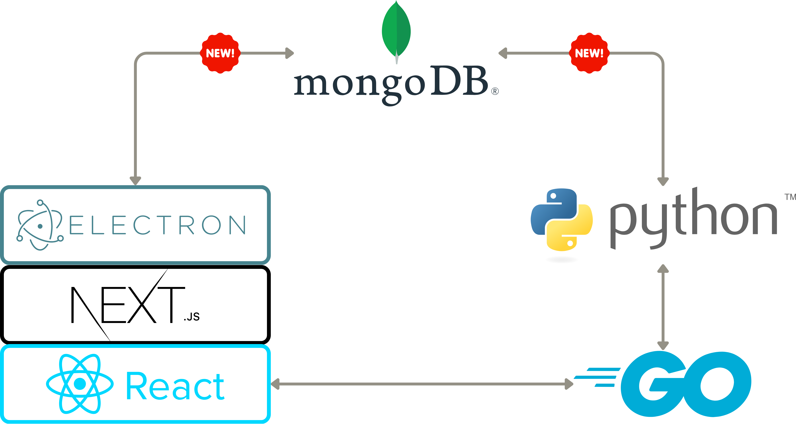

# 👩‍💻 Contributing

<figure><figcaption><p>High-Level Architecture of the Main Framework Used in the Application</p></figcaption></figure>

## Setup from the ground up 🌱


Go visit our [github develop branch ](https://github.com/MEDomics-UdeS/MEDomicsLab/tree/develop#medomicslab---develop-branch-%EF%B8%8F)!


### Scalability Branch


The requirements in this section are only necessary if you want to work from the scalability branch.


#### 1. Installation of MongoDB Community Edition

Follow the installation instructions depending on your OS [MongoDB Installation](https://www.mongodb.com/docs/manual/administration/install-community/#std-label-install-mdb-community-edition).



[Install MongoDB on Windows](https://www.mongodb.com/docs/manual/tutorial/install-mongodb-on-windows/#install-mongodb-community-edition)

* Do not install MongoDB as a service.
* You do not have to install MongoDB compass.
* You do not have to install mongosh.
* Do not forget to [add MongoDB binaries to the System PATH](https://www.mongodb.com/docs/manual/tutorial/install-mongodb-on-windows/#add-mongodb-binaries-to-the-system-path).



[Install MongoDB on Linux (Ubuntu)](https://www.mongodb.com/docs/manual/tutorial/install-mongodb-on-ubuntu/#install-mongodb-community-edition)

* Install the latest version of MongoDB



[Install MongoDB on Mac](https://www.mongodb.com/docs/manual/tutorial/install-mongodb-on-os-x/#install-mongodb-community-edition)



#### 2. Installation of MongoDB database tools

Follow the installation instructions depending on your OS [MongoDB Database Tools Installation](https://www.mongodb.com/docs/database-tools/installation/installation/).



[Install MongoDB Database Tools on Windows](https://www.mongodb.com/docs/database-tools/installation/installation-windows/#installation)

* Install with the MSI Installer.



[Install MongoDB Database Tools on Linux](https://www.mongodb.com/docs/database-tools/installation/installation-linux/#installation)

* Install with the DEB package.



[Install MongoDB Database Tools on Mac](https://www.mongodb.com/docs/database-tools/installation/installation-macos/#installation)

* Install with Homebrew.



### 1. Installation of Nvm

* [NVM for Windows](https://github.com/coreybutler/nvm-windows)
* [NVM for Ubuntu](https://github.com/nvm-sh/nvm#installing-and-updating)

### 2. Installation of npm/node.js

```
nvm install lts
nvm use lts
```

### 3. Clone the repository


We are currently using _develop_ as our main branch.




```
git clone -b develop https://github.com/MEDomics-UdeS/MEDomicsLab.git
```



<pre><code><strong>git clone -b develop git@github.com:MEDomics-UdeS/MEDomicsLab.git
</strong></code></pre>



### 4. Setup server side (Go)

#### 4.1 Installation of Go

1. Download the latest stable release of Go from the official website: [https://golang.org/dl/](https://golang.org/dl/)
2. Follow the [installation instructions](https://go.dev/doc/install) for your operating system.

#### 4.2 Setup of environment



Execute these commands in a **cmd** prompt:

```
setx GOPATH %USERPROFILE%\go
setx PATH "%PATH%;C:\Go\bin"
```





Execute these commands in a terminal:

```
echo 'export PATH=$PATH:/usr/local/go/bin' >> $HOME/.bashrc
echo 'export GOPATH=$HOME/go' >> $HOME/.bashrc
echo 'export PATH=$PATH:$GOPATH/bin' >> $HOME/.bashrc
```



After, **close all your terminals** because these commands will take effects on the initialisation of any terminal

#### 4.3 Verify installation

1. Open a new terminal
2. Run the command `go version`
3. If Go is installed correctly, you should see the version number printed to the console.

#### 4.4 Setup for the application

1. Open a new command prompt and go to the `<repo path>/go_server` directory.
2. Run the command `go run main.go` (on first time, it should download requiered libraries and lunch the server)
3. you can terminate the process by pressing `CTRL + C`
4. Then build the app by running `go build main.go` (It should create an executable file -> that file will be run by the client side javascript so modification to .go files must be followed by a rebuild) Congratulations, you're now ready to start developing Go applications!

### 5. Init submodules

```
cd <.../MEDomicsLab/>
git submodule init
git submodule update --init --recursive --remote
cd pythonCode/submodules/MEDimage
git checkout dev_lab
cd ../MEDprofiles
git checkout fusion_MEDomicsLab
```

### 6. Start the electron app !


```
cd <.../MEDomicsLab>
npm install
npm run dev
```



On **Windows**, if you encounter error messages when running `npm install,`follow the steps here to solve the issue : [https://github.com/nodejs/node-gyp#on-windows](https://github.com/nodejs/node-gyp#on-windows).

* You will need to install the [Visual Studio Build Tools](https://visualstudio.microsoft.com/thank-you-downloading-visual-studio/?sku=Community) (select the C++ build environment)&#x20;
* Install Python3.11 from [here](https://apps.microsoft.com/detail/9nrwmjp3717k?hl=en-us\&gl=US)
* Use node version v18.16.1. Run:
  * `nvm install v18.16.1`
  * `nvm use v18.16.1`
* Set the Python3.11 :
  * `$Env:npm_config_python="C:\path\to\python.exe" # PowerShell`
* Run `npm install -g node-gyp`
* Run again `npm install`





#### Modify startup settings

1. Go to file `medomics.dev.js`
2. Here is a description of the Object:

```javascript
const config = {
  // If true, the server will be run automatically when the app is launched
  runServerAutomatically: true,
  // If true, use the react dev tools
  useReactDevTools: false,
  // the default port to use for the server, be sure that no programs use it by default
  defaultPort: 5000,
  // Either "FIX" or "AVAILABLE" (case sensitive)
  // FIX 		-­> if defaultPort is used, force terminate and use defaultPort
  // AVAILABLE 	-> if defaultPort is used, iterate to find next available port
  portFindingMethod: PORT_FINDING_METHOD.FIX
}
```


## To Test the Production Build&#x20;

### Build the Electron app and Run the built version



```
npm run build:win                            # build and package the application 
.\build\dist\win-unpacked\MEDomicsLab.exe    # Run the executable of the built version
```



```
npm run build:linux                    # build and package the application 
bash build/dist/linux-unpacked/medapp  # Run the executable of the built version
```



```
npm run build:mac                                                    # build and package the application 
bash build/dist/mac-arm64/MEDomicsLab.app/Contents/MacOS/MEDomicsLab # Run the executable of the built version     
```



> The built app will be located in the `build/dist` folder
