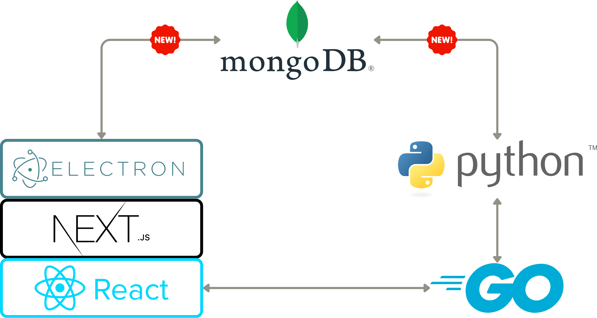

# 💻 Contributing

<figure><figcaption><p>High-Level Architecture of the Main Framework Used in the Application</p></figcaption></figure>

## The MEDomics platform architecture

The map below illustrates the organization of files, modules, databases, and the Frontend-Backend connection within the MEDomics platform. This visual guide is designed to support new contributors in understanding the application’s structure, streamlining the integration of new features, and aiding efficient navigation through the codebase.


the MEDomics platform detailed architecture


## Set up from the ground up 🌱


Contributing to MEDomics is done through our [GitHub development branch](https://github.com/MEDomics-UdeS/MEDomicsLab/tree/develop#medomicslab---develop-branch-%EF%B8%8F)!


### 1. Prerequisites

#### 1.1 Installation of MongoDB Community Edition

Follow the installation instructions depending on your OS for [MongoDB Installation](https://www.mongodb.com/docs/manual/administration/install-community/#std-label-install-mdb-community-edition).



[Install MongoDB on Windows](https://www.mongodb.com/docs/manual/tutorial/install-mongodb-on-windows/#install-mongodb-community-edition)

* Do not install MongoDB as a service.
* You do not have to install MongoDB Compass.
* You do not have to install mongosh.
* Do not forget to [add MongoDB binaries to the System PATH](https://www.mongodb.com/docs/manual/tutorial/install-mongodb-on-windows/#add-mongodb-binaries-to-the-system-path).



[Install MongoDB on Linux (Ubuntu)](https://www.mongodb.com/docs/manual/tutorial/install-mongodb-on-ubuntu/#install-mongodb-community-edition)

* Install the latest version of MongoDB



[Install MongoDB on Mac](https://www.mongodb.com/docs/manual/tutorial/install-mongodb-on-os-x/#install-mongodb-community-edition)



#### 1.2 Installation of MongoDB database tools

Follow the installation instructions depending on your OS for [MongoDB Database Tools Installation](https://www.mongodb.com/docs/database-tools/installation/installation/).



[Install MongoDB Database Tools on Windows](https://www.mongodb.com/docs/database-tools/installation/installation-windows/#installation)

* Install with the MSI Installer.



[Install MongoDB Database Tools on Linux](https://www.mongodb.com/docs/database-tools/installation/installation-linux/#installation)

* Install with the DEB package.



[Install MongoDB Database Tools on Mac](https://www.mongodb.com/docs/database-tools/installation/installation-macos/#installation)

* Install with Homebrew.



### 2. Node.js and NVM Setup

#### 2.1 Installation of Nvm

* [NVM for Windows](https://github.com/coreybutler/nvm-windows)
* [NVM for Ubuntu](https://github.com/nvm-sh/nvm#installing-and-updating)

#### 2.2 Installation of npm/node.js

```shellscript
nvm install lts
nvm use lts
```

### 3. Clone the Repository



```sh
git clone -b develop https://github.com/MEDomicsLab/MEDomics.git
```



<pre class="language-sh"><code class="lang-sh"><strong>git clone -b develop git@github.com:MEDomicsLab/MEDomics.git
</strong></code></pre>



### 4. Backend Setup (Go)

#### 4.1 Install Go

1. Download the latest stable release of Go from the official website: [https://golang.org/dl/](https://golang.org/dl/)
2. Follow the [installation instructions](https://go.dev/doc/install) for your operating system.

#### 4.2 Setup of environment



Execute these commands in a **CMD** prompt:

```powershell
setx GOPATH %USERPROFILE%\go
setx PATH "%PATH%;C:\Go\bin"
```





Execute these commands in a terminal:

```zsh
echo 'export PATH=$PATH:/usr/local/go/bin' >> $HOME/.bashrc
echo 'export GOPATH=$HOME/go' >> $HOME/.bashrc
echo 'export PATH=$PATH:$GOPATH/bin' >> $HOME/.bashrc
```



After, **close all your terminals** because these commands will take effect on the initialization of any terminal

#### 4.3 Verify installation

In a new terminal, run:

```bash
go version
```

If Go is installed correctly, you should see the version number printed to the console.

#### 4.4 Setup for the application

```shellscript
cd <repo-path>/go_server
go run main.go   # initial run installs dependencie
```

Next, build the executable:

```shellscript
go build main.go
```


Rebuild after any `.go` file modification.


### 5. Initialize submodules

```
cd <.../MEDomicsLab/>
git checkout dev_lab
cd ../MEDprofiles
git checkout fusion_MEDomicsLab
```

### 6. Run the Electron App


```shellscript
cd <repo_path/MEDomics>
npm install
npm run dev
```



On **Windows**, if you encounter error messages when running `npm install`related to tensorflow .dll files missing, revert your node version by following these steps:

* [Download node v18.16.1](https://nodejs.org/fr/blog/release/v18.16.1)
* Add to the PATH variable the path to your new node placing it higher than the old node.
* Test your node version using: `node --version`



**MongoDB configuration**

The MEDomicsLab platform uses **port 54017** as the default MongoDB connection port. For database visualization and management, we recommend using [MongoDB Compass](https://www.mongodb.com/products/compass), the official GUI client from MongoDB.

**Key Details**:

* Default Port: `54017`
* Recommended Client: MongoDB Compass
* Connection String Format: `mongodb://localhost:54017/`



#### Modify startup settings

1. Go to file `medomics.dev.js`
2. Here is a description of the Object:

```javascript
export const PORT_FINDING_METHOD = {
  FIX: 0,
  AVAILABLE: 1
};

const config = {
  // Automatically starts the backend server when the app launches
  runServerAutomatically: true,

  // Enables React Developer Tools (useful for debugging UI)
  useReactDevTools: false,

  // Default port used by the Electron/Go server
  defaultPort: 54288,

  // MongoDB connection port
  mongoPort: 54017,

  // Port allocation strategy:
  // FIX        -> Forces use of defaultPort (terminates conflicting processes if needed)
  // AVAILABLE  -> Finds the next available port if defaultPort is occupied
  portFindingMethod: PORT_FINDING_METHOD.FIX
};

export default config;
```


## Testing Production Builds&#x20;

### Build & Run



```powershell
npm run build:win                            # build and package the application 
.\build\dist\win-unpacked\MEDomics.exe    # Run the executable of the built version
```



```bash
npm run build:linux                    # build and package the application 
bash build/dist/linux-unpacked/medomics-platform  # Run the executable of the built version
```



```zsh
npm run build:mac                                                    # build and package the application 
bash build/dist/mac-arm64/MEDomicsLab.app/Contents/MacOS/medomics-platform  # Run the executable of the built version     
```



The built app will be located in the `build/dist` folder.
