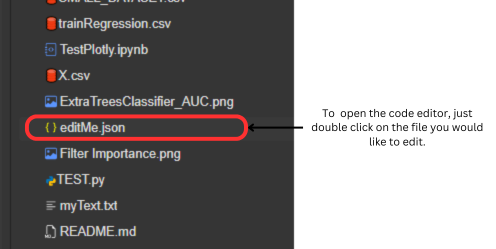
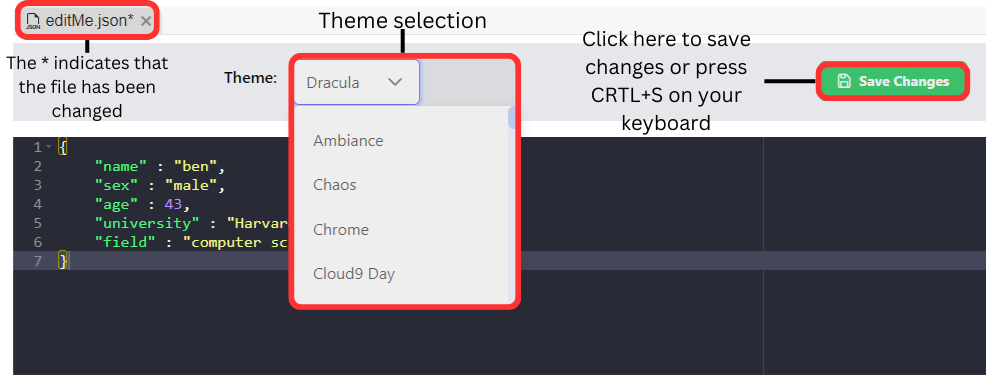
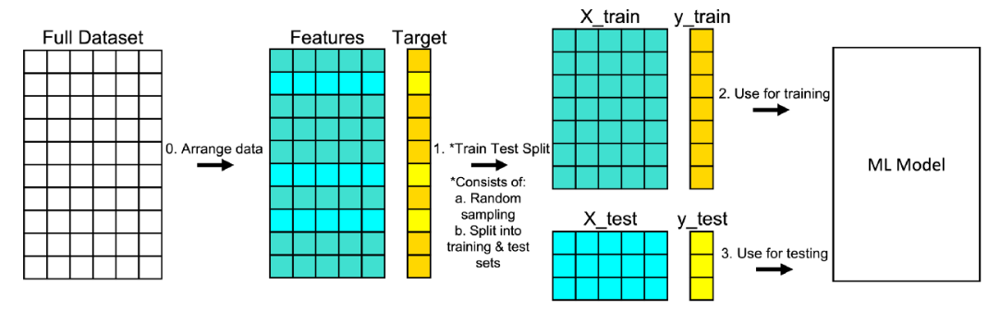
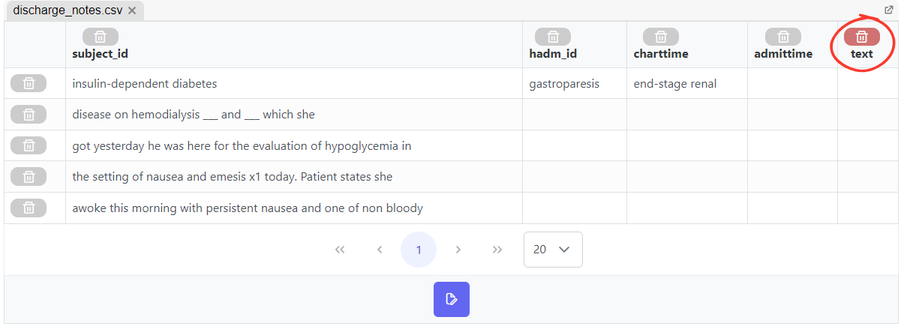
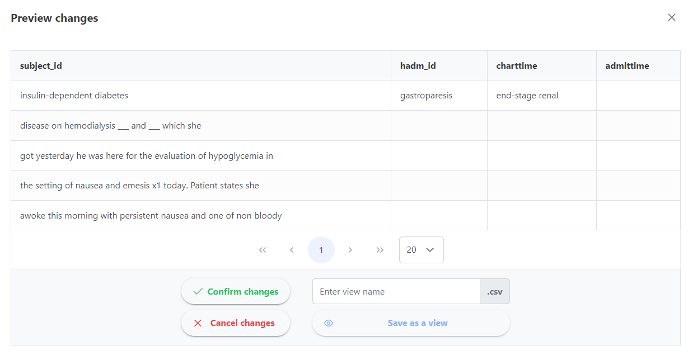
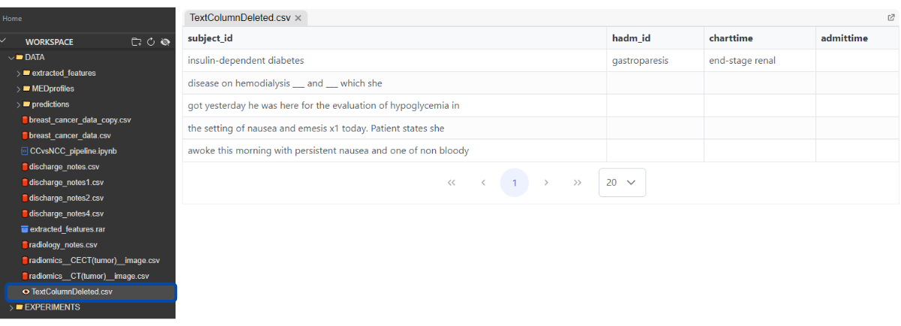

# 🆕 New features

## 🖊️Code Editor

Starting from v1.5.0, **MEDomics introduces an integrated code editor**, allowing users to seamlessly edit Python, text, Markdown, and JSON files directly within the platform. Built on the [**react-ace** package](https://github.com/securingsincity/react-ace), the editor offers a variety of themes and robust support for multiple file types. To get started, simply double-click any supported file in your workspace—it will open automatically in the editor, where you can make modifications and save your changes. Below are some screenshots showcasing the new editor in action:

<figure><figcaption>
Code Editor: how to open?
</figcaption></figure>

<figure><figcaption>
Code Editor Breakdown
</figcaption></figure>

<figure><figcaption>
Code Editor Example
</figcaption></figure>

## 👁️Views

In [MongoDB, views](https://www.mongodb.com/docs/manual/core/views/) are virtual collections created using [aggregation pipelines](https://www.mongodb.com/docs/manual/core/aggregation-pipeline/#std-label-aggregation-pipeline), which allow you to transform and present data without physically storing it as a new collection.&#x20;

#### What is a View in MongoDB?

A view in MongoDB is essentially a query that’s saved and accessible like a collection, but without actually storing any data. Views are read-only, which means you cannot modify data directly in a view. They are generated using aggregation pipelines, which transform and filter the underlying data from one or more source collections.

#### How Views Work

A MongoDB view is defined by an aggregation pipeline, which can be a series of stages to filter, group, sort, or transform documents from the source collection(s). When you query a view, MongoDB applies the defined aggregation stages to the source data on-the-fly, creating a "virtual" collection that shows the result of the pipeline.

#### MongoDB Views in the MEDomics platform

In MEDomics, views primarily help prevent the creation of redundant dataset copies by enabling flexible data representation and access.

1. They allow for simplified representations of complex data. For instance, you might have a large, detailed collection with multiple fields, but you create a view that only exposes the fields most relevant to certain users or applications.
2. Views also facilitate direct access to processed data, supporting analytics like features extraction, models training, and other computed insights, making it easier for the each module to access the processed data directly.

#### Example Use Case

In MEDomics, MongoDB Views are utilized to provide previews of datasets following a particular process, such as removing a column.&#x20;

In this example:

<figure><figcaption>
Delete "Text" column clicked
</figcaption></figure>

once the delete "_Text_" column button is pressed, a preview panel appears, offering options to confirm, cancel, or save the changes as a view. Selecting "_confirm changes_" will apply the changes directly to the original dataset (i.e. will delete the "_Text_" column):

<figure><figcaption>
Delete "Text" column preview
</figcaption></figure>

while choosing "_save as view_" will create a new MongoDB View, preserving the changes in a separate collection. This new view will then appear in your workspace, allowing you to interact with the modified dataset without affecting the original:

<figure><figcaption>
Opening a saved view
</figcaption></figure>

MongoDB views provide flexibility in how you present and control access to data, allowing you to tailor data views to the needs of different users without modifying the original collections.
