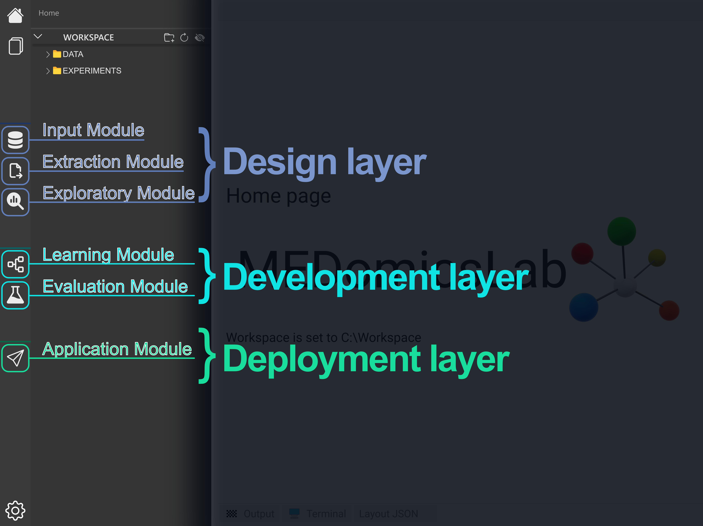

# 👀 Overview

## 1. Set your workspace

The application needs a workspace to run.

_At first, we recommend you create an empty folder (named "**Workspace**" for example) and choose it as your workspace directory._


The DATA folder is where you will store your datasets&#x20;



The EXPERIMENTS folder is where the experiments, the models and the results will be stored



The folders DATA and EXPERIMENTS cannot be deleted inside the application, we **strongly** recommend you to avoid erasing them from outside of the application



The .medomics folder is used by application to store all the infos of the workspace, don't touch it if you want the app to run smoothly :wink:


<figure><figcaption></figcaption></figure>

