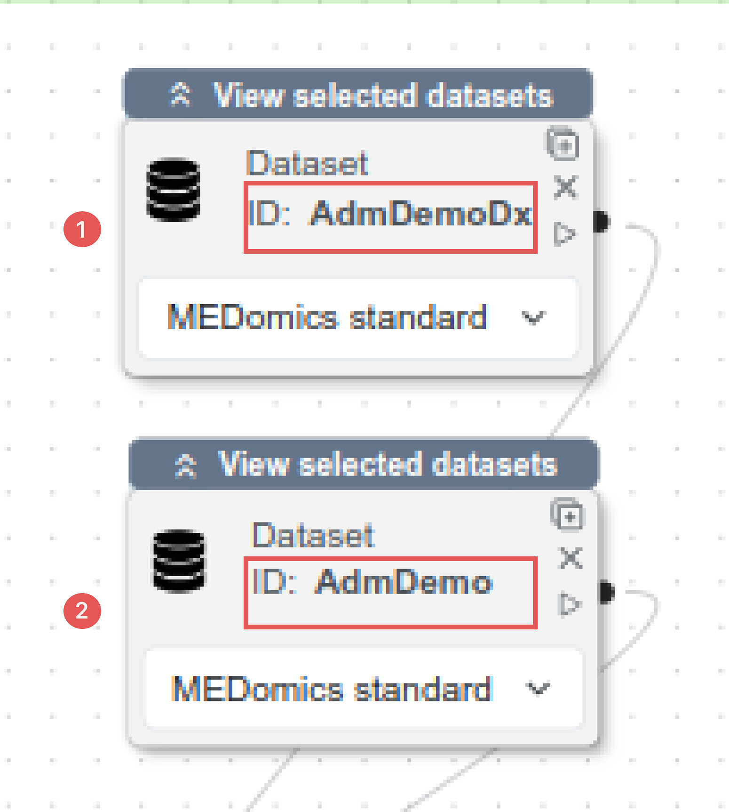
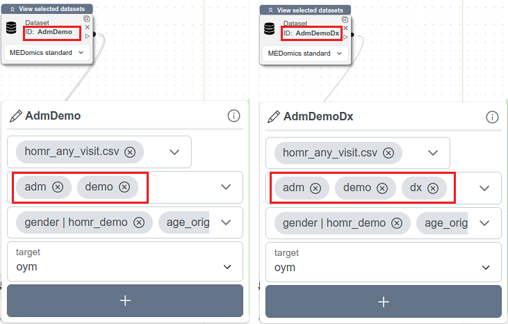
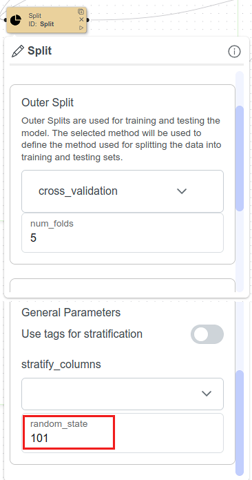

# Learning Module

The Machine Learning section of this proof of concept is structured into two execution options.

#### [<mark style="color:$primary;">Option 1 : Platform-Integrated Pipeline (Recommended for Continuity)</mark>](learning-module.md#option-1-platform-integrated-pipeline)

This option applies the predictive pipeline to the reduced dataset\
`Learning_homr_any_visit_10pct.csv`.

It ensures the continuity of the proof of concept by allowing a lighter, fully integrated end-to-end execution within MEDomics. The trained model is then saved and reused in the **Evaluation** and **Application** modules.

This option is designed to:

* Maintain workflow continuity within the platform
* Reduce computational load
* Enable smooth transition to evaluation and deployment

#### [<mark style="color:$primary;">Option 2 : Full Dataset Reproduction (Extended Configuration)</mark>](learning-module.md#option-2-full-dataset-reproduction-extended-configuration-1)

This optional configuration runs the same pipeline on the full dataset (`homr_any_visit.csv`), while adapting specific settings to accommodate memory and scalability constraints within MEDomics.

Since the complete pipeline has already been detailed in Option 1, no structural modifications are required. Instead, this option involves:

* Updating the **Dataset nodes** to use the full dataset rather than the reduced version.
* Adjusting the **Train Model** configuration to better manage scalability constraints within the platform.
* Generating **code notebooks** to allow the model to be trained outside of MEDomics using parameters that more closely match the original study configuration.

This option enables deeper methodological alignment with the original study while ensuring reproducibility beyond the MEDomics environment.

## <mark style="color:$primary;">Option 1 : Platform-Integrated Pipeline</mark>

This subsection provides a hands-on tutorial to create the machine learning scene enabling us to train a Random Forest model using the `Learning_homr_any_visit_10pct.csv` dataset.


If this is your first time working with the Learning Module, we recommend reviewing the dedicated documentation, which provides detailed explanations of [scene creation](https://medomicslab.gitbook.io/medomics-docs/tutorials/development/learning-module#how-to-create-a-scene) and the [module’s architecture](https://medomicslab.gitbook.io/medomics-docs/tutorials/development/learning-module#the-learning-modules-architecture).


We begin by creating a new scene.

Click on the **Learning Module** icon. The scene creation interface will appear, where you can name the scene `homr_scene`.


&#x20;Do **not** select the _Experimental Scene_ setup. Since we already have a predefined modeling strategy (Random Forest), there is no need to use the Experimental Scene, which is designed to automatically explore and compare multiple models.

You can learn more about the Experimental Scene configuration [here](https://medomicslab.gitbook.io/medomics-docs/tutorials/development/learning-module/experimental-scene).


Next step is accessing the new scene that you created. In your workspace, you will find a folder named `homr_scene`. Click on it and access the `homr_scene.medml` file.&#x20;

This is an overview of the pipeline that we will have by the end of this section. In the following sections, each node will be described individually.

<figure><figcaption>
Scene overview
</figcaption></figure>

Follow the steps illustrated in the figure to create a scene :

1. Double-click on the **Learning Module** icon.
2. Click on **Create scene**.
3. Enter the page name: `homr_scene`.
4. Make sure the **Experimental Scene** toggle is disabled.
5. Click **Create** to generate the scene.

<figure><figcaption>
Create the "homr_scene" scene
</figcaption></figure>

After creating the scene, it appears inside the **EXPERIMENTS** folder under the name `homr_scene`.

<figure><figcaption>
homr_scene folder in Experiments
</figcaption></figure>

Inside this scene folder, there are 3 items :

* **models/** : This folder contains all trained models generated during the experiment. Each time a model is trained and saved, it will be stored here.
* **notebooks/** : This folder contains the generated notebooks associated with the scene. These notebooks allow you to reproduce or extend the experiment outside of MEDomics.
* **homr\_scene.medml** : This is the main scene file where the pipeline is built and configured. All nodes, connections, and experiment settings are defined inside this file.

Click on the `homr_scene.medml` file. Now, we can start the nodes configuration. The nodes are available in the left part of the screen, under 3 sections : _Initialization_, _Training_ and _Analysis._


If you do not see the list of available nodes, click on the **blue menu button** located in the top-left corner of the scene (the icon with three horizontal lines).

This button toggles the node panel and allows you to display or hide the list of nodes.


### Nodes Configuration

We will present nodes by section (_Initialization_, _Training_ and _Analysis_).

#### Initialization Nodes


You can learn more about Initialization Nodes [here](https://medomicslab.gitbook.io/medomics-docs/tutorials/development/learning-module/initialization).


* **Dataset Node**: This node is used twice in this experiment to represent the two predictor sets defined in the POYM study: **AdmDemo** and **AdmDemoDx**.\
  Create two _Dataset nodes_, set both to the _MEDomics Standard_ format, and name them accordingly, as shown in the figure below. Each node corresponds to a distinct group of predictors and relies on the previously created column tags.

<figure><figcaption>
Dataset Nodes setup
</figcaption></figure>

Going one step further, select the `homr_any_visit.csv` file for each Dataset node, and for every ID (seen above), apply the corresponding tags, and define the target variable as "**oym**". This configuration step is illustrated in the second below.

<figure><figcaption>
Dataset Nodes configuration
</figcaption></figure>

* **Split Node**: Configure the _Outer Split_ to use cross-validation as the splitting method with _5 folds_. This outer split defines the external loop of a _**5-fold nested cross-validation**_ setup; the inner splits will be specified later in the _Train Model_ node.\
  Under _General Parameters_, set the _random\_state_ to 101, as used in the original POYM study, to ensure reproducibility.

<figure><figcaption>
Split Node configuration
</figcaption></figure>


If you're unfamiliar with the nested cross-validation method in machine learning, you can check this [link](https://machinelearningmastery.com/nested-cross-validation-for-machine-learning-with-python/) for more information.


* **Model Node**: Select _Random Forest_ as the machine learning algorithm.&#x20;

> The original study relies on _SKRanger_, a C++ implementation of the _Random Forest_ algorithm, whereas our _Learning Module_ is based on _PyCaret_, which builds on _scikit-learn_.\
> To ensure methodological consistency, we therefore use the closest equivalent hyperparameters available in _PyCaret_ to mirror those used in _SKRanger_. While minor implementation differences remain, this approach allows us to stay as close as possible to the original experimental setup.

<mark style="color:green;">**Initial Model Configuration**</mark>

Specifying initial values for the hyperparameters in the Model node is **not mandatory**.

Regardless of the initial values set (including default values), the model will ultimately be trained and optimized using the **custom hyperparameter grid** defined in the Train Model node.

Therefore, you may skip detailed initialization if desired. However, it is essential to ensure that the following hyperparameters are selected in the Model node, as only selected hyperparameters will be available for optimization in the Train Model node.

<mark style="color:green;">**Hyperparameters to Select**</mark>

The following hyperparameters must be selected to ensure they are optimized:

* **`n_estimators`** — Number of decision trees in the Random Forest.
* **`min_samples_leaf`** — Minimum number of training samples required in each terminal node (equivalent to `min_node_size` in SKRanger).
* **`max_features`** — Number of features randomly selected at each split (equivalent to `MTRY` in SKRanger).
* **`class_weight`** — Class imbalance handling strategy (equivalent to `weight` in SKRanger).
* **`random_state`** — Reproducibility seed (equivalent to `seed` in SKRanger).


The specific values set at this stage do not impact the final optimized model, as the training process will rely on the custom hyperparameter grid defined in the next section.

However, you may initialize them using the values shown in the figure below for consistency.


<figure><figcaption>
Model Hyperparameters configuration
</figcaption></figure>

#### Training Nodes

* **Train Model :** In this section, we only use the Train Model node. This is the most configuration-heavy part of the tutorial, so make sure to follow each step carefully.&#x20;

Make sure to activate the **Tune Model** toggle button as shown in the figure below.

<figure><figcaption>
Train Model Node setup
</figcaption></figure>

<mark style="color:green;">**Hyperparameter Tuning Configuration**</mark>

When activating the **Tune Model** toggle in the _Train Model_ node, you will notice that the option **"Use PyCaret's default hyperparameter search space"** is automatically enabled.

Since we are defining a custom tuning grid, the default PyCaret search space is not required. Make sure to **deactivate this toggle**.

Once disabled, the Custom Tuning Grid section for the Random Forest model becomes available, allowing you to configure the hyperparameters manually.&#x20;

The figure below illustrates these steps.

<figure><figcaption>
Custom Tuning Grid for our model
</figcaption></figure>

\
Click on the plus button next to Random Forest. Each hyperparameter selected in the Model node will appear in the grid, where you can specify either:

* A Range (start, end, step), or
* Discrete values.

<mark style="color:green;">**Custom Grid Configuration**</mark>

Set the hyperparameters as follows:

**1️. `n_estimators`**

Number of trees in the forest.

* Range values: {128, 256, 384, 512, 640, 768, 896, 1024}
* Start: **128**
* End: **1024**
* Step: **128**

**2️. `min_samples_leaf`**

Minimum number of samples required at a leaf node.

* Range values: {10, 20, 30, 40, 50, 60, 70, 80}
* Start: **10**
* End: **80**
* Step: **10**

**3️. `max_features`**

Number of features considered at each split.

* Discrete values:\
  `10, 15, 20`

**4️. `class_weight`**

Class imbalance handling strategy.

* Discrete values:\
  `None, balanced, balanced_subsample`


The optimization of `class_weight` differs from the original study. For this proof of concept, we adopt a simplified configuration to ensure stability and clarity within the MEDomics environment.


<mark style="color:green;">**Tune Model Options**</mark>&#x20;

After defining the custom hyperparameter grid, configure the tuning options as follows:&#x20;

**1. `fold`**

Set the **fold** parameter to **5**.

This corresponds to the number of internal folds used in our **5-fold nested cross-validation** setup.

**2. `search_library`**

Set the **search\_library** parameter to **"scikit-learn"**.

In the original study, hyperparameter optimization was performed using **Optuna** with 100 trials. However, within MEDomics, Optuna is currently supported only through a random search strategy.

For this proof of concept, we instead use **Scikit-Learn**, as it enables a structured and controlled **grid search** over predefined hyperparameter ranges.

**3. `search_algorithm`**

Set the **search\_algorithm** parameter to **"grid"**.

This ensures that all combinations within the defined hyperparameter grid are systematically evaluated.

<figure><figcaption>
Tune Model options
</figcaption></figure>

#### Analysis Nodes

* No changes required for the _Analyze Node_.

#### <mark style="color:red;">Pipeline Creation</mark>&#x20;


If you are unfamiliar with the input/output (I/O) ports of each node, please refer to the [documentation](https://medomicslab.gitbook.io/medomics-docs/tutorials/development/learning-module#available-nodes-summary-table) for more information.


The final step before running the scene is to connect the nodes to form the pipeline.

1. Connect the **Dataset** nodes to the **Split** node.
2. Connect the **Split** node to the first input of the **Train Model** node.
3. Connect the **Model** node to the second input of the **Train Model** node.
4. Finally, connect the **Train Model** node to the **Analyze** node to display the results.

Make sure all connections are correctly established before launching the scene.

#### Run the scene and analyze the results


An overview of each button in the Learning Module, along with its corresponding functionality, is available in the documentation. You can access it [here](https://medomicslab.gitbook.io/medomics-docs/tutorials/development/learning-module#id-4.-utils-menu).


Once the scene is fully configured, Click the Run button located in the top-right corner of the interface, as highlighted in the figure below.

<figure><figcaption>
Run the scene 
</figcaption></figure>

You can monitor the progress using the progress bar displayed at the bottom of the interface.

When the execution is complete, the _Analysis Mode_ button will become active. Click on it to open the analysis panel at the bottom of the screen, where the results for **Pipeline 1** and **Pipeline 2** will be displayed.

As shown in the figure below:

* **Pipeline 1** corresponds to the **AdmDemo** dataset node.
* **Pipeline 2** corresponds to the **AdmDemoDx** dataset node.

Select the models’ performance results to review and compare their evaluation metrics.

<figure><figcaption>
Pipeline results in Analysis Mode
</figcaption></figure>

These are some of the results obtained from the AdmDemo pipeline :&#x20;

<figure><figcaption>
Metrics' statistics for the AdmDemo model
</figcaption></figure>

And, the results from the AdmDemoDx pipeline :&#x20;

<figure><figcaption>
Metrics' statistics for the AdmDemoDx model
</figcaption></figure>

#### <mark style="color:$success;">Results</mark>

The reproduced models show a slight decrease in performance (in MEDomics) compared to the original POYM study.

For the AdmDemo model, the AUC decreased from 0.876 in the original study to 0.8565 when using the full dataset with limited hyperparameter tuning. When applying the full tuning strategy on the learning set of the reduced 10% dataset, the AUC further decreased to 0.8489.

Several factors explain these differences:

* **Dataset reduction:** Training on the learning set of 10% of the data reduces the model’s ability to generalize, particularly for complex feature interactions.
* **Class weight configuration:** Differences in class weighting strategies influence the decision boundaries and the sensitivity-specificity trade-off.
* **Scalability constraints in MEDomics:** Platform memory and computational limitations required methodological adaptations that may slightly impact performance.

Overall, despite these constraints, the reproduced models achieve performance levels close to the original study, confirming the validity of the pipeline implementation.

<mark style="color:green;">**Finalize and Save the model**</mark>&#x20;

In order to evaluate and deploy our model, click on the _Finalize & Save Model_ button, seen on the pipeline presentation. Make sure to save the **AdmDemo model** (Pipeline 1). You can read this [documentation](https://medomicslab.gitbook.io/medomics-docs/tutorials/development/learning-module/analysis#finalize-and-save-model) for more info on how to proceed.


Save the scene and results using the Save button.


## <mark style="color:$primary;">Option 2 : Full Dataset Reproduction (Extended Configuration)</mark>

This optional configuration runs the same pipeline described in **Option 1**, but on the full dataset (`homr_any_visit.csv`). The objective is to move closer to the original POYM study results while accounting for memory and scalability constraints within MEDomics.

It is **strongly recommended to create a separate scene** for this configuration to avoid overwriting or modifying the setup used in Option 1.

You may name this new scene: `exp-with-all-data.medml`.


Make sure to **save both scenes** (the reduced dataset scene and the full dataset scene) to preserve reproducibility and allow future comparisons.


#### <mark style="color:green;">Workflow Overview</mark>

For this option, you will have to :

* Reuse the same pipeline architecture as in Option 1.
* Replace the reduced dataset (`Learning_homr_any_visit_10pct.csv`) with the full dataset (`homr_any_visit.csv`) in the Dataset nodes.
* Adjust the Train Model configuration to better manage scalability constraints within the platform.

No structural modifications to the pipeline are required.

#### <mark style="color:green;">Dataset Node Configuration</mark>

The Dataset node is used twice to represent the two predictor sets defined in the POYM study:

* **AdmDemo**
* **AdmDemoDx**

For both Dataset nodes:

1. Select `homr_any_visit.csv`.
2. Keep the format as _MEDomics Standard_.
3. Apply the appropriate column tags (`adm`, `demo`, `dx`) as previously defined.
4. Set the target variable to **`oym`**.


For this configuration to work, you have to reapply the tags to the `homr_any_visit.csv` dataset in the Input Module.


#### <mark style="color:green;">Train Model Adaptation</mark>

Due to scalability constraints within MEDomics, full hyperparameter tuning may not be feasible when using the complete dataset.

In this configuration:

* The tuning strategy may be simplified (e.g., tuning a reduced subset of hyperparameters such as `max_features` only). To achieve this, select only one hyperparameter instead of three in the Model node configuration.
* The rest of the pipeline remains unchanged.

These adjustments allow the experiment to run within the platform’s computational limits while maintaining methodological consistency.


As a result, the results presented below were obtained by tuning only a single hyperparameter: **`max_features`** using values from the grid above.


#### <mark style="color:green;">Run the scene and analyze the results</mark>

Once the scene is set up, hit the Run button, and track the execution process through the bottom progress bar. Select the models' performance results:

<figure><figcaption>
AdmDemo and AdmDemoDx results
</figcaption></figure>

The **AdmDemo** model achieved an AUC of **0.8565**, compared to **0.876** reported in the original study. Similarly, the **AdmDemoDx** model reached an AUC of **0.8908**, compared to **0.905** in the reference study.

This performance gap can be primarily explained by two factors:

* Differences in the `class_weight` configuration
* Tuning only one hyperparameter (`max_features`) instead of the four hyperparameters optimized in the original study

Since this option uses the full dataset, results are higher than those obtained in Option 1.

The comparative table below presents a comparison of AUCs from the different configurations evaluated in the Learning Module section.

| Model         | Original Study | Full Dataset – 1 HP Tuning | 10% Dataset – Full Tuning |
| ------------- | -------------- | -------------------------- | ------------------------- |
| **AdmDemo**   | 0.876          | 0.8565                     | 0.8489                    |
| **AdmDemoDx** | 0.905          | 0.8908                     | 0.875                     |

### <mark style="color:green;">Notebook Generation</mark>

To go beyond MEDomics scalability limitations, the final step of Option 2 is to generate the notebook associated with the trained pipeline. This allows the same experiment to be executed externally with a configuration that more closely matches the original study.

To generate the notebook, simply click the _Generate_ button.


If you do not execute the scene with the full dataset inside MEDomics, we provide the generated notebook directly in this section. All required steps and guidelines are included within the notebook itself.


In the notebook, we first reproduce the MEDomics configuration from the previous step, then progressively incorporate the missing elements from the original study setup:

1. **Grid Search (scikit-learn) :** Tune all study-defined hyperparameters using Grid Search, which exhaustively evaluates all predefined combinations.
2. **Optuna (100 trials) :** Perform hyperparameter tuning using Optuna with 100 trials. Optuna is an adaptive optimization framework (e.g., TPE) that explores the hyperparameter space more efficiently than Grid Search by prioritizing promising configurations based on previous trials.

<mark style="color:purple;">The notebook is available at this OneDrive link. You can download it</mark> [<mark style="color:purple;">here</mark>](https://usherbrooke-my.sharepoint.com/:u:/g/personal/kalm7073_usherbrooke_ca/IQDePwIl15EAQ5OpcWyyzzAuAecHdkoINCIEHS_C3GkQdUs?e=BndxAW)<mark style="color:purple;">.</mark>

> This concludes our Learning Module section. Let's move to the Evaluation Module to test our saved model!
