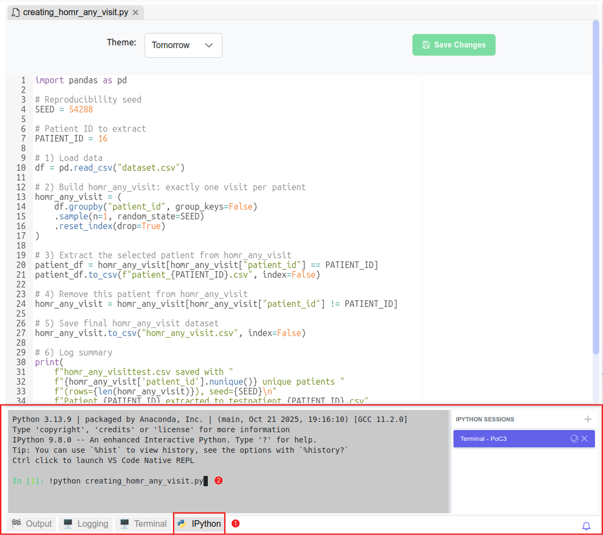

# Code Editor & MEDomics Terminal


You can read about our Code Editor [here](https://medomicslab.gitbook.io/medomics-docs/new-features#code-editor).


### Create your Workspace

Start by downloading the initial dataset used in the original study. This dataset serves as the raw input from which we will extract needed data for our proof of concept. It contains the full set of patient visits and is required to reproduce the data selection process described in the study.

Download the dataset [here](https://zenodo.org/records/12954673). The file is named  `dataset.csv` .

Next, create a folder in your file explorer and place the downloaded file inside it. This folder will be used as your workspace in _MEDomics_ in the following steps.

Launch the platform and select the folder as your new workspace.

### Create the Extraction File

Create a _Python_ file (outside of _MEDomics_) named  `creating_homr_any_visit.py` in which insert the following code:

```py
import pandas as pd

# Reproducibility seed
SEED = 54288

# Patient ID to extract
PATIENT_ID = 16

# Change this to your dataset path before running the script
path = "dataset.csv"

# 1) Load data
df = pd.read_csv(path)

# 2) Build homr_any_visit: exactly one visit selected randomly per patient
homr_any_visit = (
    df.groupby("patient_id", group_keys=False)
    .sample(n=1, random_state=SEED)
    .reset_index(drop=True)
)

# 3) Extract the selected patient from homr_any_visit
patient_df = homr_any_visit[homr_any_visit["patient_id"] == PATIENT_ID]
patient_df.to_csv(f"patient_{PATIENT_ID}.csv", index=False)

# 4) Remove this patient from homr_any_visit
homr_any_visit = homr_any_visit[homr_any_visit["patient_id"] != PATIENT_ID]

# 5) Save final homr_any_visit dataset
homr_any_visit.to_csv("homr_any_visit.csv", index=False)

# 5bis) Extract 1/10 of the final dataset
homr_any_visit_10pct = homr_any_visit.sample(frac=0.1, random_state=SEED)
homr_any_visit_10pct.to_csv("homr_any_visit_10pct.csv", index=False)

# 6) Log summary
print(

    f"homr_any_visit.csv saved with "
    f"{homr_any_visit['patient_id'].nunique()} unique patients "
    f"(rows={len(homr_any_visit)}), seed={SEED}\n"
    f"Patient {PATIENT_ID} extracted to patient_{PATIENT_ID}.csv\n"
    f"10% subset saved to homr_any_visit_10pct.csv "
    f"(rows={len(homr_any_visit_10pct)})"
)
```

This script generates 3 files :&#x20;

1. `homr_any_visit.csv` : This dataset is created by randomly selecting one visit per patient from the original dataset in a reproducible manner. Make sure the seed remains unchanged to ensure the same output is obtained across all steps.
2. `patient_{id}.csv` : We exclude a specific patient (defined by `PATIENT_ID`) from the dataset. The excluded patient is then used to test different data entries in the Application Module.
3. `homr_any_visit_10pct.csv`: This file contains a 10% sample of `homr_any_visit.csv`. It is used for the proof of concept because the full extracted dataset is too large for efficient end-to-end testing within the platform. Reducing the dataset size improves memory usage and overall scalability during testing.

As a final step in this section, don't forget to add the newly generated file to the workspace used for this proof of concept. Press the reload button if you're not able to see it yet.

<figure><figcaption><p>Extraction file in the workspace</p></figcaption></figure>

### Visualize and Edit the Extraction File

Follow the steps shown below to open the `creating_homr_any_visit.py` file in MEDomics' Code Editor.&#x20;

<figure><figcaption><p>Opening the Extraction File in MEDomics' Code Editor</p></figcaption></figure>

This is an overview of the file open in MEDomics. You can, for example, change the seed or the patient's ID or the variables' names.

<figure><figcaption><p>Extraction File in Code Editor</p></figcaption></figure>

### Run the Extraction File

In order to run the extraction file in the MEDomics built-in terminal, click on IPython button as shown in the figure below. Then, run the file with this command :&#x20;

```vb
!python creating_homr_any_visit.py
```

<figure><figcaption><p>Run the code in IPython</p></figcaption></figure>

To execute the generated Python script, make sure you are using the **MEDomics Python environment**, especially if Python is not installed locally on your machine.

You can retrieve the exact Python executable path directly from the application:

1. Open **Settings** in MEDomics.
2. Locate the configured **Python environment path**.
3. Copy the full path to the Python executable.

Then, run the script from your terminal using the following command format:

```bash
C:\Users\<your_username>\.medomics\Python\python.exe creating_homr_any_visit.py
```

Once you run the file, click on the refresh button in your workspace. You should be able to see the 3 new files discussed above.

<figure><figcaption><p>Result files in the workspace</p></figcaption></figure>


For the next steps, we will use the `homr_any_visit_10pct.csv` dataset. As the `homr_any_visit.csv` file, there will be tutorials on how to use it to replicate the original study.


This concludes the first step of this PoC. In the next one, we will dive deeper into the processing of the dataset using the Input Module.
