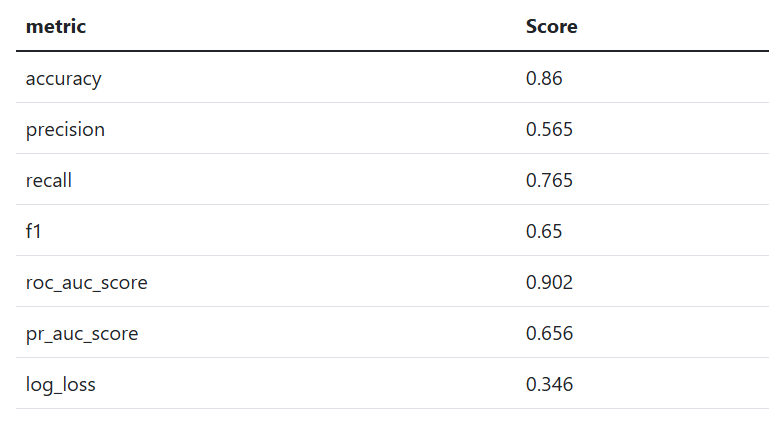

# Evaluation Module

### Creation of a Holdout Sub-Sample

Due to current scalability constraints within MEDomics—particularly when generating the ExplainerDashboard in the Evaluation Module—we restricted the evaluation to a randomly selected subset of 100 patients from the original holdout set. This approach allows us to maintain the full evaluation workflow while ensuring computational feasibility and stability.


You may also use `Holdout_homr_any_visit_10pct.csv` for this section.

Although this file does not require any modification, it may lead to longer execution times and increased memory consumption. However, the resulting performance metrics remain very similar, so you can still follow the tutorial without significant differences in outcomes.

We also give alternative methods to generate lighter test files.


Create a _Python_ file named "creating\_holdout\_100\_patients.py" in your folder and open it in the workspace. Place the following code :&#x20;

```python
import pandas as pd

# Reproducibility seed
SEED = 54288

# Load holdout dataset
holdout = pd.read_csv("Holdout_homr_any_visit_10pct.csv")

# Randomly select 100 patients
holdout_100 = holdout.sample(n=100, random_state=SEED)

# Save subset
holdout_100.to_csv("holdout_100patients.csv", index=False)

print("Number of patients:", len(holdout_100))
```

Run the file on the IPython terminal using this command:

```
!python creating_holdout_100_patients.py
```

You can also use the Holdout Set Creation Tools to create a sub-sample from the `Holdout_homr_any_visit_10pct.csv` file. Click on _Shuffle_ and _Stratify_, change the split percentage at **5%**, "drop" as the empty cells cleaning method, select "**oym**" as our target column and make sure that the _Keep tags_ toggle button is active so that the tags can be applied to the resulting sets.&#x20;

The settings should be fixed as seen in the figure below.

<figure><figcaption><p>Holdout sub-sample creation using Input Module</p></figcaption></figure>

The resulting sets are `Learning_Holdout_homr_any_visit_10pct.csv` and `Holdout_Holdout_homr_any_visit_10pct.csv` .&#x20;


For the evaluation, you can use the `Holdout_Holdout_homr_any_visit_10pct.csv` dataset as it contains 123 patients.


Since we are using the **AdmDemo** model, it is important to reapply the tags described in the _Input Module_ section to this newly created subset. This ensures consistency between the training configuration and the evaluation dataset.


If the Python script cannot locate the original holdout file, double-click on `Holdout_homr_any_visit_10pct.csv` in the workspace and use the **sync()** function to make it accessible.


### Initialization


Learn how to create an Evaluation page [here](../../tutorials/development/evaluation-module.md#id-1.-create-an-evaluation).


Create the Evaluation page and activate the _MEDomics Standard_ toggle.

Since the dataset nodes were configured using the _MEDomics Standard_, it is essential to activate the same mode here to ensure consistency across the pipeline. Using a different mode may lead to mismatches in feature interpretation and evaluation outputs.

<figure><figcaption><p>The Evaluation Page creation</p></figcaption></figure>

For the evaluation configuration, we will select our saved Random Forest model, which should be available in the models list in the "homr\_scene" scene, then select the holdout set created above `holdout_100patients.csv` as our evaluation dataset. Finally, click "Create an evaluation".

<figure><figcaption><p>Evaluation Page configuration</p></figcaption></figure>


As mentioned before, you can use `holdout_100patients.csv`, `Holdout_homr_any_visit_10pct.csv` or `Holdout_Holdout_homr_any_visit_10pct.csv` for this part. This demonstration was conducted using the `holdout_100patients.csv`. However, the structure of the results and their interpretation remain similar regardless of the file selected.


### The evaluation results

The evaluation results are separated into two different sections:

#### Predict/Test

The **Predict/Test** section is where you can see the predictions for each row of our holdout set. The results consist of the predicted value (`prediction_label`) and the prediction score. The prediction score, which indicates the model's confidence in its answer, ranges from 0 to 1 (or 0% to 100%), showing how confident a model is about its answer, with 1 indicating that the model is completely certain about its answer.

<figure><figcaption><p>Predictions' results</p></figcaption></figure>

#### Dashboard

The second tab, named "Dashboard", is an interactive tool used for interpretation and diagnosis. It allows us to analyze thoroughly our saved model. It is based on the [ExplainerDashboard](https://explainerdashboard.readthedocs.io/en/latest/) Python open-source package.

The model was trained using the `Learning_homr_any_visit_10pct.csv` dataset and evaluated on a subset of 100 patients.

#### <mark style="color:blue;">Global Model Performance</mark>

The dashboard first shows global performance metrics.

Let us explain what they mean in simple terms.

1. **Accuracy** (0.86) : Accuracy means that 86% of predictions are correct overall. However, accuracy alone can be misleading when the outcome is rare (only 17% of patients died in this dataset).\
   That is why we need additional metrics.
2. **Recall** (0.76) : Recall measures how many actual deaths were correctly detected.Here, the model identifies 76% of patients who died within one year. In healthcare applications, recall is often very important, because missing high-risk patients (false negatives) can have serious consequences.
3.  **Precision** (0.57) : Precision measures how many predicted high-risk patients actually died.

    Among patients predicted as high-risk, 57% actually died.

    Since the baseline mortality rate is only 17%, this shows that the model significantly concentrates risk in the predicted high-risk group.
4.  **ROC-AUC** (0.90) : ROC-AUC measures the model’s ability to separate high-risk and low-risk patients across all possible thresholds. A value of 0.90 indicates very strong discrimination ability.

    In simple terms:

    If we randomly pick one patient who died and one who survived, the model will correctly assign a higher risk score to the deceased patient about 90% of the time.
5. **PR-AUC** (0.66) : Because mortality is relatively rare (17%), the Precision-Recall curve is especially important. A PR-AUC of 0.66 shows that the model performs much better than random guessing (which would be around 0.17).

<figure><figcaption><p>Metrics on the 100 patiens</p></figcaption></figure>

#### <mark style="color:blue;">Confusion Matrix</mark>

A confusion matrix summarizes how the model’s predictions compare to the true outcomes. In a binary classification problem (Death = 1, Survival = 0), there are four possible outcomes.

Out of 100 patients:&#x20;

* **True Negatives** : 73. These are patients who died within one year and were correctly predicted as high-risk.
* **True Positives** : 13. These patients survived and were correctly predicted as low-risk.
* **False Positives** : 10. These patients were predicted as high-risk but actually survived.
* **False Negatives** : 4. These patients died but were predicted as low-risk.

In our sample, 17 patients died and 83 patients survived. The model:

* Correctly identified 13 deaths
* Missed 4 deaths
* Incorrectly flagged 10 survivors as high-risk

The model captures most mortality cases (76%) while keeping false alarms relatively moderate.

<figure><figcaption><p>Confusion Matrix</p></figcaption></figure>

#### <mark style="color:blue;">Risk Stratification</mark>

This graph shows how mortality prevalence changes as predicted probability increases.

We observe:

* Overall mortality rate: 17%
* Below threshold (0.5): only 5% mortality
* Above threshold: about 56% mortality

Interpretation:&#x20;

The model effectively separates patients into:

* A low-risk group (very low mortality rate)
* A high-risk group (substantially higher mortality rate)

This means predicted probabilities are meaningful and not random.

<figure><figcaption><p>Precision Plot</p></figcaption></figure>

#### <mark style="color:blue;">Precision-Recall Curve</mark>

The Precision–Recall curve shows how **precision** and **recall** change when we move the decision threshold. Because mortality is not common, the Precision-Recall curve gives a clearer view of performance.

The curve shows how precision decreases as recall increases.

This helps decide:

* Whether we want to detect as many deaths as possible
* Or reduce the number of false alarms

<figure><figcaption><p>PR Curve</p></figcaption></figure>

#### <mark style="color:blue;">Feature Interaction</mark>

This section illustrates how the model captures interactions between clinical features rather than evaluating each variable independently.

The feature input panel shown below allows users to modify individual patient characteristics and immediately observe how the predicted mortality risk changes. This interactive component helps demonstrate that predictions are not fixed values but depend on the combination of input features.

The figure also highlights how variations in the **“service\_group”** variable can influence the behavior and impact of other variables in the model. In our global Feature Importance analysis, **“service\_group” ranks as the most influential feature**, followed by **age**. This suggests that the clinical context (represented by service group) plays a central role in mortality prediction and may modify the contribution of other variables, including age.

<figure><figcaption><p>Feature Input table</p></figcaption></figure>

This interaction plot visualizes how two features jointly influence the prediction:

* **service\_group** (x-axis)
* **age\_original** (color scale)

The vertical axis shows the SHAP value, which represents the contribution of the interaction to the predicted mortality risk.

Each point corresponds to one patient.

How to Interpret the Interaction plot:

1\. <mark style="color:green;">**X-axis (service\_group):**</mark> Represents the type of hospital service or clinical context. Different service categories show different distributions of SHAP values.

2\. <mark style="color:green;">**Color scale (age):**</mark> Color represents patient age:

* Blue = younger patients
* Red = older patients

This allows us to see how age modifies the impact of service group.

3\. <mark style="color:green;">**Y-axis (SHAP value):**</mark> The SHAP value measures how much this interaction pushes the prediction:

* Positive SHAP value → increases predicted mortality risk
* Negative SHAP value → decreases predicted mortality risk

<figure><figcaption><p>Interaction plot for service_group and age</p></figcaption></figure>

<details>

<summary>What are SHAP values?</summary>

SHAP values, short for **SHapley Additive exPlanations**, are a method used to explain how each feature in a model contributes to a specific prediction. In simple terms, a SHAP value shows how much a particular feature increases or decreases the model’s prediction compared to the average prediction. This makes SHAP values a powerful and consistent way to interpret complex models, helping us understand which factors most strongly influence each prediction.

</details>

This concludes our Evaluation Module section, don't hesitate to explore more options on the generated dashboard!
