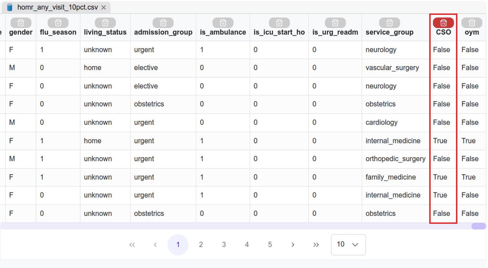

# Input Module

The [Input Module](../../tutorials/design/input-module/) provides multiple data processing key tools needed to fulfill various tasks within the MEDomics platform. In this proof of concept, we will use two tools from the Input Module : the _Column Tagging Tools_ and the _Holdout Set Creation Tools_. We will also use the MEDomics editor to delete a column.


The MEDomics Editor refers to the dedicated workspace within our platform where users can visualize datasets, track and review applied transformations, and interactively edit the data.


#### Column Deletion&#x20;

Before moving into the Input Module, we have to delete a column from our dataset file named "CSO". This column is not used in the original study and therefore we don't need to keep it.&#x20;

Double click on the `homr_any_visit_10pct.csv` file in your workspace to open it in the _MEDomics_ editor. Then, click on the bin above the "CSO" column to delete it.

<figure><figcaption>
Data in <em>MEDomics</em> editor
</figcaption></figure>

#### Column Tagging&#x20;

This [tool](https://medomicslab.gitbook.io/medomics-docs/tutorials/design/input-module#feature-or-column-tagging-tools) is a core component of the _MEDomics_ platform, as it enables the use of the _MEDomics Standard_ data format.

Follow the steps on the figure below to access the Column Tagging tool in the Input Module.

<figure><figcaption>
Steps to the Column Tagging tools
</figcaption></figure>

In _MEDomics_, a **tag** represents a _group of columns_. Each tag corresponds to a coherent subset of features sharing a common meaning or role (e.g., administrative data, demographic variables, clinical diagnoses). Column selection for tags is defined by the user based on data understanding and domain knowledge.

The _MEDomics Standard_ format is built on this tagging mechanism. Rather than relying on a fixed dataset schema, _MEDomics_ allows users to define multiple semantic views over the same dataset through tags. This design provides flexibility while preserving consistency and traceability.

<mark style="color:green;">**Dataset Structure**</mark>

The predictors in our dataset include:

* **Demographics** (age and sex at birth) – 2 variables
* **Admission characteristics** – 10 variables
* **Comorbidity diagnoses** – 85 binary variables
* **Admission diagnoses** – 147 binary variables

This results in a total of **244 predictors**.

<mark style="color:green;">**Predictor Sets in the POYM Study**</mark>

The POYM study defines two predictor sets for model training and evaluation:

* <mark style="color:$primary;">**Adm**</mark><mark style="color:yellow;">**Demo**</mark> → <mark style="color:$primary;">**Adm**</mark> (Admission characteristics) + <mark style="color:yellow;">**Demo**</mark> (Demographics)
* <mark style="color:$primary;">**Adm**</mark><mark style="color:yellow;">**Demo**</mark><mark style="color:$danger;">**Dx**</mark> → <mark style="color:$primary;">**Adm**</mark> (Admission characteristics) + <mark style="color:yellow;">**Demo**</mark> (Demographics) + <mark style="color:$danger;">**Dx**</mark> (Comorbidity diagnoses + Admission diagnoses)

For this proof of concept, we represent these predictor sets using three tags:

* <mark style="color:$primary;">**Adm**</mark> → Admission characteristics (10 variables)
* <mark style="color:yellow;">**Demo**</mark> → Demographics (2 variables: age\_original, gender)
* <mark style="color:$danger;">**Dx**</mark> → Comorbidity diagnoses (85) + Admission diagnoses (147)

To assign tags to variables:

1. Open the Input Module from the left navigation panel.
2. Under Data Organization, select Structuring & Tagging.
3. Click on Column Tagging Tools.

This tool allows you to assign the appropriate tag (`adm`, `demo`, or `dx`) to each variable according to the study definition.

<mark style="color:green;">**Variable Mapping by Tag**</mark>

| Tag                                          | Description                                                                                                                                                                                                                                                                                                                                                                                                             | Number of Variables |
| -------------------------------------------- | ----------------------------------------------------------------------------------------------------------------------------------------------------------------------------------------------------------------------------------------------------------------------------------------------------------------------------------------------------------------------------------------------------------------------- | ------------------- |
| <mark style="color:$primary;">**Adm**</mark> | 
Admission characteristics : 

<ul><li><code>ed_visit_count</code></li><li><code>ho_ambulance_count</code></li><li><code>total_duration</code></li><li><code>flu_season</code></li><li><code>living_status</code></li><li><code>admission_group</code></li><li><code>is_ambulance</code></li><li><code>is_icu_start_ho</code></li><li><code>is_urg_readm</code></li><li><code>service_group</code></li></ul> | 10                  |
| <mark style="color:yellow;">**Demo**</mark>  | 
Demographics : 

<ul><li><code>age_original</code></li><li><code>gender</code></li></ul>                                                                                                                                                                                                                                                                                                                    | 2                   |
| <mark style="color:$danger;">**Dx**</mark>   | Comorbidity diagnoses + Admission diagnoses (the rest of the columns)                                                                                                                                                                                                                                                                                                                                                   | 232                 |


The columns "patient\_id", "visit\_id" and "oym" should not be assigned to any tag.&#x20;


This figure below illustrates the process of assigning tags to dataset columns using the Column Tagging Tools.

1. Select the dataset (`homr_any_visit_10pct.csv`).
2. Create the three required tags: `adm`, `demo`, and `dx`.
3. Select the columns corresponding to each tag.
4. Choose the appropriate tag to apply.
5. Click **Apply tags to selected columns** to validate the configuration.

In this example, the variables `age_original` and `gender` are assigned to the `demo` tag.

<figure><figcaption>
Create the "adm", "demo" and "dx" tags
</figcaption></figure>

You can visualize the tags within the dataset in the _MEDomics_ editor.


If the dataset is already open in the MEDomics Editor, please close it and reopen it to update the view and ensure that the newly assigned tags are properly displayed.


#### Holdout set creation

After creating our tags, the final step is to split our data into a learning set and a holdout set.&#x20;

For this task, we will use the _Holdout Set Creation Tools_. To access this [tool](https://medomicslab.gitbook.io/medomics-docs/tutorials/design/input-module#holdout-set-creation-tool), select _Sampling_ under the _Data Wrangling_ section in the _Input Module_.&#x20;

<figure><figcaption>
Sampling in the Data Wrangling section
</figcaption></figure>

After selecting the dataset (`homr_any_visit_10pct.csv`):

1. Enable **Shuffle** and **Stratify**.
2. Select **`oym`** as the target column.
3. Set the split percentage to **20%**.
4. Choose **"drop"** as the empty cells cleaning method.
5. Activate the **Keep tags** toggle.
6. Click the **Save** icon to create the Learning and Holdout sets.

These steps are illustrated in the figure below.

<figure><figcaption>
Create Learning and Holdout sets from our dataset
</figcaption></figure>


This will create two new CSV datasets: `Holdout_homr_any_visit_10pct.csv` and `Learning_homr_any_visit_10pct.csv`.&#x20;


With the creation of the Holdout and the Learning sets, we conclude our Input Module steps, and we can now start the machine learning phase.

> This step ensures that the dataset is properly prepared for the demo and ready to be used in a complete end-to-end workflow within _MEDomics_, including the **Learning**, **Evaluation** and **Application** modules. In the next section, we will use `homr_any_visit_10pct.csv` dataset (with the applied tags preserved, of course!) to run machine learning experiments and replicate the POYM study.&#x20;

This concludes our _Input Module_ section. Now our data is ready for model training!
