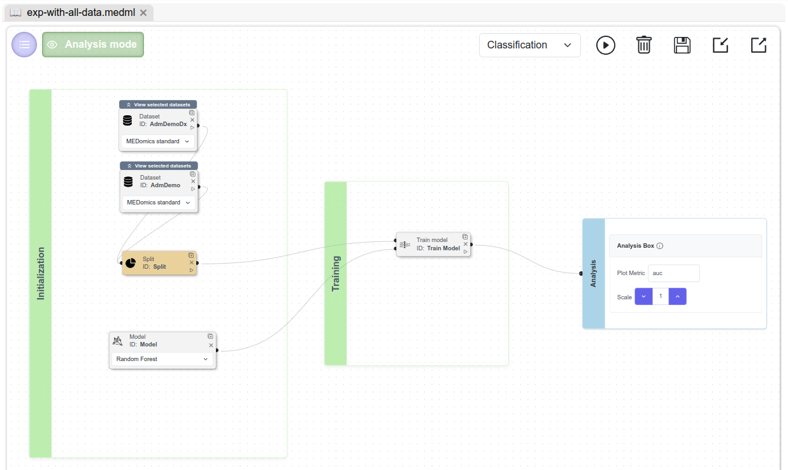

# Learning Module

The Machine Learning section of this proof of concept is structured into two main parts.

**Part 1** aims to reproduce the reference study using the full dataset (`homr_any_visit.csv`), while adapting the optimization strategy to address memory and scalability constraints within MEDomics.

* **Part 1A** presents the complete pipeline, including its nodes and selected hyperparameters.
* **Part 1B** introduces a code generation step to enhance reproducibility and allow the model to be trained outside of _MEDomics_, using parameters that are more representative of the original study configuration.

**Part 2** applies the same pipeline to the reduced dataset (`Learning_homr_any_visit_10pct.csv`). This step ensures continuity of the proof of concept while enabling a lighter, end-to-end execution within the platform. The trained model is then saved and reused in the **Evaluation** and **Application** modules.

## <mark style="color:orange;">Part 1 :</mark> <mark style="color:orange;">Training with all data</mark>

### Part 1A : Workflow overview


You do **not** need to reproduce the scene using `homr_any_visit.csv`, as it is computationally intensive and time-consuming. Instead, the generated notebook provided in the next subsection will allow you to replicate the POYM study externally, using the full dataset and the exact parameters defined in the original study.

For this section, your objective is to recreate the scene using `Learning_homr_any_visit_10pct.csv`.


This section provides an overview of the scene to be created and the nodes used in the machine learning experiment. In the following sections, each node will be described individually.

Make sure to name this scene <kbd>exp-with-all-data.medml</kbd>. As previously stated, the full dataset is used at this stage to ensure results that are as close as possible to those reported in the POYM study. After completing these experiments, the scene will be recreated using `Learning_homr_any_visit.csv` to maintain continuity and reproducibility within _MEDomics_ modules.

<figure><figcaption>
Scene overview
</figcaption></figure>

### Nodes configuration

We will present nodes by section (_Initialization_, _Training_ and _Analysis_).

#### Initialization Nodes

* **Dataset Node**: This node is used twice in this experiment to represent the two predictor sets defined in the POYM study: **AdmDemo** and **AdmDemoDx**.\
  Create two _Dataset nodes_, set both to the _MEDomics Standard_ format, and name them accordingly, as shown in the figure below. Each node corresponds to a distinct group of predictors and relies on the previously created column tags.

<figure><figcaption>
Dataset Nodes setup
</figcaption></figure>

Going one step further, select the `homr_any_visit.csv` file for each Dataset node, and for every ID (seen above), apply the corresponding tags, and define the target variable as "**oym**". This configuration step is illustrated in the second below.

<figure><figcaption>
Dataset Nodes configuration
</figcaption></figure>

* **Split Node**: Configure the _Outer Split_ to use cross-validation as the splitting method with _5 folds_. This outer split defines the external loop of a _**5-fold nested cross-validation**_ setup; the inner splits will be specified later in the _Train Model_ node.\
  Under _General Parameters_, set the _random\_state_ to 101, as used in the original POYM study, to ensure reproducibility.

<figure><figcaption>
Split Node configuration
</figcaption></figure>

* **Model Node**: Select _Random Forest_ as the machine learning algorithm.&#x20;

> The original study relies on _SKRanger_, a C++ implementation of the _Random Forest_ algorithm, whereas our _Learning Module_ is based on _PyCaret_, which builds on _scikit-learn_.\
> To ensure methodological consistency, we therefore use the closest equivalent hyperparameters available in _PyCaret_ to mirror those used in _SKRanger_. While minor implementation differences remain, this approach allows us to stay as close as possible to the original experimental setup.

In the next section, we detail the initial values used to train our model, and our custom grid hyperparameters optimisation. We selected and tuned a set of hyperparameters that are conceptually equivalent to those used in SKRanger, while respecting scikit-learn’s constraints and best practices.

1. **n\_estimators**: is the number of decision trees composing the Random Forest model.\
   For the purpose of this demonstration, it is set to **512**.
2. **min\_samples\_leaf**: is the minimum number of training samples required in each terminal node of a tree. It corresponds to the "min\_node\_size" hyperparameter in SKRanger. It is set to **10**.
3. **max\_features**: is the number of features randomly selected at each split during tree construction. It corresponds to the "MTRY" hyperparameter in SKRanger. Choose the _Integer_ type in the dropdown menu and set it to **15**.
4. **class\_weight**: controls the relative importance assigned to each class during model training, allowing the algorithm to account for class imbalance. It corresponds to the "weight" hyperparameter in SKRanger. It is set to **Balanced**.
5. **random\_state:** corresponds to the "seed" hyperparameter in SKRanger. It is set to **101**.

<figure><figcaption>
Model Hyperparameters configuration
</figcaption></figure>

#### Training Nodes

* **Train Model**: In General Options, select fold and set it to 5 (as in 5 folds to achieve the 5-fold nested cross-validation mentioned above). Enable tuning to adjust model hyperparameters and optimize performance.

<figure><figcaption>
Train Model Node setup
</figcaption></figure>

Set the custom grid to the following values:

For the first two hyperparameters, you can add their respective values in the _Range_ section.

1. **n\_estimators**: the number of trees is explored over the range **{128, 256, 384, 512, 640, 768, 896, 1024}**. The starting point is 128, the ending point is 1024 and the step is 128.
2. **min\_samples\_leaf**: the minimum number of samples per leaf is varied over the range **{10, 20, 30, 40, 50, 60, 70, 80}.**
3. **max\_features**: the number of features considered at each split is explored using fixed values **{10, 15, 20}**.
4. **class\_weight**: Class imbalance handling is explored through three values: **None**, **balanced** and **balanced\_subsample**. This hyperparameter optimisation is different from the original study, as we prefer a simpler way for this proof of concept.

**Tune Model Options :**&#x20;

1. Select the _fold_ parameter and set it to **5**. This is for the number of internal folds of our 5-fold nested cross validation.
2. Select the _search\_library_ parameter and set it to **"scikit-learn"**. For this proof of concept, _Scikit-learn_ is used for hyperparameter search instead of Optuna (used in the original study with 100 trials). At this stage, MEDomics supports Optuna only through a random search strategy, so we prefer using Scikit-Learn with a grid search as it enables a structured grid search over predefined hyperparameter ranges.
3. You guessed it! Our third and final parameter for tuning is _search\_algorithm._ Set it to **"grid"**.

<figure><figcaption>
Tune Model options
</figcaption></figure>

#### Analysis Nodes

* No changes required for the _Analyze Node_.


Due to scalability limitations within the platform, we were not able to execute the full pipeline as described above. As a result, the results presented below were obtained by tuning only a single hyperparameter: **`max_features`**.


#### Run the scene and analyze the results

Once the scene is set up, hit the Run button, and track the execution process through the bottom progress bar. Once your results are ready, the "_**Analysis mode**_" button will be activated, and upon clicking on it, you will access the analysis panel at the bottom, where all the results (Pipeline 1 and Pipeline 2) will be displayed. Select the models' performance results:

<figure><figcaption>
AdmDemo and AdmDemoDx results
</figcaption></figure>

The **AdmDemo** model achieved an AUC of **85.65%**, compared to **87.6%** reported in the original study. Similarly, the **AdmDemoDx** model reached an AUC of **89.08%**, compared to **90.5%** in the reference study.

The observed performance gap can be primarily explained by two factors:

1. Differences in the `class_weight` configuration, and
2. The tuning of only one hyperparameter (`max_features`) instead of the four hyperparameters optimized in the original study.

#### Part 1B : Generate the notebook&#x20;

The final step of this part is to generate the notebook associated with the trained model. To do so, simply click the “_Generate_” button.

Since you are not executing the scene with the full dataset, we provide the generated notebook directly in this section. All necessary steps and guidelines are included within the notebook itself.

In this notebook, we first rerun the model presented in **Part 1A**, and then progressively incorporate the elements missing from the original study configuration. This is done in a step-by-step manner:

1. First, tuning all hyperparameters defined in the study using Grid Search (via scikit-learn), which exhaustively evaluates all predefined combinations in the search space.
2. Then, performing hyperparameter tuning using Optuna with 100 trials.

> Optuna is a modern hyperparameter optimization framework based on adaptive search strategies (e.g., Tree-structured Parzen Estimator, TPE). Unlike Grid Search, which evaluates all combinations in a fixed grid, Optuna explores the search space more efficiently by dynamically selecting promising configurations based on previous results. With 100 trials, Optuna samples 100 candidate configurations from the defined hyperparameter space, providing a balance between optimization quality and computational cost.

<mark style="color:purple;">The notebook is available at this OneDrive link. You can access it</mark> [<mark style="color:purple;">here</mark>](https://usherbrooke-my.sharepoint.com/:u:/g/personal/kalm7073_usherbrooke_ca/IQDePwIl15EAQ5OpcWyyzzAuAecHdkoINCIEHS_C3GkQdUs?e=BndxAW)<mark style="color:purple;">.</mark>

## <mark style="color:orange;">Part 2 :</mark> <mark style="color:orange;">Training using the Learning Set</mark>

For this part, the first step is to create a new scene called <kbd>homr\_scene.medml</kbd>. Then, replicate the pipeline described in **Part 1A**. Run the scene and open Analysis Mode to explore the results.&#x20;

<figure><figcaption>
Pipeline results in Analysis Mode
</figcaption></figure>

These are some of the results obtained from the AdmDemo pipeline :&#x20;

<figure><figcaption>
Metrics' statistics for the AdmDemo model
</figcaption></figure>

And, the results from the AdmDemoDx pipeline :&#x20;

<figure><figcaption>
Metrics' statistics for the AdmDemoDx model
</figcaption></figure>


Do not forget to click the “Save & Finalize” button to save the model generated from the AdmDemo pipeline. This model will be reused in the Evaluation and Application modules.


### Results

The reproduced models show a slight decrease in performance (in _MEDomics_) compared to the original POYM study.

For the AdmDemo model, the AUC decreased from 87.6% in the original study to 85.65% when using the full dataset with limited hyperparameter tuning. When applying the full tuning strategy on the reduced 10% dataset, the AUC further decreased to 84.89%.

Similarly, the AdmDemoDx model achieved an AUC of 90.5% in the original study, compared to 89.08% with limited tuning on the full dataset and 87.56% when trained on the reduced dataset with full hyperparameter optimization.

Several factors explain these differences:

1. **Hyperparameter optimization strategy**: In the constrained setting, only one hyperparameter was tuned instead of the four optimized in the original study.
2. **Dataset reduction**: Training on 10% of the data reduces the model’s ability to generalize, particularly for complex feature interactions.
3. **Class weight configuration**: Differences in class weighting strategies influence the decision boundaries and sensitivity-specificity trade-off.
4. **Scalability constraints in&#x20;**_**MEDomics**_: Platform memory and computational limitations required methodological adaptations that may slightly impact performance.

Overall, despite these constraints, the reproduced models achieve performance levels close to the original study, confirming the validity of the pipeline implementation.

The comparative table below presents a comparison of the different configurations evaluated in the Learning Module section.

| Model         | Original Study | Full Dataset (1 HP tuning) | 10% Dataset (Full tuning) |
| ------------- | -------------- | -------------------------- | ------------------------- |
| **AdmDemo**   | 87.6%          | 85.65%                     | 84.89%                    |
| **AdmDemoDx** | 90.5%          | 89.08%                     | 87.56%                    |
