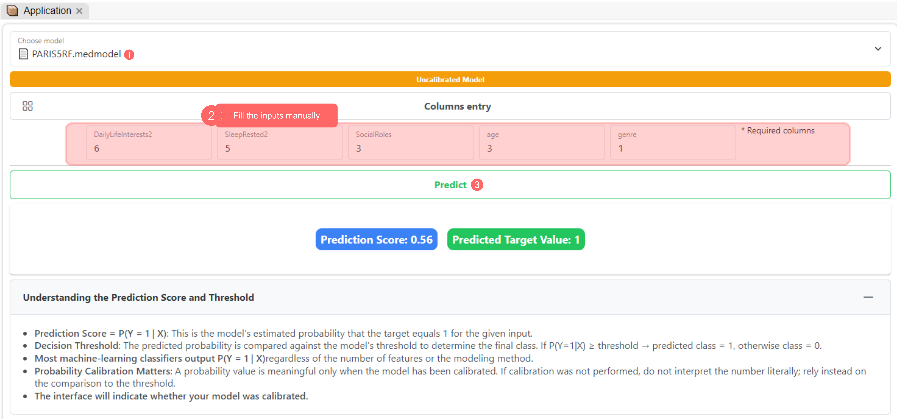
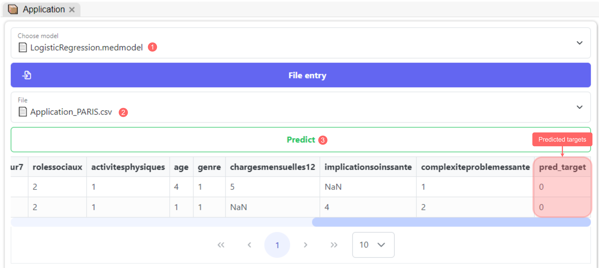

# Application Module

The Application module, as shown in the documentation, accepts two input types: the first is a single input entry, which consists of manually entering a value for each variable input, while the second type takes a CSV file as input containing multiple samples as an entry. In this POC, we will illustrate the use of both methods. However, for both approaches, the steps remain the same:

* Select the right model
* Enter/Select your data
* Click "Predict"
* Explore results

### Single input entry

Once you open the application module, select the Logistic Regression model that was saved in [step 4](./#learning-module). A list of column entries will appear, and you will need to enter the value for each variable manually. Only column entries with `*` next to their name are required inputs; hence, if other variables are missing, they will be replaced using the same imputation process used from the machine learning pipeline. Once all the values are entered, click "Predict" and wait for the results.

Use the figure below to correctly follow the steps required:

<figure><figcaption>
Steps to generate a prediction for a single PARIS data sample
</figcaption></figure>

In the bottom section, results consist of the predicted value and the prediction score. In our case, the predicted value is 0 with a probability of 83%, meaning that our model is 83% confident that the predicted value is 0. Note that this probability, indicating the model's confidence in its answer, ranges from 0 to 1 (or 0% to 100%), showing how confident a model is about its answer, with 1 indicating that the model is completely certain about its answer.

### File entry

To use the file entry option, you will need a CSV file containing the data samples you would like to test. We suggest you create one manually and import it to your MEDomics workspace. Ensure the columns of the file are the same as the variables used in training, which you can find in the model's metadata saved under the `.medmodel` object.

The figure below illustrates these steps:

<figure><figcaption>
Steps to generate predictions for PARIS data file
</figcaption></figure>

This demonstrates how the Application module can be used as a production environment for your trained machine learning models. It bridges the gap between model development and practical application, allowing users to interact with the model to make predictions on new data.

> _This final step concludes our **PARIS Proof of Concept (PoC)**, where we explored the main modules and functionalities of the **MEDomics** platform, from data exploration and preprocessing to model training and deployment. While this PoC covered most of the platform’s core components, **MEDomics** offers many additional capabilities yet to be explored. We encourage you to review the other PoCs for a deeper look into other modules and more complex use cases._
