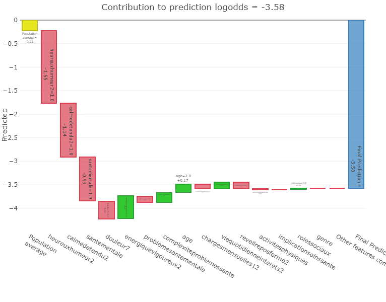

# Evaluation Module

### Intialization


Learn how to create an Evaluation page [here](../../tutorials/development/evaluation-module.md#id-1.-create-an-evaluation).



In evaluation, we used the final model from the [additional analysis](./#learning-module).


For the evaluation configuration, we will select our saved Logistic Regression model, which should be available in the model's list, then select the holdout set created in the third step as our evaluation dataset. Finally, click "Create an evaluation".

<figure><figcaption>
The Evaluation Page Configuration
</figcaption></figure>

### The evaluation results

The evaluation results are separated into two different sections:

#### Predict/Test

The Predict/Test section is where you can see the predictions for each row of our holdout set. The results consist of the predicted value (`prediction_label`) and the prediction score. The prediction score, which indicates the model's confidence in its answer, ranges from 0 to 1 (or 0% to 100%), showing how confident a model is about its answer, with 1 indicating that the model is completely certain about its answer.

<figure><figcaption>
Predictions on holdout set
</figcaption></figure>

#### Dashboard

The second tab, named "Dashboard", is an interactive tool used for interpretation and diagnosis. It allows us to analyze how our Logistic Regression model made predictions by visualizing relationships between features, outcomes, and model behaviours, all within a unified dashboard interface. It is based on the [ExplainerDashboard](https://explainerdashboard.readthedocs.io/en/latest/) Python open-source package.

<figure><figcaption>
The PARIS evaluation dashboard
</figcaption></figure>

***

### Discussion

Let's examine the Dashboard tab more closely and review some figures to understand the most impactful features influencing our logistic regression model’s classification of patients with or without emotional distress.

#### Confusion Matrix

<figure><figcaption>
Model's confusion matrix on the holdout set
</figcaption></figure>

The confusion matrix from the holdout set reveals that the model maintains good generalization performance in distinguishing patients with and without emotional distress. Specifically, 41.5% of the cases correspond to true negatives, meaning patients without emotional distress were correctly classified, while 28.8% represent true positives, indicating accurate identification of distressed patients. However, 15.8% of cases were false negatives, patients experiencing emotional distress who were incorrectly predicted as non-distressed, highlighting a limitation in the model’s sensitivity. Additionally, 14% of cases were false positives, where non-distressed patients were misclassified as distressed. Overall, these results suggest that the model performs well in capturing emotional distress patterns, though improving recall could further enhance its reliability in clinical screening scenarios.

#### **Features Importances (using SHAP values)**&#x20;

_**Which features had the biggest impact?**_

<figure><figcaption>
Average features impact on predicted target
</figcaption></figure>

This figure presents the five most influential features contributing to our logistic regression model’s classification of patients with or without emotional distress, as determined by the mean absolute [SHAP values](evaluation-module.md#what-are-shap-values):

* **SleepRested2** is the dominant predictor, showing the largest mean absolute SHAP value, which indicates that perceived sleep quality has the strongest influence on the model’s predictions.
* **DailyLifeInterests2** ranks second, suggesting that engagement or interest in daily activities is another key driver, though with a noticeably smaller impact than sleep.
* **SocialRoles** and **age** have moderate and comparable contributions, meaning they influence predictions but play a secondary role relative to sleep and daily-life interests.
* **Genre** has the lowest importance among the top features, implying a relatively limited contribution to the predicted outcome compared with the other variables.

Overall, this SHAP-based analysis highlights the predominance of affective and self-evaluative variables in driving the model’s predictive decisions.

#### Contributions Plot

_**How has each feature contributed to the prediction?**_

<figure><figcaption>
Features contribution to predictions
</figcaption></figure>

This waterfall plot illustrates the SHAP-based feature contributions to the prediction of patients with emotional distress (`target=1`), culminating in a final log-odds prediction of -3.58 (corresponding to a high probability of emotional distress). The most influential negative predictors are:

* The features **“heureuxhumeur2”** (-1.55), **“calmedetendu2”** (-1.14)  and **“santementale”** (-0.93) **all** appear to decrease the no-distress risk. These negative contributions in the waterfall representation reflect their strong association with the positive distress outcome.&#x20;
* Conversely, several demographic and clinical variables contribute small positive effects toward no-distress, such as "**energiquevigoureux2"** (+0.48), **"ComplexiteProblemesSante" (complexity of understanding of health problems)** (+0.2) and **"age"** (+0.17).

Again, this SHAP-based analysis highlights the predominance of the same self-evaluative questions rather than other demographic and clinical variables.

Now that we have analyzed our model's results on an external set, we can move to the final step, where we will deploy the model using the Application Module to test it on new data.

***

What are SHAP values?

SHAP values, short for **SHapley Additive exPlanations**, are a method used to explain how each feature in a model contributes to a specific prediction. In simple terms, a SHAP value shows how much a particular feature increases or decreases the model’s prediction compared to the average prediction. This makes SHAP values a powerful and consistent way to interpret complex models, helping us understand which factors most strongly influence each prediction.

