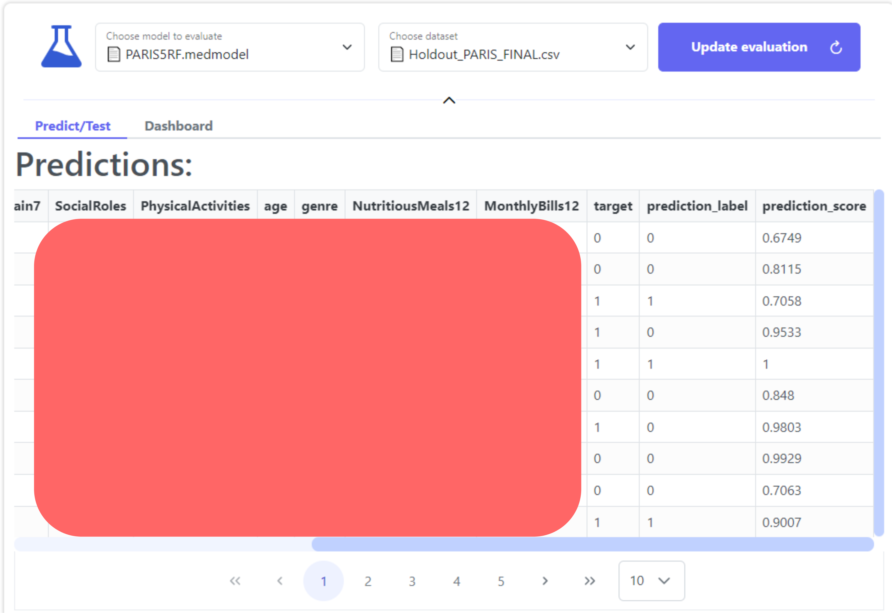

# Evaluation Module

### Intialization


Learn how to create an Evaluation page [here](../../tutorials/development/evaluation-module.md#id-1.-create-an-evaluation).


For the evaluation configuration, we will select our saved Random Forest model, which should be available in the model's list, then select the holdout set created in the third step as our evaluation dataset. Finally, click "Create an evaluation".

<figure><figcaption>
The Evaluation Page Configuration
</figcaption></figure>

### The evaluation results

The evaluation results are separated into two different sections:

#### Predict/Test

The Predict/Test section is where you can see the predictions for each row of our holdout set. The results consist of the predicted value (`prediction_label`) and the prediction score. The prediction score, which indicates the model's confidence in its answer, ranges from 0 to 1 (or 0% to 100%), showing how confident a model is about its answer, with 1 indicating that the model is completely certain about its answer.

<figure><figcaption>
Predictions on holdout set
</figcaption></figure>

#### Dashboard

The second tab, named "_Dashboard_", is an interactive tool used for interpretation and diagnosis. It allows us to analyze how our Random Forest model makes predictions by visualizing relationships among features, outcomes, and model behaviour, all within a unified dashboard interface. It is based on the [ExplainerDashboard](https://explainerdashboard.readthedocs.io/en/latest/) Python open-source package.

<figure><figcaption>
The PARIS evaluation dashboard
</figcaption></figure>

***

### Discussion

Let's examine the Dashboard tab more closely and review some figures to understand the most impactful features influencing our Random Forest model’s classification of patients with or without emotional distress.

#### Confusion Matrix

<figure><figcaption>
Model's confusion matrix on the holdout set
</figcaption></figure>

The confusion matrix from the holdout set reveals that the model maintains good generalization performance in distinguishing patients with and without emotional distress. Specifically, 41% of the cases correspond to true negatives, meaning patients without emotional distress were correctly classified, while 30.8% represent true positives, indicating accurate identification of distressed patients. However, 13.8% of cases were false negatives, patients experiencing emotional distress who were incorrectly predicted as non-distressed, highlighting a limitation in the model’s sensitivity. Additionally, 14.5% of cases were false positives, where non-distressed patients were misclassified as distressed. Overall, these results suggest that the model performs well in capturing emotional distress patterns, though improving recall could further enhance its reliability in clinical screening scenarios.

#### **Features Importances (using SHAP values)**&#x20;

What are SHAP values?

SHAP values, short for **SHapley Additive exPlanations**, are a method used to explain how each feature in a model contributes to a specific prediction. In simple terms, a SHAP value shows how much a particular feature increases or decreases the model’s prediction compared to the average prediction. This makes SHAP values a powerful and consistent way to interpret complex models, helping us understand which factors most strongly influence each prediction. [Read more](https://towardsdatascience.com/using-shap-values-to-explain-how-your-machine-learning-model-works-732b3f40e137/).

_**Which features had the biggest impact?**_

<figure><figcaption>
Average features impact on predicted target
</figcaption></figure>

This figure presents the five most influential features contributing to our Random Forest model’s classification of patients with or without emotional distress, as determined by the mean absolute [SHAP values](evaluation-module.md#what-are-shap-values):

* **SleepRested2** is the dominant predictor, showing the largest mean absolute SHAP value, which indicates that perceived sleep quality has the strongest influence on the model’s predictions.
* **DailyLifeInterests2** ranks second, suggesting that engagement or interest in daily activities is another key driver, though with a noticeably smaller impact than sleep.
* **SocialRoles** and **age** have moderate and comparable contributions, meaning they influence predictions but play a secondary role relative to sleep and daily-life interests.
* **Genre (**_**Gender**_**)** has the lowest importance among the top features, implying a relatively limited contribution to the predicted outcome compared with the other variables.

Overall, this SHAP-based analysis highlights the predominance of affective and self-evaluative variables in driving the model’s predictive decisions.

#### Contributions Plot/Table

_**How has each feature contributed to the prediction?**_

The following figures present complementary views of the same **SHAP decomposition** for a single observation (Index = 1). The **model output is 44.56%**, representing the average prediction the model would make over the entire population in the absence of any individualized feature information. Each SHAP value then quantifies how much a specific feature's observed value shifts the output from this baseline. After summing all contributions, the **final prediction is 47.95%**, reflecting a net positive displacement of approximately +3.39 percentage points from the baseline.

<figure><figcaption>
Features contribution plot to predictions
</figcaption></figure>

<figure><figcaption>
Features contribution table to predictions
</figcaption></figure>

This waterfall plot illustrates the SHAP-based feature contributions to the prediction of patients with emotional distress (`target=1`), culminating in a final log-odds prediction of -3.58 (corresponding to a high probability of emotional distress). The most influential negative predictors are:

* The features **“heureuxhumeur2”** (-1.55), **“calmedetendu2”** (-1.14)  and **“santementale”** (-0.93) **all** appear to decrease the no-distress risk. These negative contributions in the waterfall representation reflect their strong association with the positive distress outcome.&#x20;
* Conversely, several demographic and clinical variables contribute small positive effects toward no-distress, such as "**energiquevigoureux2"** (+0.48), **"ComplexiteProblemesSante" (complexity of understanding of health problems)** (+0.2) and **"age"** (+0.17).

Again, this SHAP-based analysis highlights the predominance of the same self-evaluative questions rather than other demographic and clinical variables.

The two figures present complementary views of the same **SHAP decomposition** for a single observation (Index = 1).

***

**Feature-by-Feature SHAP Breakdown**

| Feature             | Observed Value | SHAP Value | Direction             |
| ------------------- | -------------- | ---------- | --------------------- |
| SleepRested2        | 4.0            | +13.71%    | ↑ Strongly positive   |
| genre               | 1.0            | +1.01%     | ↑ Mildly positive     |
| age                 | 5.0            | −1.35%     | ↓ Mildly negative     |
| SocialRoles         | 1.0            | −3.34%     | ↓ Moderately negative |
| DailyLifeInterests2 | 1.0            | −6.65%     | ↓ Strongly negative   |

***

**Key SHAP Interpretations**

The model is predicting the probability that an individual is experiencing **emotional distress**. The baseline probability across the population is 44.56%, and this individual's final predicted probability is 47.95% (just below the 50% threshold), meaning the model narrowly classifies them as **not emotionally distressed**, but with considerable uncertainty.

1. **SleepRested2 = 4.0 → SHAP: +13.71%** — This is the single strongest driver pushing the model _toward_ an emotional distress prediction. At first glance, it suggests that in this model's learned structure, a SleepRested2 score of 4.0 is associated with a _higher_ likelihood of emotional distress relative to the population average. This could reflect that individuals reporting a particular sleep pattern (e.g., excessive sleep or a specific ordinal category) tend to co-occur with distress in the training data.
2. **DailyLifeInterests2 = 1.0 → SHAP: −6.65%** — This feature is the strongest suppressor of the distress prediction. A value of 1.0 pushes the model away from classifying this individual as emotionally distressed. This may indicate that a certain level of engagement or disengagement in daily life interests is, somewhat counterintuitively, protective against a distress classification in this model. Alternatively, this value represents a category the model associates with lower distress prevalence in the training population.
3. **SocialRoles = 1.0 → SHAP: −3.34%** — This feature also reduces the predicted probability of emotional distress. The individual's social role profile (value = 1.0) is associated with a below-average likelihood of distress, suggesting that occupying this particular social role may serve as a buffering factor — consistent with broader mental health literature linking structured social roles to psychological stability.
4. **age = 5.0 → SHAP: −1.35%** — This individual's age (encoded as 5.0, meaning the patient's age is between 60 and 64 years old) slightly reduces the predicted distress probability. The model has learned that individuals in this age group tend to present with marginally lower emotional distress compared to the population average, though the effect is modest and not a primary driver.
5. **genre = 1.0 → SHAP: +1.01%** — Gender (encoded as 1.0) provides a small positive push toward a distress prediction. This is consistent with well-established epidemiological findings where certain gender groups report higher rates of emotional distress, though here the contribution is relatively minor for this individual.

**Overall clinical picture:** This individual sits in an uncertain zone for emotional distress. The model is being pulled strongly toward a distress classification primarily by their sleep pattern, but this is largely counteracted by their daily life interests profile and social role context. Clinically, the sleep-related signal warrants attention, as it is by far the most influential factor, even as the other features collectively push back against a distress classification.

***

Now that we have analyzed our model's results on an external dataset, we can proceed to the final step: deploying the model using the [Application Module](../../tutorials/deployment/application-module.md) to test it on new data.
