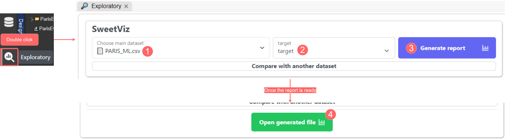
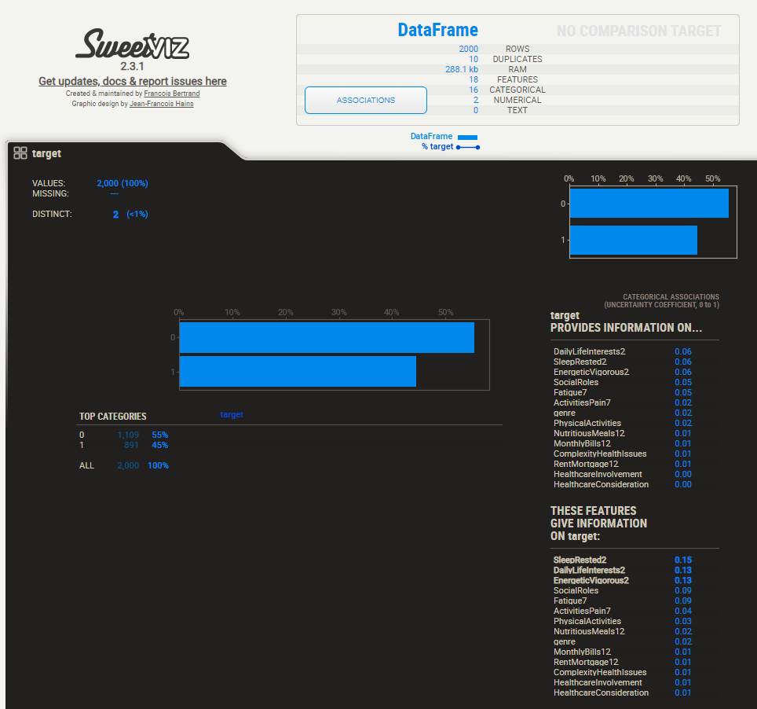
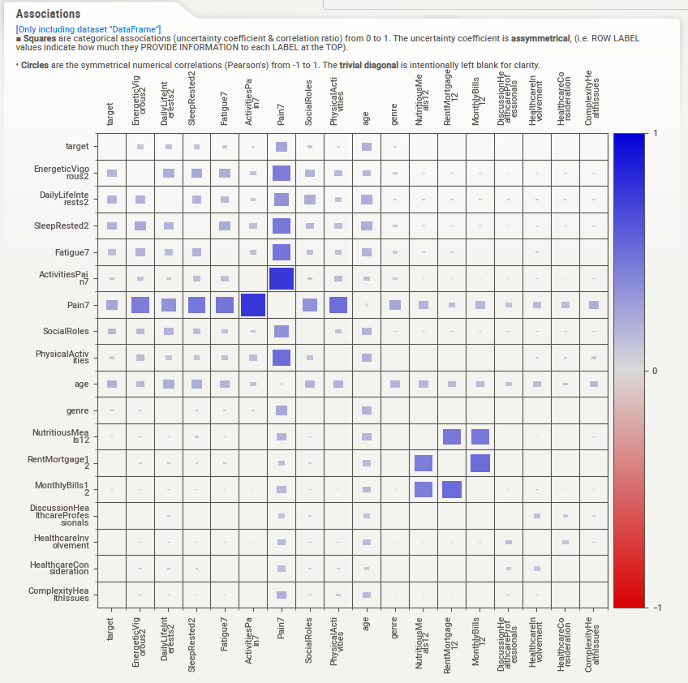

# Exploratory Module

Using the [Exploratory Module](../../tutorials/design/exploratory-module.md), we will explore the variables within our dataset before using them to train models in the Learning module. However, we will particularly focus on [sweetViz](../../tutorials/design/exploratory-module.md#id-1.-sweetviz), as it provides all the tools needed for this data analysis step, from feature analysis to correlation, and many other useful functionalities.

#### Generate a report

The first step is to generate a sweetViz report. Start by opening the Exploratory Module, and in the sweetViz section, select your dataset, your target variable, and then click Generate Report. These steps are illustrated in the figure below:

<figure><figcaption>
Generate a sweetViz report
</figcaption></figure>

Upon opening the HTML report, you will notice a breakdown of all the features present in the dataset file, starting with the target value and ending with the last column. The Target section illustrates the relationship between the target variable and other features. It quantifies how the target provides information to other features and vice versa. In our PoC (see report below), we can see that the target variable provides information for the following features:

* DailyLifeInterests2
* SleepRested2
* EnergeticVigorous2
* ...

Conversely, the following features provide information to target:

* SleepRested2
* DailyLifeInterests2
* EnergeticVigorous2
* ...

<figure><figcaption>
The sweetViz Target variable report for PARIS dataset
</figcaption></figure>

#### Associations

sweetViz provides a comprehensive Associations figure unifying all the analysis of relationships between different features in a dataset. The figure presents a pairwise relationship between all pairs of features in the dataset, with each square representing a categorical association between two features. The size and the colour of the square indicate the strength of the association, which varies from 0 to 1.

In this PoC, the resulting Associations figure is as follows:

<figure><figcaption>
PARIS Associations figure
</figcaption></figure>

According to the figure, we can notice multiple features having a strong association. Therefore, our PARIS dataset must be cleaned before using it in the Learning Module. For a pair of features with a strong combination, the one with the least association with the target will be removed. Using this approach, we decided to remove the following features:

* ActivitiesPain7
* DiscussionHealthcareProfessionals
* RentMortgage12
* HealthcareInvolvement
* HealthcareConsideration
* ComplexityHealthIssues

To do so, we will need the Input Module. This brings us to the next step of this demo. See you on the next page!
