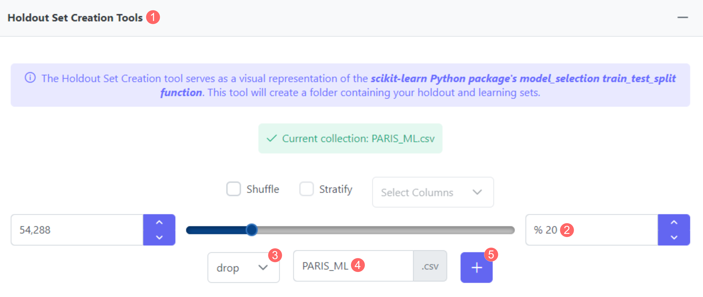

# Input Module

The [Input Module](../../tutorials/design/input-module/) provides multiple data processing key tools needed to fulfill various tasks within the MEDomics platform. In this Proof of Concept (PoC), we will use it for two main tasks: the deletion of associated features and the creation of a Holdout set.

#### Columns deletion

As we have seen in the previous step, multiple variables within our data are highly associated and must be removed. To do so, we will use the _Drop Columns Tools,_ which enables the deletion of multiple columns at once. First, open the Input Module, select your target CSV (`PARIS_ML.csv`), then scroll down to the Drop Columns tool. Next, select the following columns to be deleted:

* ActivitiesPain7
* DiscussionHealthcareProfessionals
* RentMortgage12
* HealthcareInvolvement
* HealthcareConsideration
* ComplexityHealthIssues

Once selected, choose a new name for the final set, then hit Create new dataset. All these steps are laid out in the figure below:

<figure><figcaption>
Fig 20 - How to drop columns from the PARIS CSV
</figcaption></figure>

#### Holdout set creation

After cleaning our dataset, the final step is to split our data into a learning set and a holdout set. For this task, we will use the _Holdout Set Creation Tools_. After selecting our final CSV (`PARIS_FINAL.csv`), keep the split percentage at 20%, "drop" as the empty cells cleaning method (feel free to test other options) and `PARIS_ML` as the new CSV name. Then hit the plus icon. This will create two new CSV datasets: `Holdout_PARIS_ML.csv` and `Learning_PARIS_ML.csv`. These steps are illustrated in the figure below:

<figure><figcaption>
Fig 21 - Create a holdout set for our final PARIS dataset
</figcaption></figure>

With the creation of the Holdout and the Learning sets, we conclude our Input Module step, and we can now start the machine learning phase.

#### _Extra: Other use cases_

Another key tool you should try before the machine learning step is the subset creation tool. This tool can be used to create new data or overwrite existing data based on different conditions. For example, it can be utilized to remove rows where the machine learning target variable is null or undefined.

<figure><figcaption>
Fig 22  - How to remove NaN target values from the PARIS set.
</figcaption></figure>

After that, you can overwrite the current dataset or create a new filtered one under a new name.

This concludes the third step of this PoC. Now our data is ready to tackle the machine learning prediction problem!
