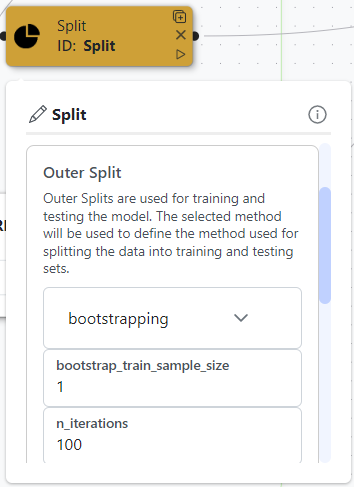

# Learning Module

As explained in the [Learning Module workflow](../../tutorials/development/learning-module/#the-learning-modules-architecture), it is highly recommended to start by conducting a comparison of machine learning algorithms using the Experiment scene before training a final model in the main scene. Thus, this process is separated into two steps: the experimentation step and the final model creation step.

### Experimenting: selecting the best ML algorithm

#### Scene Creation


Learn how to create an Experiment Scene [here](../../tutorials/development/learning-module/#how-to-create-a-scene).


Start by creating an Experiment scene in the Learning Module. Then, open your scene and use the following setup, by dragging, dropping and connecting nodes:

<figure><figcaption>
Fig 23 - PARIS Experiment Scene
</figcaption></figure>

For the Dataset node, use the following configuration:

* **Type**: Custom data file
* **Files**: Learning\_PARIS\_Final.csv (or any other given name to the learning set of the PARIS data)
* **Target**: target

<figure><figcaption>
Fig 24 - Dataset node configuration
</figcaption></figure>

No changes will be needed for the rest of the nodes, and once the scene is ready, click Run.

#### Experimental Scene Results


Models in Experimental scenes are trained and tested using a single iteration, resulting in a low bias but a high variance (uncertainty).


Once the results are ready, click the "See Results" button and select the "Compare Models" section. This will open a list of machine learning algorithms ranked by their performance on the task of predicting patients with emotional distress. For more clarity, the steps are illustrated in the figure below:

<figure><figcaption>
Fig 25 - Compare Models results
</figcaption></figure>

As shown in the results panel, the Random Forest model has the best performance; therefore, it will be used to train our final model in the main scene.

### Main scene: Final model training and evaluation

Now that we have selected the best-performing algorithm, we will train a final model, following the machine learning best practices, while focusing on optimizing the training process for better performance. For this purpose, create a Main Scene and apply the following setup:

<figure><figcaption>
Fig 26 - The Main Scene for PARIS data Emotional Distress prediction
</figcaption></figure>

#### Nodes configuration

Apply the following configurations for your nodes:

* **Dataset Node**: Use the learning set created in the previous step with the target column "target". Moreover, one-hot encoding is automatically applied when using PyCaret, and since our dataset does not require it, it will be deactivated by setting the `max_encoding_ohe` to 0. You can add this option by clicking the plus button on the node and enabling it. Finally, add the session\_id option and set it to a fixed number to control the randomness of the experiment.

<figure><figcaption>
Fig 27 - Dataset node configuration
</figcaption></figure>

<figure><figcaption>
Fig 28 - Extra option for the Dataset node
</figcaption></figure>

*   **Clean Node**: The default pyCaret's cleaning process already includes the necessary data processing steps, including:

    * &#x20;Data type inference: automatically detects data types.
    * Missing values imputation: 'Mean' imputation for numerical features, and 'Mode' imputation for categorical ones.
    * Categorical encoding: converts categories to integers.

    However, to simplify our model, a feature selection with a maximum of 5 final features is applied. Click on the Clean node, then click on the "+" button, and add the following options:

    * _**feature\_selection**_: to select a subset of features based on feature importance. Set to **True**.
    * _**feature\_selection\_estimator**_: classifier used to determine the importance. Set to '**lr' (logistic regression)**.
    * _**n\_features\_to\_select**_: maximum number of features to select. Set to **5**.

Feel free to test other cleaning options, such as adding a feature normalization process.&#x20;

<figure><figcaption>
Fig 29 - Setting feature selection inside the cleaning node
</figcaption></figure>

* **Split Node**: Use Bootstrap as the splitting method with 100 iterations. Set the stratification column to "_target_". Bootstrap helps in reducing the bias in the performance estimate.


If you would like to avoid long wait times, replace the 100-bootstrap method with **random subsampling** across 10 iterations.


<figure><figcaption></figcaption></figure>

<figure><figcaption>
Fig 30 - Split Node setup
</figcaption></figure>

* **Model Node**: Select "_Random Forest_" as our machine learning algorithm.

<figure><figcaption>
Fig 31 - Model Node setup
</figcaption></figure>

* **Train Model**: Enable tuning to adjust model hyperparameters and optimize performance.

<figure><figcaption>
Fig 32 - Train Model Node setup
</figcaption></figure>

* **Analyze Node**: No changes required, but feel free to change the metric to plot.

#### Run the scene and analyze the results

Once the scene is set up, hit the Run button, and track the execution process through the bottom progress bar. Once your results are ready, the "_**Analysis mode**_" button will be activated, and upon clicking on it, you will access the analysis panel at the bottom, where all the results will be displayed. Then select the model's performance results:

<figure><figcaption>
Fig 33 - Model results
</figcaption></figure>

The model has reached an AUC of 0.76, which is considered good, but there is always room for improvement. This performance showcases the potential of our model. It demonstrates how users with no prior programming experience can create exploitable models, thereby proving the utility of the MEDomics platform, particularly the Learning Module.

#### Finalize and save our model.

The final step is to retrain our model on the entire training set and save it for a final evaluation on the holdout set created in step 3. To do so, you can click the "_**Finalize & Save Model**_" button. This will retrain your model on the whole learning set using the same process as before. Once the model is saved, you should see it under the "models" subfolder of your scene folder.

<figure><figcaption>
Fig 34 - Main scene's tree
</figcaption></figure>

Once the model is saved, you're ready for the next and final step, where we will evaluate our model on the Holdout set, explain and analyze its predictions using the Evaluation Module.

#### _Extra: other configurations you can try_


For simplicity, we chose a model with only five features, but a better performance is achieved when the maximum number of features to use is not restricted.


The learning module has numerous parameters and functionalities, leading to a variety of configurations that can be implemented and tested. In this section, we retrain our model without setting a maximum feature number, which yielded the following results:

<figure><figcaption>
Fig 35 - Trained model's results
</figcaption></figure>

We strongly encourage you to experiment with various configurations and methods to possibly improve your results. In the following sections, we will assess the saved model on the holdout set.
