# Superset


[What is Superset?](../../tutorials/superset/)


### Initial steps

The initial step in this section is [launching and connecting to Superset](../../tutorials/superset/#launch-superset-button) within MEDomics.

Once you are connected and have access to the Superset dashboard, the next step is updating some security settings to enable external data upload. To do so, click on _Settings_, then _Database Connections_, select _Edit_ on the examples dataset, which is available by default in the database connections list. Finally, under the _Security_ section, in the _Advanced_ tab, enable "_Allow file uploads to database_." These steps are summarized in the figure below.

<figure>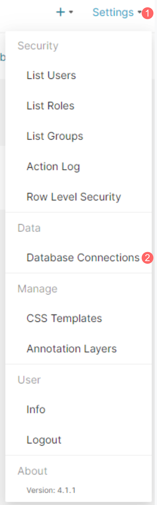<figcaption></figcaption></figure>

<figure>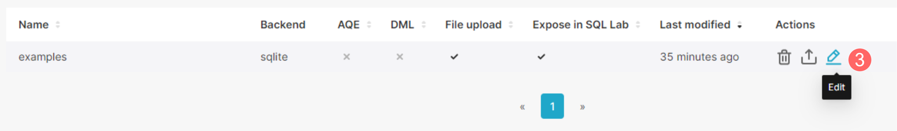<figcaption></figcaption></figure>

<figure>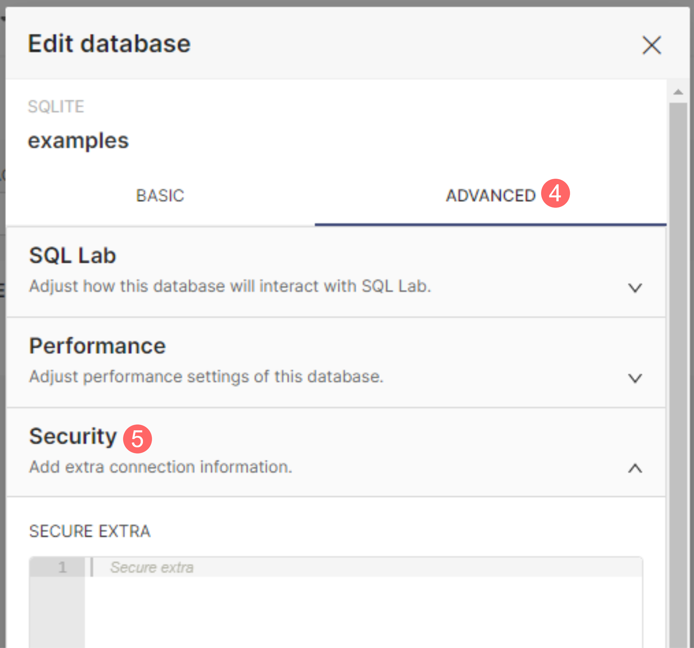<figcaption></figcaption></figure>

<figure>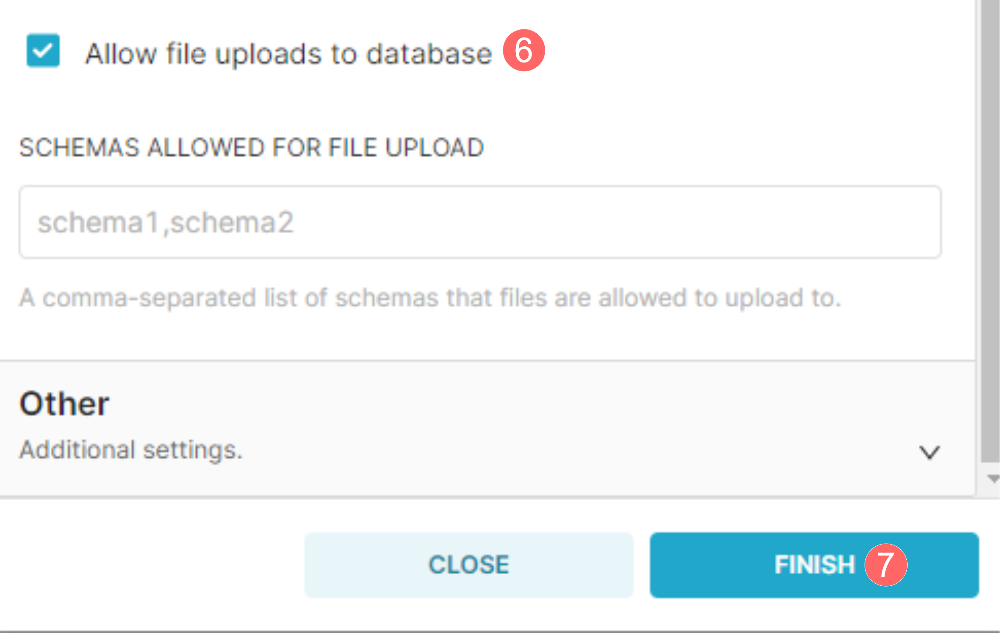<figcaption></figcaption></figure>

### Data visualization

#### _Upload Data_

Now that we have allowed CSV files to be uploaded to Superset, we can upload the PARIS data to start visualizing it. To do so, click the "+" icon to your right, select Data, then click "Upload CSV to database". Fill in the required information and click _Finish_. The instructions are depicted in the figures below:

<figure>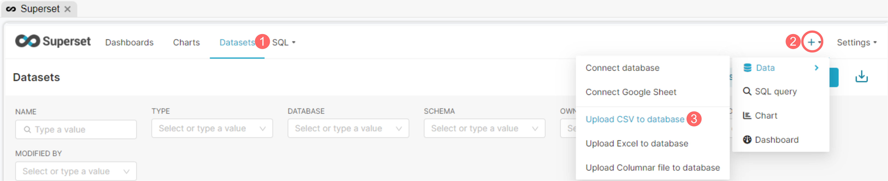<figcaption></figcaption></figure>

<figure>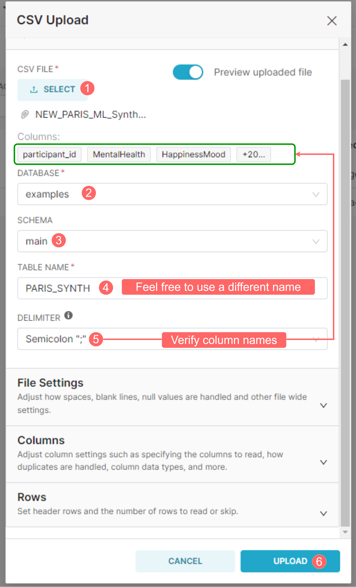<figcaption></figcaption></figure>

<figure>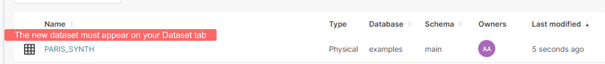<figcaption></figcaption></figure>

#### _Charts Creation_

Once your PARIS dataset is created, you can choose to create from a variety of charts. For example, we can create a pie chart to visualize differences in Genders among our questionnaire participants. The figure below shows the steps to follow:

<figure>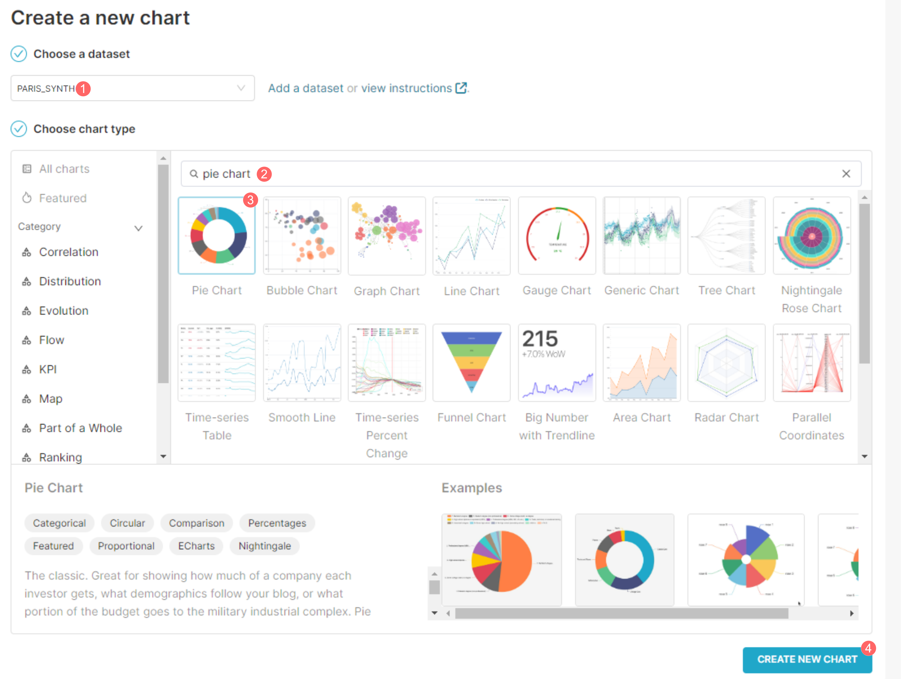<figcaption><p>Create a new pie chart</p></figcaption></figure>

After creating the chart, we will select the information we would like to visualize. To do so, look up the target column (Gender) and drag it to the Dimension box. Second, in the metric box, select the metric to display (COUNT). Finally, hit "Create Chart" to generate the chart, which should appear to the right of your screen. Once you're satisfied with your final chart, you can click "SAVE" to save it and add it to a dashboard.

<figure>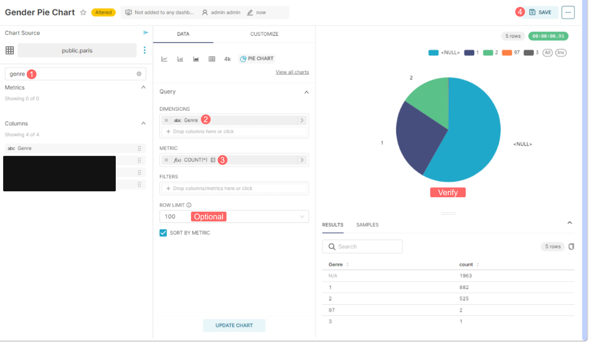<figcaption><p>Create a Gender data Pie Chart</p></figcaption></figure>

In this proof of concept, we suggest the creation of three charts, using the following configurations to create each one of them:

* **Total number of participants**:&#x20;
  * Chart's type: _BIG NUMBER_
  * Metric: _COUNT_&#x20;

<figure>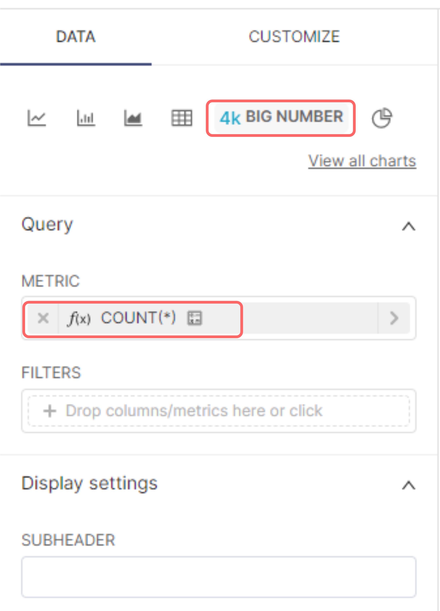<figcaption><p>Defining chat's settings</p></figcaption></figure>

* **Gender Distribution**:
  * Chart's type: _PIE CHART_
  * Dimensions: _Gender_
  * Metric: _COUNT_

<figure>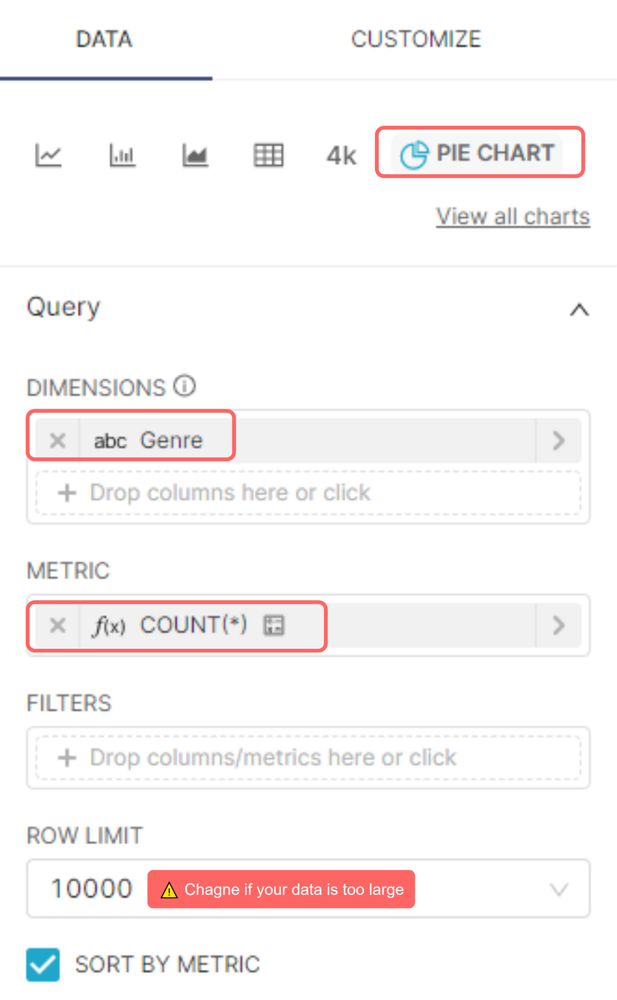<figcaption><p>Defining chat's settings</p></figcaption></figure>

* **Age Distribution**:
  * Chart's type: _BAR CHART_
  * X-Axis: _Age_
  * Metric: _COUNT_&#x20;

<figure>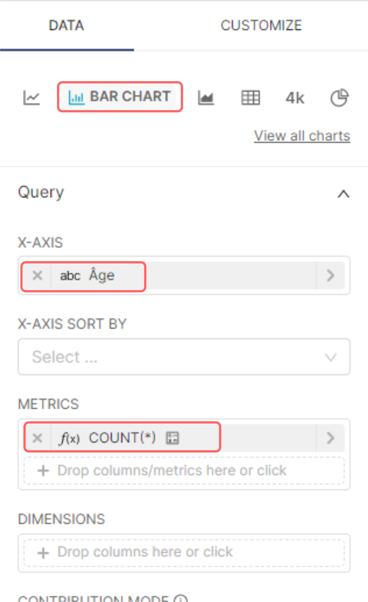<figcaption><p>Defining chat's settings</p></figcaption></figure>

#### _Dashboards Creation_

The Superset dashboards are interactive visual data displays, created using the Superset charts. Therefore, the charts made in the previous section can be utilized to create a single dashboard to interact with our data, monitoring key metrics, statistics, etc. To create a dashboard, follow the steps laid out in the figure below:

<figure><figcaption><p>Creating a Superset Dashboard and adding charts to it</p></figcaption></figure>

#### _Final dashboard_


Do not hesitate to create a more beautiful dashboard!


Once all your charts have been imported and organized in your dashboard, you should have a similar result:

<figure><figcaption><p>PARIS final dashboard</p></figcaption></figure>

#### _Using Filters_

In Superset dashboards, you can use filters to explore data dynamically. They enable users to explore data displayed based on a specific criterion, metric, etc., without modifying the underlying queries.

Part of this POC is the application of filters to our final dashboard, to help display data according to predefined criteria. To do so, follow the instructions laid out below:

<figure>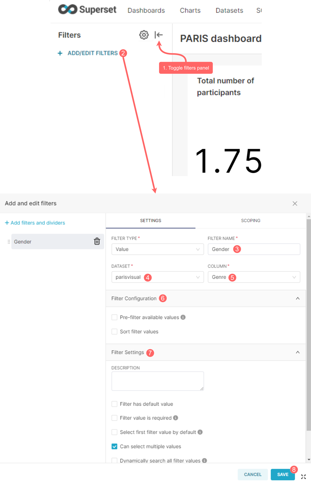<figcaption><p>How to implement new filters into your dashboard</p></figcaption></figure>

You now have a functioning interactive dashboard to explore your questionnaire data. Feel free to add new charts, filters, or create new dashboards.&#x20;

Superset has many useful tools that cannot all be covered in this proof of concept. Therefore, we recommend checking the [Superset's documentation](https://superset.apache.org/docs/intro/) for more insights on how to use this tool to explore your dataset.

#### Export data to workspace


[Skip this step](exploratory-module.md) if you have access to synthetic data.


In this last step, we will use Superset to export the data needed for the rest of the PoC to our workspace. First, in the Superset's SQL Lab, run the following command:

```sql
SELECT * FROM paris_ml; --change paris_ml to your dataset's name
```

Before clicking run, change the row limit according to your dataset's size. Once the query is executed, you can click Download to CSV and save the retrieved data to your DATA folder under your Workspace (we recommend using the name `PARIS_ML.csv` for the sake of consistency with the rest of the steps). Finally, refresh your workspace and ensure your file is there. The instructions are summarized in the following figure:

<figure>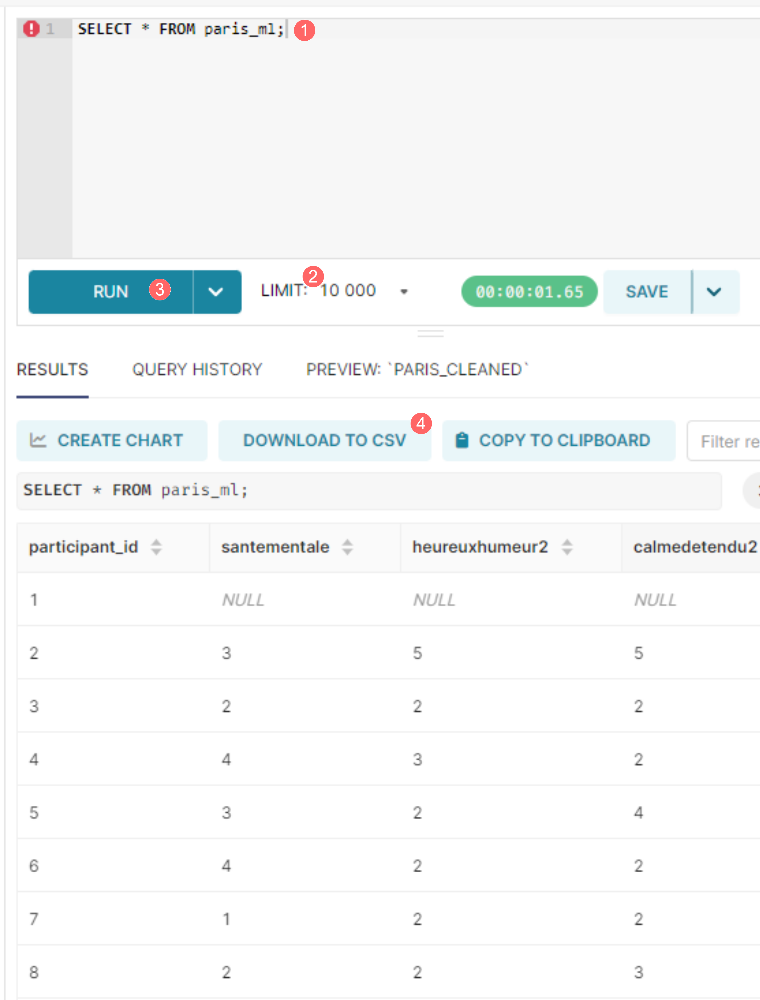<figcaption><p>How to export your dataset as a CSV file</p></figcaption></figure>

This concludes the first step of this PoC. In the next one, we will dive deeper into the exploration of the dataset using the Exploratory Module.
