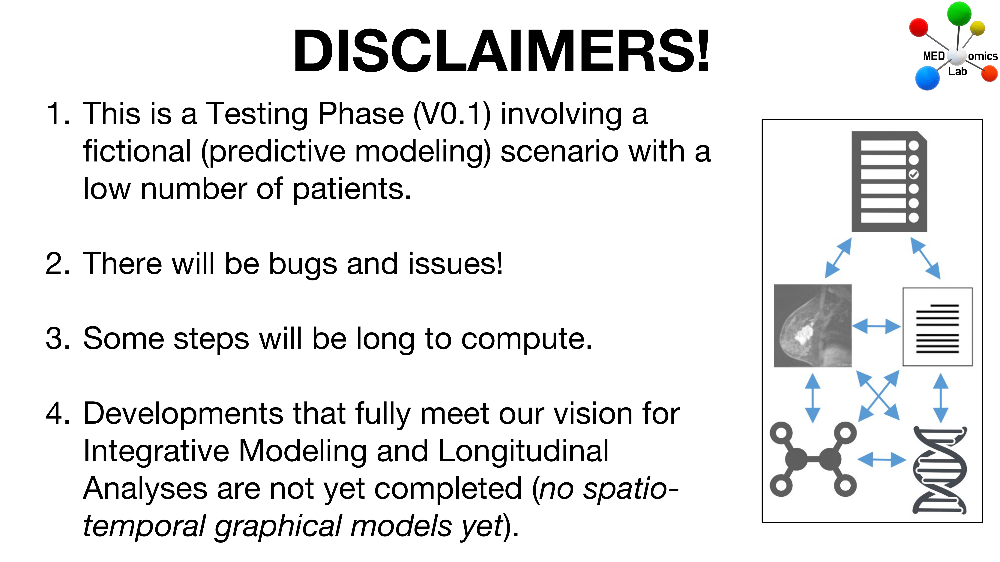
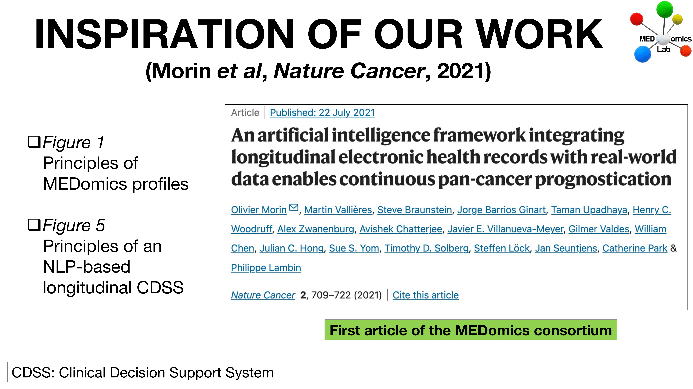
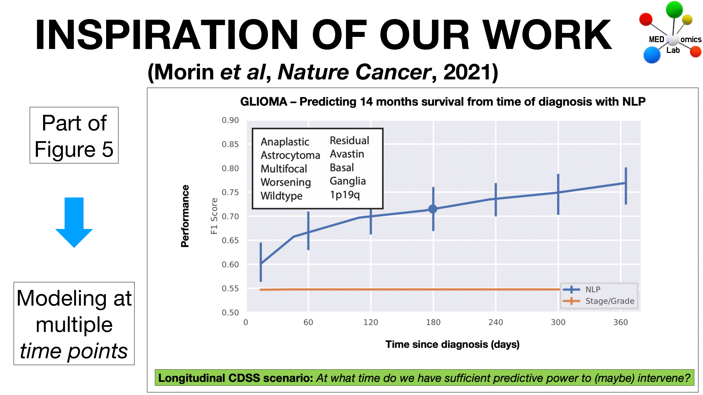

# 📄 Testing Phase with MIMIC

## Overview

During the Winter 2024 semester, the first Testing Phase of [MEDomicsLab](https://github.com/MEDomics-UdeS/MEDomicsLab) will take place via a series of tutorials. For an overview of the vision that we have for the platform, please [go here](../#an-overview-of-medomicslab).

We would love to have you join the effort and provide feedback during this Testing Phase, prior to a first official release of MEDomicsLab! Our intent is to properly recognize all the participants of the Testing Phase when the first official release will come.

<figure><figcaption></figcaption></figure>

<figure><figcaption></figcaption></figure>

<figure><figcaption></figcaption></figure>

**See the list of participants** [here](https://docs.google.com/spreadsheets/d/1w4n2gygstxnrFSzAi1LqGsxgCVYa1Odyb8vl9huu-kU/).

We anticipate that the **participation in the Testing Phase will involve 1 hour of work per week for 17 consecutive weeks, starting January 15, 2024.** We are thinking of involving some mini-challenges with prizes, so this could be fun! Please also note that no programming is involved and that the tutorials can be performed on a laptop.


The participation in the Testing Phase require [mimic-data-access.md](mimic-data-access.md "mention").


Please note that an **Information Session** about the Testing Phase was held on December 15, 2023. You can find the recording of the session below :


Recording of the Information Session


The schedule of the Testing Phase (2024) and series of tutorials are planned as follows:

<table><thead><tr><th width="98.33333333333331">Step</th><th width="421">Description</th><th>Dates</th></tr></thead><tbody><tr><td>1</td><td><a href="step-1.md">Install and Explore</a></td><td>Jan 15 – Jan 29</td></tr><tr><td>2</td><td><a href="step-2.md">Extract Data</a></td><td>Jan 29 – Feb 12</td></tr><tr><td>3</td><td><a href="step-3.md">Prepare ML tables</a></td><td>Feb 12 – Feb 26</td></tr><tr><td>4</td><td><a href="step-4.md">Explore Data</a></td><td>Feb 26 – Mar 11</td></tr><tr><td>5</td><td><a href="step-5.md">Vacations</a></td><td>Mar 11 – Mar 25</td></tr><tr><td>6</td><td><a href="step-6.md">Create Model</a></td><td>Mar 25 – Apr 8</td></tr><tr><td>7</td><td><a href="step-7.md">Evaluate &#x26; Apply Model</a></td><td>Apr 8 – Apr 22</td></tr><tr><td>8</td><td><a href="step-8.md">Challenge</a></td><td>Apr 22 – May 13</td></tr></tbody></table>

**If you want to participate, please** [**register here**](../forms/join-the-testing-phase.md) **!**

## How to be part of the testing phase?

Click here :point\_right: [join-the-testing-phase.md](../forms/join-the-testing-phase.md "mention")

**People who already joined** :see\_no\_evil:&#x20;



You are also welcome to join us on Discord: [here](https://discord.gg/ZbaGj8E6mP)

_The MEDomicsLab team_
