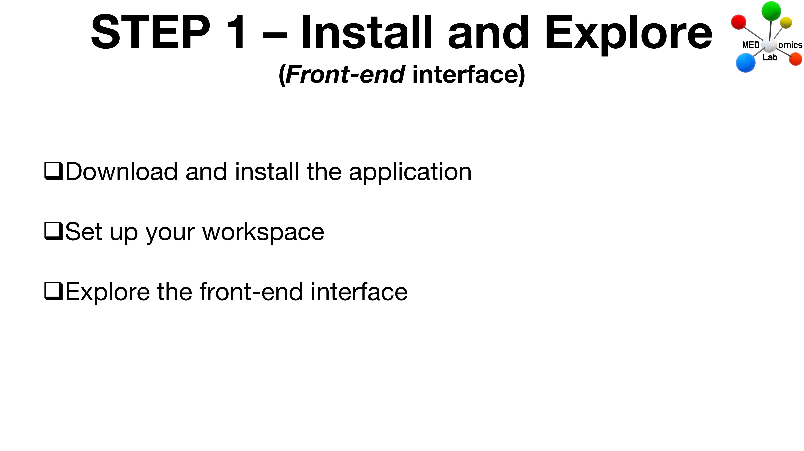

# Step 1 : Install and Explore

<figure><figcaption>
Step 1 - Install and Explore
</figcaption></figure>

Welcome to Step 1 of the Testing Phase of the MEDomicsLab platform!

This step, divided into three parts, consists of installing the MEDomicsLab platform and exploring it by configuring your workspace.&#x20;

## 1. Download and install the application

Depending on your Operating System, follow the corresponding tutorial video on the [Quick Start](../quick-start.md) page.

## 2. Set up your workspace & 3. Explore the front-end interface

* Download the [Kaggle dataset 'breast\_cancer'](https://www.kaggle.com/datasets/uciml/breast-cancer-wisconsin-data) (used in the [Overview](../overview.md) video tutorial).
* Replicate the steps demonstrated in the [Overview](../overview.md) video.

***

Remember that the goal of the Testing Phase is to gather your feedback and detect bugs in the application. You can report them using the following forms in our GitBook:

* [Contact us](../forms/contact-us.md)
* [Report an issue](../forms/report-an-issue.md)


The message you write in the [Contact us](../forms/contact-us.md) form will be sent to the MEDomicsLab team only and will not be made public.



The [Report an Issue](../forms/report-an-issue.md) form will add an issue on the [MEDomicsLab GitHub repository](https://github.com/MEDomics-UdeS/MEDomicsLab/issues) (public).



Contact us and Report an issue: how to use the forms


***


If you encounter any problem, don't hesitate to consult the [Troubleshooting](../troubleshooting.md) page.



If you have questions, don't hesitate to consult the [FAQ](../faq.md) page.



For any other inquiries, remember that you can join our [Discord](https://discord.com/invite/ZbaGj8E6mP) to chat with us!

