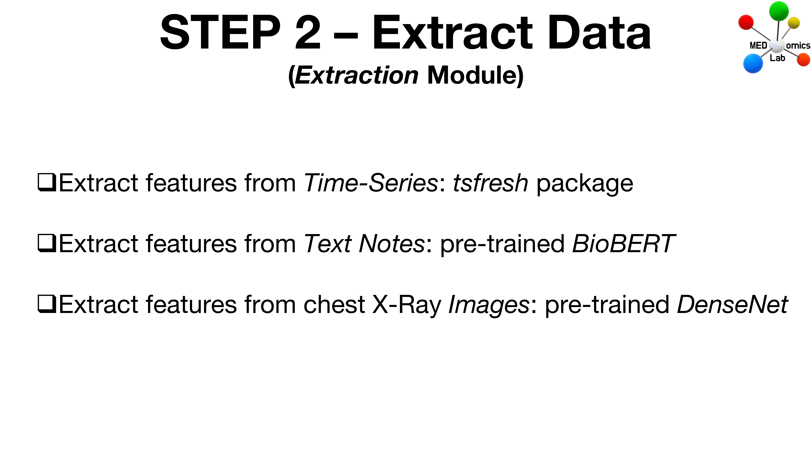

# Step 2: Extract Data

<figure><figcaption>
Step 2 - Extract Data
</figcaption></figure>


This is the step where coffee breaks will be the most useful (a considerable amount of computation time will be required in this step) :wink:.


## About the data

The Testing Phase of MEDomicsLab involves the use of MIMIC data. For the purpose of the Testing Phase, we selected a small subset of patients (200) with the intent of simulating a longitudinal clinical decision support system (CDSS) scenario as in the study of [Morin et al.](https://www.nature.com/articles/s43018-021-00236-2) (see Figure 5) using multimodality data (tabular, time series, text, images) acquired from multiple patient visits over a year (i.e. all data from the last year since death or the last visit of a given patient). In the subsequent steps of the Testing Phase, one of the goal will be to predict one-year mortality using this data.

In this step of the Testing Phase, we will extract relevant features from time series, text and imaging data based on the package [_tsfresh_](https://tsfresh.readthedocs.io/en/latest/) (time series) and pretrained models from the study of [Soenksen et al.](https://www.nature.com/articles/s41746-022-00689-4) (text and images). More specifically, this includes:

* Their images from the MIMIC-CXR-JPG database
* Their laboratory events (time series) from the MIMIC-IV database (we considered a subset of events as in the study of [Soenksen et al.](https://www.nature.com/articles/s41746-022-00689-4))
* Their chart events (time series) from the MIMIC-IV database (we considered a subset of events as in the study of [Soenksen et al.](https://www.nature.com/articles/s41746-022-00689-4))
* Their procedure events (time series) from the MIMIC-IV database (we considered a subset of events as in the study of [Soenksen et al.](https://www.nature.com/articles/s41746-022-00689-4))
* Their radiology notes from the MIMIC-IV-Note database
* Their discharge notes from the MIMIC-IV-Note database&#x20;

Finally, note that the criterion for selecting patients for the Testing Phase (100 alive and 100 deceased after one year) was based on the maximization of the entropy of the distribution of multimodal data over one year.

## Get the data for this step


At this point you must have completed the[ MIMIC data access](mimic-data-access.md) requirements to have access to the data.


Once you have submitted the required documents to the MEDomicsLab team, you will receive an email with a link to a drive space, containing a zip folder. Simply download the folder into your documents, and follow the instructions for Step 2 in the video below.&#x20;

## Extract Data

For additional informations about the extraction module and the extraction types used in our application, please refer to the tutorials of the [_Extraction Module_](../tutorials/design/extraction-modules/).

## Instructions for Step 2 - Extract Data



**Content**

&#x20;Get data and create your workspace [0:00](https://www.youtube.com/watch?v=vIPnv4JBnL0\&t=0s)

&#x20;Extract data from discharge notes [1:32](https://www.youtube.com/watch?v=vIPnv4JBnL0\&t=92s)

&#x20;Extract data from radiology notes [2:52](https://www.youtube.com/watch?v=vIPnv4JBnL0\&t=172s)

&#x20;Extract data from chart events [3:26](https://www.youtube.com/watch?v=vIPnv4JBnL0\&t=206s)

&#x20;Extract data from laboratory events [4:51](https://www.youtube.com/watch?v=vIPnv4JBnL0\&t=291s)

&#x20;Extract data from procedure events [5:50](https://www.youtube.com/watch?v=vIPnv4JBnL0\&t=350s)

&#x20;Extract data from chest X-Ray images [6:59](https://www.youtube.com/watch?v=vIPnv4JBnL0\&t=419s)


NOTE : We commonly refer to the study of [Soenksen et al.](https://www.nature.com/articles/s43018-021-00236-2) as the "HAIM study".

