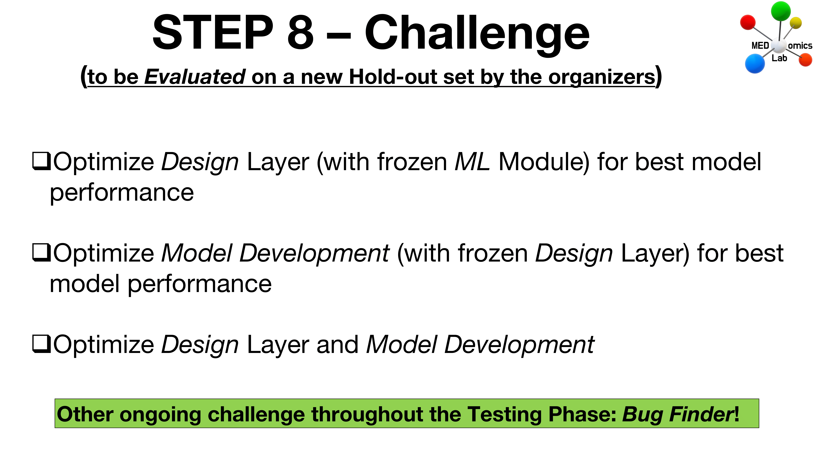

# Step 8: Challenge

<figure><figcaption>
Step 8 - Challenge
</figcaption></figure>


This step will require you to download the new learning set that we sent you (_MEDomicsLab\_TestingPhase\_Step8.zip_). This set comprises four datasets (one for each time point), combining the learning and holdout sets obtained in [_Step 4 - Explore Data_](step-4.md).

An invitation to access the _MEDomicsLab\_TestingPhase\_Step8.zip_ data has been sent via email.


Welcome to the final step of the MEDomicsLab Testing Phase! We appreciate your engagement throughout this journey.

In _Step 8 - Challenge_, you'll leverage the knowledge you've gained from the MEDomicsLab platform in the preceding steps of the Testing Phase. Since the tasks to be accomplished depend on your choices, there isn't an instructional video for this step.

The objective here is to optimize the use of the MEDomicsLab platform through a new experiment, which will be evaluated using a fresh, private holdout set from the [MIMIC](https://mimic.mit.edu/) database. Considering our growing familiarity with the MEDomicsLab platform and the insights gained during the Testing Phase, we've updated the rules for this step. There will be a singular challenge that involves manipulations in the [_Development Layer_](../tutorials/development/) only.

## Recommendations

Before proceeding with _Step 8 - Challenge_ of the MEDomicsLab Testing Phase, we recommend revisiting the page related to [_Step 5 - Create Model_](step-5.md).


[step-5.md](step-5.md)


## Instructions for Step 8 - Challenge

* Download the new learning set provided in _MEDomicsLab\_TestingPhase\_Step8.zip_.
* Create a model following the instructions from [_Step 5 - Create Model_](step-5.md) in the [_Learning Module_](../tutorials/development/learning-module.md). Follow these guidelines for creating the best model:
  * Train, optimize, and test models.
  * Compare different data combinations at different time points.
  * Choose a learning hypothesis and create a final model.
* Once you believe you have the best model for the experiment, submit your model as you did at the end of [_Step 5 - Create Model_](step-5.md).&#x20;


After the conclusion of the Testing Phase on May 13, we will assess the models submitted by all participants and establish a ranking through an evaluation using our private holdout set. Following this, we will communicate the ranking and announce the winner of this Challenge.

Additionally, we will reveal the winner of another challenge in this Testing Phase: the individual who discovered the most bugs in our application!

