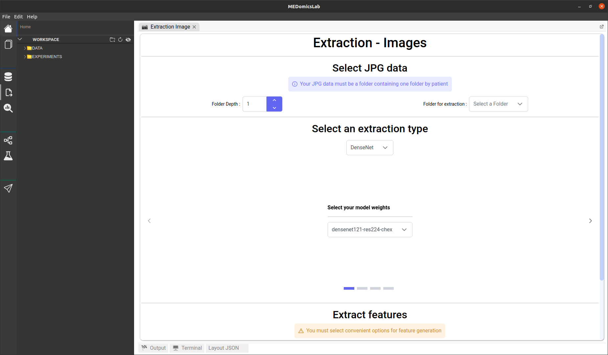
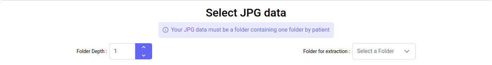
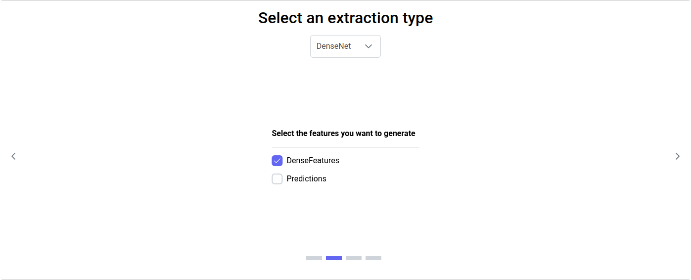
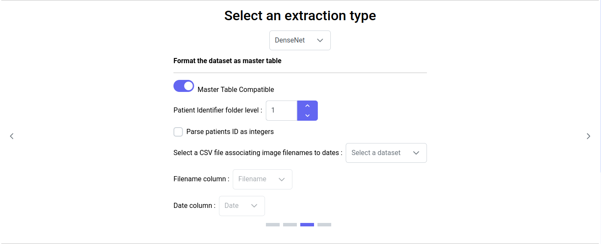

# Image Extraction Page

When you click on the image extraction icon, you should see this page :

<figure><figcaption>
Extraction image page
</figcaption></figure>

## 1. Select JPG data

The first step on this page is to select your input, which is a folder containing folders containing JPG images. The folders contained in the main folder must correspond to patients (one folder by patient). If your patients folders contain subfolders (for example if your JPG images are divided into admissions subfolders for each patient), you must increase the Folder Depth according to the subfolder hierarchy in order to update the available folder list.

<figure><figcaption></figcaption></figure>

## 2. Select an extraction type


For now, only the DenseNet extraction type is available.


### 2.1. DenseNet

This extraction type uses the pre-trained DenseNet model from the TorchXRayVision python library : [https://mlmed.org/torchxrayvision/models.html](https://mlmed.org/torchxrayvision/models.html). TorchXRayVision is a library of chest X-ray datasets and models, indeed this model is intend to be used on chest radiographies.&#x20;

#### 2.2.1. Select your model weights

The TorchXRayVision library provide seven different weights for the DenseNet model that are available in our application. By default we set the weights 'densenet121-res224-chex'.

<figure><figcaption>
Select your model weights
</figcaption></figure>

#### 2.1.2. Select the features you want to generate

The TorchXRayVision DenseNet model provide an vector of 1024 densefeatures and a vector of 18 prediction for the following targets : Atelectasis, Consolidation, Infiltration, Pneumothorax, Edema, Emphysema, Fibrosis, Effusion, Pneumonia, Pleural\_Thickening, Cardiomegaly, Nodule, Mass, Hernia, Lung Lesion, Fracture, Lung Opacity, Enlarged Cardiomediastinum.

You may choose to generate only the densefeatures, only the predictions or both.

<figure><figcaption>
Select the features you want to generate
</figcaption></figure>

#### 2.1.3. Format the dataset as master table

Regardless of the selected options, there is a toggle button indicating whether you want your generated embeddings to be Master Table Compatible. Turning this option on will generate embeddings that can be used in the MEDprofiles' process within the input module. The tables generated for the MEDprofiles' process may contain less or different information than the original tables.&#x20;

For the images extraction, turning this option on will require a CSV file that associates the image filenames (including the .jpg extension) to a datetime. Also you have to indicate wich folder level correspond to the patients identifiers and there is a checkbox that allows you to convert the patients identifiers folder name into integers (for example if a folder name is 'p123', it will be converted into '123' in the generated embeddings table). This option is useful if you want to compare the patients image data to other data types where the patients identifiers are numbers.

<figure><figcaption>
Format the dataset as master table
</figcaption></figure>

#### 2.1.4. Column name prefix

You can choose a prefix to assign to the generated embeddings column names. This is useful for entering the MEDprofiles' process in the input module, especially for creating MEDclasses that depend on this prefix column name. The prefix must consist only of letters and/or numbers and cannot be empty. The default prefix is 'img'.

<figure><figcaption>
Column name prefix
</figcaption></figure>

## 3. Extract features

Once all the previous steps have been completed, you can proceed to feature extraction. If a warning appears stating, 'You must select convenient options for feature generation,' and the 'Extract Data' button is disabled, please check if you have provided all the required information in the 'Select an Extraction Type' section.&#x20;

In this section, you can specify the filename under which you want to save your generated embeddings. The filename must be followed by the .csv extension, composed only of letters, numbers, and/or the '\_' character, and cannot be empty. The default filename is 'image\_extracted\_features.csv.' The file will be saved under DATA/extracted\_features.&#x20;

Finally, you can initiate the extraction process by clicking the 'Extract Data' button. This may take a few minutes, and the progress will be displayed in this section and in the output tab.

<figure><figcaption>
Extract features
</figcaption></figure>

## 4. Extracted data

Once the extraction process is complete (which may take a few minutes, but you can monitor the progress on the output tab), a message will appear at the bottom of the page indicating where the features have been saved. You can review your results in the 'Extracted Data' section by toggling on the switch. Alternatively, you can open your generated CSV file in your workspace.

<figure><figcaption>
Section extracted data while features have been generated
</figcaption></figure>
