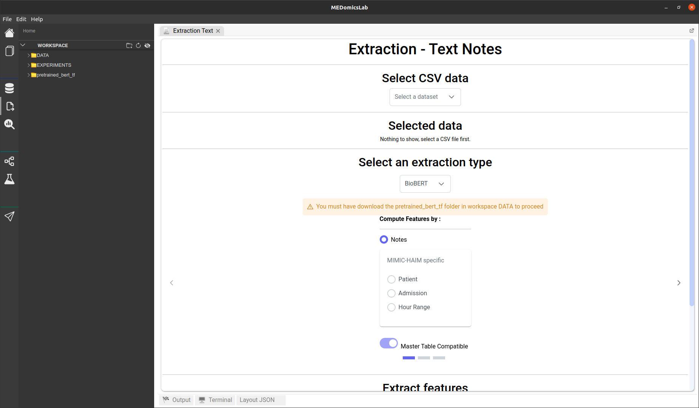
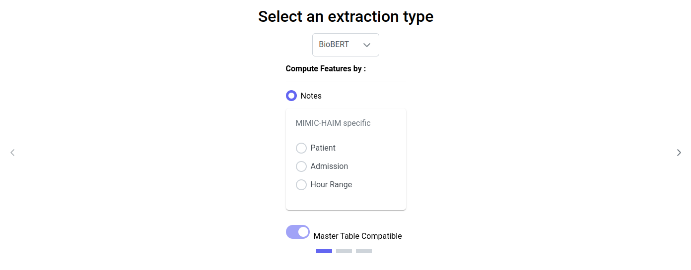
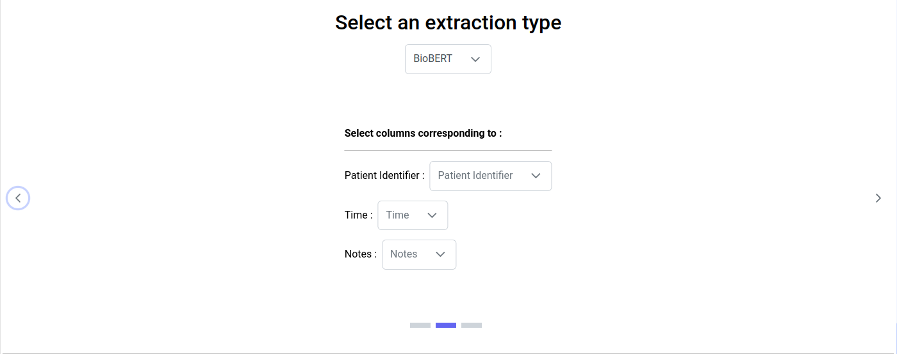
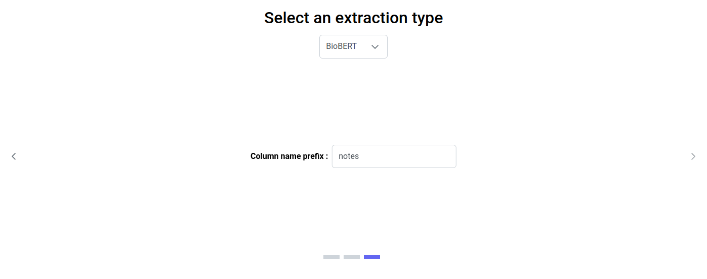
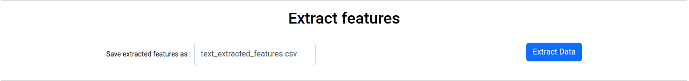
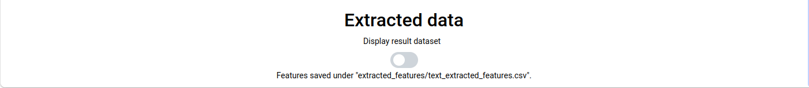

# Text Extraction Page

When you click on the text extraction icon, you should see this page :

<figure><figcaption>
Extraction text page
</figcaption></figure>

## 1. Select CSV data

The first step on this page is to select your input, which is a CSV file that must contain at least one column with patient identifiers, a column with dates, and a column with text notes.

## 2. Selected data

Once you have selected your data, it will be displayed in the 'Selected data' section.

## 3. Select an extraction type


For now, only the BioBERT extraction type is available.


### 3.1. BioBERT

This extraction type uses the pre-trained BioBERT model, which is a biomedical language representation model designed for biomedical text mining : [https://arxiv.org/abs/1901.08746](https://arxiv.org/abs/1901.08746).


Before proceeding with the extraction, you must download the pre-trained BioBERT weights into your workspace's DATA folder. The weights can be obtained from the following link: [https://github.com/EmilyAlsentzer/clinicalBERT](https://github.com/EmilyAlsentzer/clinicalBERT). Ensure that you add the 'pretrained\_bert\_tf' folder under DATA, and this folder must contain, at the very least, a subfolder named 'biobert\_pretrain\_output\_all\_notes\_150000.' Additionally, make sure the json file in this subfolder is named 'config.json.' If a warning appears on the page, it indicates that the pre-trained weights haven't been found in your DATA folder. Try reloading the page after adding them.


#### 3.1.1. Compute Features by

You have several options for extraction:

* The default option is '**Notes**': you will obtain one embedding vector per text note.
* If you choose the '**Patient**' option, you will obtain one embedding vector per patient, computed as the mean of all generated embeddings for all text notes associated with that patient.
* If you choose the '**Admission**' option, you will obtain one embedding vector per patient admission, computed as the mean of all generated embeddings for all text notes associated with that admission.
* If you choose the '**Hour Range**' option, you will obtain one embedding vector for every selected hour range per patient, computed as the mean of all generated embeddings for all text notes within the specified hour range.

<figure><figcaption>
BioBERT extraction options
</figcaption></figure>

Regardless of the selected option, there is a toggle button indicating whether you want your generated embeddings to be Master Table Compatible. Turning this option on will generate embeddings that can be used in the MEDprofiles' process within the input module. The tables generated for the MEDprofiles' process may contain less information than the original tables. The toggle button is disabled if the two formats (Master Table Compatible or not) are exactly the same for the selected option.

#### 3.1.2. Select columns corresponding to

Depending on the options selected earlier, you need to choose the dataset columns that correspond to the necessary information for feature generation. The column selection for each required information will be filtered by types (for example, if the required information is time, only the columns in your data table containing date-time types will be displayed).

<figure><figcaption>
Columns selection for embeddings generation by notes
</figcaption></figure>

#### 3.1.3. Column name prefix

You can choose a prefix to assign to the generated embeddings column names. This is useful for entering the MEDprofiles' process in the input module, especially for creating MEDclasses that depend on this prefix column name. The prefix must consist only of letters and/or numbers and cannot be empty. The default prefix is 'notes'.

<figure><figcaption>
Column name prefix
</figcaption></figure>

## 4. Extract Features

Once all the previous steps have been completed, you can proceed to feature extraction. If a warning appears stating, 'You must select convenient options for feature generation', and the 'Extract Data' button is disabled, please check if you have provided all the required information in the 'Select an Extraction Type' section.

In this section, you can specify the filename under which you want to save your generated embeddings. The filename must be followed by the .csv extension, composed only of letters, numbers, and/or the '\_' character, and cannot be empty. The default filename is 'text\_extracted\_features.csv.' The file will be saved under DATA/extracted\_features.

Finally, you can initiate the extraction process by clicking the 'Extract Data' button. This may take a few minutes, and the progress will be displayed in this section and in the output tab.

<figure><figcaption>
Extract features
</figcaption></figure>

## 5. Extracted data

Once the extraction process is complete (which may take a few minutes, but you can monitor the progress on the output tab), a message will appear at the bottom of the page indicating where the features have been saved. You can review your results in the 'Extracted data' section by toggling on the switch. Alternatively, you can open your generated CSV file in your workspace.

<figure><figcaption>
Section Extracted data while features have been generated
</figcaption></figure>
