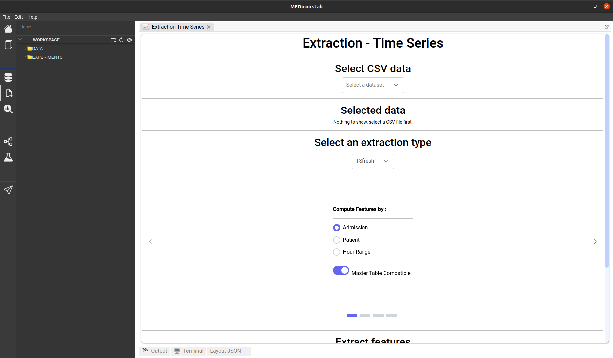
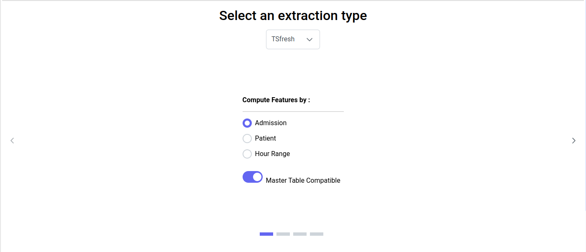
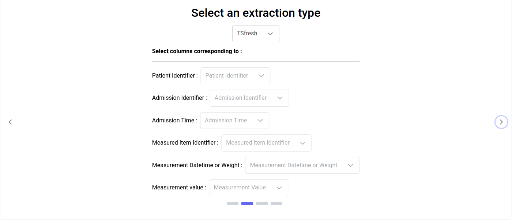
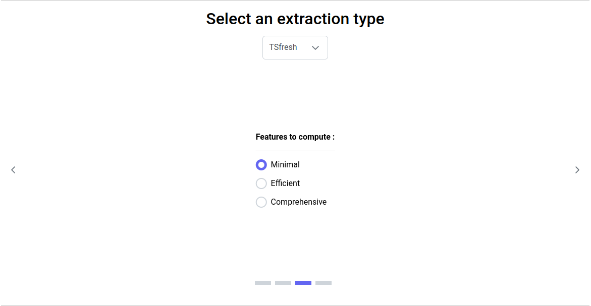
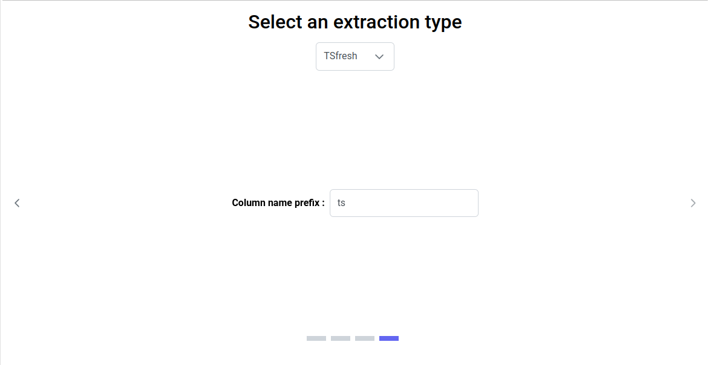
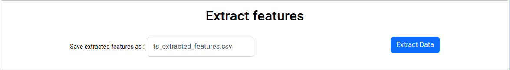

# Time Series Extraction Page

When you click on the time series extraction icon, you should see this page :

<figure><figcaption>
Extraction time series page
</figcaption></figure>

## 1. Select CSV data

The initial step on this page is to select your input, which is a CSV file that must contain at least one column with patient identifiers, a column with dates, a column with item identifiers, a column with associated item weights (which may be a date-time or a numerical value), and a column with associated item values.

## 2. Selected data

Once you have selected your data, it will be displayed in the 'Selected Data' section.

## 3. Select an extraction type


For now, only the TSfresh extraction type is available.


### 3.1. TSfresh

This extraction type utilizes the Python package TSfresh, which enables the computation of a wide range of time series characteristics: [https://tsfresh.readthedocs.io/en/latest/](https://tsfresh.readthedocs.io/en/latest/).

#### 3.1.1. Compute features by

You have several options for extraction:

* The default option '**Admission**' will generate one embedding vector per patient admission, computed with all measurements associated with that admission.
* If you choose the '**Patient**' option, you will obtain one embedding vector per patient, with all measurements associated with that patient.
* If you choose the '**Hour Range**' option, you will obtain one embedding vector for every selected hour range per patient, computed with all measurements taken within the specified hour range.

<figure><figcaption>
TSfresh extraction options
</figcaption></figure>

Regardless of the selected option, there is a toggle button indicating whether you want your generated embeddings to be Master Table Compatible. Turning this option on will generate embeddings that can be used in the MEDprofiles' process within the input module. The tables generated for the MEDprofiles' process may contain less information than the original tables. The toggle button is disabled if the two formats (Master Table Compatible or not) are exactly the same for the selected option.

#### 3.1.2. Select columns corresponding to

Depending on the options selected earlier, you need to choose the dataset columns that correspond to the necessary information for feature generation. The column selection for each required information will be filtered by types (for example, if the required information is time, only the columns in your data table containing date-time types will be displayed).

<figure><figcaption>
Columns selection for embeddings generation by admission
</figcaption></figure>

#### 3.1.3. Features to compute

Regardless of the options selected earlier, you can choose between three methods of feature computation: Minimal, Efficient, and Comprehensive. These options represent predefined sets of features provided by the TSfresh package: [https://tsfresh.readthedocs.io/en/latest/text/feature\_extraction\_settings.html](https://tsfresh.readthedocs.io/en/latest/text/feature\_extraction\_settings.html). Specifically, the three options are defined as follows:

* **Minimal**: Relies on `tsfresh.feature_extraction.settings.MinimalFCParameters` and includes only a handful of features. It is suitable for quick tests.
* **Comprehensive**: Relies on `tsfresh.feature_extraction.settings.ComprehensiveFCParameters` and includes all features without parameters and all features with parameters, each with different parameter combinations. This is the default option in TSfresh.
* **Efficient**: Relies on `tsfresh.feature_extraction.settings.EfficientFCParameters` and includes mostly the same features as in `tsfresh.feature_extraction.settings.ComprehensiveFCParameters`, excluding features marked with the 'high\_comp\_cost' attribute. This option is useful if runtime performance is a critical factor.

The default option is set to 'Minimal' to reduce computation time.

<figure><figcaption>
Features to compute
</figcaption></figure>

#### 3.1.4. Column name prefix

You can choose a prefix to assign to the generated embeddings column names. This is useful for entering the MEDprofiles' process in the input module, especially for creating MEDclasses that depend on this prefix column name. The prefix must consist only of letters and/or numbers and cannot be empty. The default prefix is 'ts'.

<figure><figcaption>
Column name prefix
</figcaption></figure>

## 4. Extract features

Once all the previous steps have been completed, you can proceed to feature extraction. If a warning appears stating, 'You must select convenient options for feature generation', and the 'Extract Data' button is disabled, please check if you have provided all the required information in the 'Select an Extraction Type' section.&#x20;

In this section, you can specify the filename under which you want to save your generated embeddings. The filename must be followed by the .csv extension, composed only of letters, numbers, and/or the '\_' character, and cannot be empty. The default filename is 'ts\_extracted\_features.csv.' The file will be saved under DATA/extracted\_features.&#x20;

Finally, you can initiate the extraction process by clicking the 'Extract Data' button. This may take a few minutes, and the progress will be displayed in this section and in the output tab.

<figure><figcaption>
Extract features
</figcaption></figure>

## 5. Extracted data

Once the extraction process is complete (which may take a few minutes, but you can monitor the progress on the output tab), a message will appear at the bottom of the page indicating where the features have been saved. You can review your results in the 'Extracted data' section by toggling on the switch. Alternatively, you can open your generated CSV file in your workspace.


Some of the feature options may generate datasets that are too large to be displayed on the extraction page. If this is the case, a message will appear at the bottom of the page, stating 'The result dataset is too large to be displayed here'.


<figure><figcaption>
Section Extracted data while features have been generated
</figcaption></figure>
