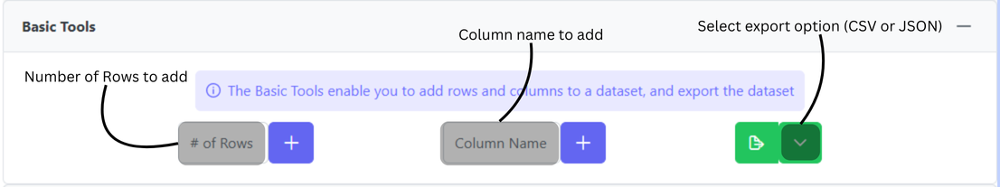
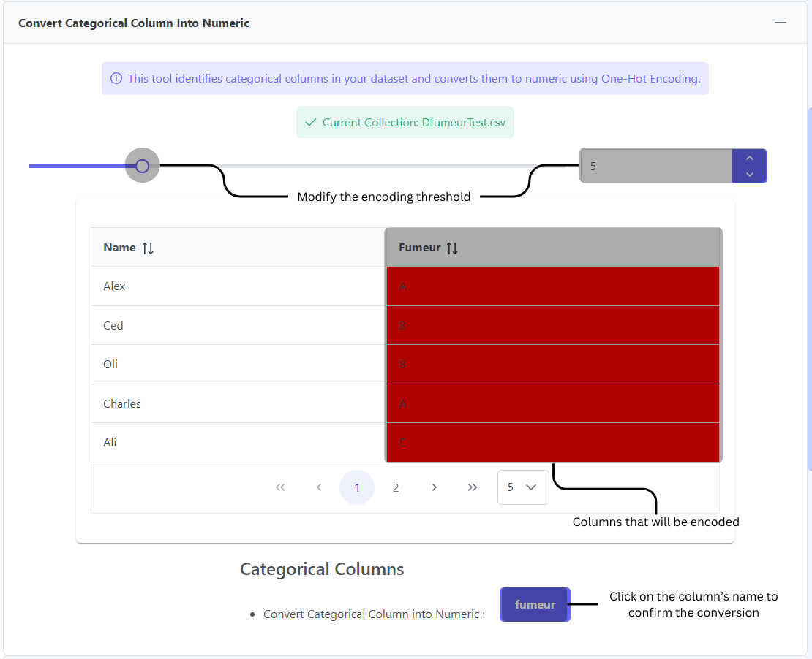
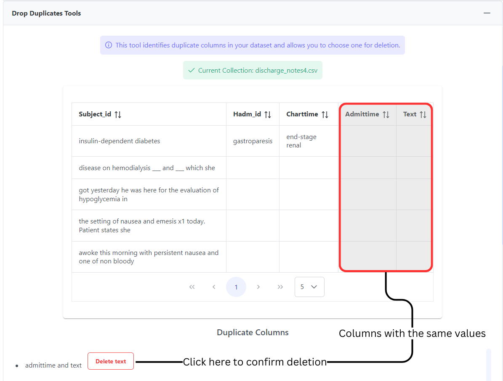
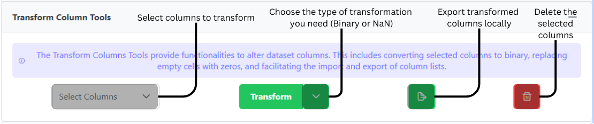
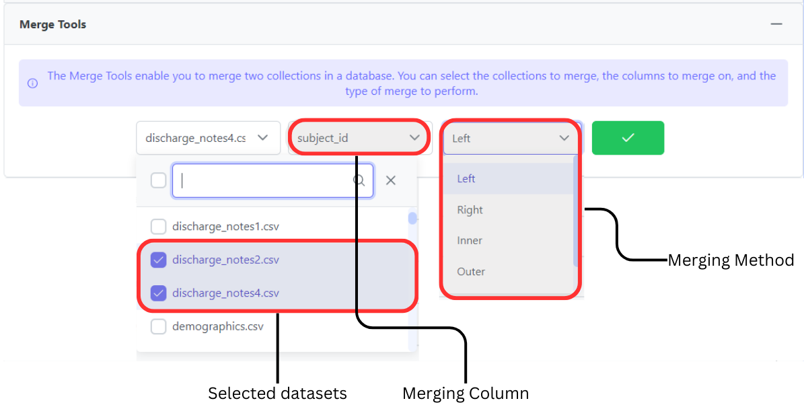
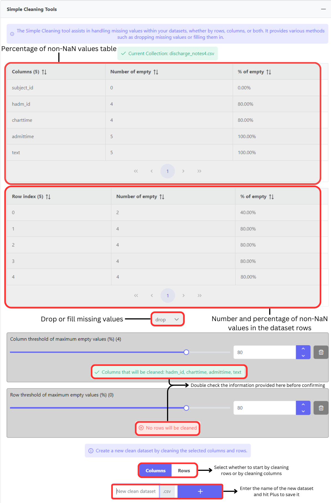
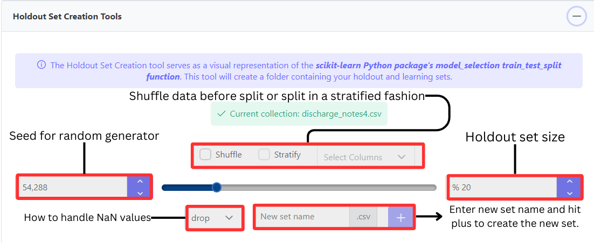
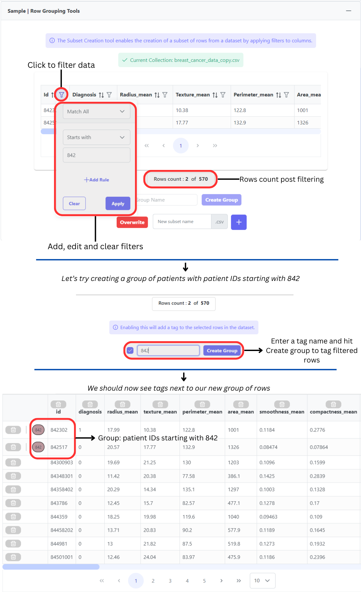

# Input Module


Video Tutorial of the Input module



We are continuously working on enhancing the MEDomics platform, and we would like to inform you about the improvements that we are currently working on (i.e. not yet implemented):

* **Definition of Empty Cells:** While we often refer to empty cells as NaN (Not A Number) values, it is important to note that empty does not necessarily mean NaN.
* **Display in Simple Cleaning Tool:** In the _Simple Cleaning tool_, we currently display the percentages of non-NaN values. However, we acknowledge that this can be confusing, and we plan to improve it by showing the percentage of NaN values instead.
* **Cleaning Columns and Rows in Simple Cleaning Tool:** When cleaning columns and rows simultaneously in the _Simple Cleaning tool_, the cleaning is currently done independently (as opposed to sequentially where the output of one process influence the other), and all the columns and rows displayed in red are removed. We are working on enhancing this tool. Additionally, please be aware that imputation methods are available in the [_Learning Module_](../../development/learning-module/).
* **Holdout Set Creation Tool:** In the _Holdout Set Creation tool_, the NaN method is applied only to rows that contain NaN values **in columns selected as a means to "Stratify"**. We plan to enhance the NaN handling method by introducing options such as mean fill, median fill, and mode fill.
* **Feature Reduction Tool:** The _Feature Reduction tool_ currently has only basic utilities. We are committed to improving it, for example by allowing to transfer the PCA (Principal Component Analysis) transformations through the [_Evaluation Module_](../../development/evaluation-module.md).

We appreciate your understanding as we work towards making the MEDomics platform even more effective and user-friendly.


**Content**&#x20;

* Introduction [00:00](https://www.youtube.com/watch?v=tj3qsXLnudk\&t=0s)&#x20;
* Merge tool [00:23](https://www.youtube.com/watch?v=tj3qsXLnudk\&t=23s)&#x20;
* Grouping/Tagging tool [04:06](https://www.youtube.com/watch?v=tj3qsXLnudk\&t=246s)
* Simple Cleaning tool [08:07](https://www.youtube.com/watch?v=tj3qsXLnudk\&t=487s)&#x20;
* Holdout Set Creation tool [11:15](https://www.youtube.com/watch?v=tj3qsXLnudk\&t=675s)
* Subset Creation tool [13:43](https://www.youtube.com/watch?v=tj3qsXLnudk\&t=823s)
* Feature Reduction tool [17:30](https://www.youtube.com/watch?v=tj3qsXLnudk\&t=1050s)

### Latest Release

In the latest release, the input module interface implemented new tools and updated existing ones. An image of the new interface is shown below. Once the user selects a dataset, the list of input tools is shows, and as you can see, two new tools have been added: _**Categorical to Numerical**_ tool and _**Duplicates Deletion**_ tool. The _**Row Grouping**_ tool added a new a feature to tag rows (similar to columns tagging), hence, you can now tag relevant rows to distinguish them from others. More details can be found  in the next section.

<figure><figcaption>
the MEDomics platform Input Tools
</figcaption></figure>

Basic Tools

The Basic Tools enable you to add rows and columns to a dataset, and export the dataset as a CSV or a JSON. The following figure depicts all the features of the _Basic Tools_.

Convert Categorical Column Into Numeric

This tool identifies categorical columns in the selected dataset and converts them to numeric values using One-Hot Encoding. The following figure depicts all the features of the tool.

Drop Duplicates Tools

This tool identifies duplicate columns in your dataset and enables you to delete them. More details in the following figure:

Transform Columns tool

The Transform Columns tool enables you to modify columns in a dataset, either by converting selected columns into binaries or by replacing missing cells with zeros. Here's how to use this tool:

1. Select the dataset from which you want to transform columns in the "Select the dataset" section. Your dataset will be displayed in a table within the Accordion component.
2. In the "Select the columns to keep" section, choose the columns you want to transform from your dataset.
3. Choose the type of transformation you need in the "Choose the type of transformation" section:
   * Binary: Empty cells become zeros, and non-empty cells become ones.
   * NaN to 0: Empty cells become zeros, and others remain the same.
4. Provide a name for saving the new dataset. The default name is your selected dataset name followed by the "\_modified" suffix.
5. Click the "Create subset with the transformed columns" button.

Your new dataset will be saved at the same location as your selected dataset. The following figure depicts all the features of the tool.

Merge tool

The _Merge tool_ functions as a visual representation of the _pandas_ Python library merge function ([https://pandas.pydata.org/docs/reference/api/pandas.merge.html](https://pandas.pydata.org/docs/reference/api/pandas.merge.html)). Follow these steps to merge datasets:

1. Select the two datasets you would like to merge from the dataset list.
2. Select the columns you wish to merge on.
3. Select the merge type. For additional information about merge types, consult the [_pandas_ documentation](https://pandas.pydata.org/docs/reference/api/pandas.merge.html).
4. Click the "Merge" button.

By default the merged dataset will be named "Dataset1Name\_Dataset2Name\_mergedType". The following figure summarizes the aforementioned steps:

Simple Cleaning tool

The Simple Cleaning tool assists in removing NaN values from datasets, either by rows or columns. Follow these steps to clean a dataset:

1. Select a dataset from the dataset list, displaying information about NaN values in your dataset.
   1. The first table associates your dataset columns with the number and percentage of non-NaN values. You can order this dataframe by column name or number/percentage of non-NaN values.
   2. The second table associates your dataset rows with the number and percentage of non-NaN values. You can order this dataframe by row index or number/percentage of non-NaN values.
2. Depending on your cleaning preferences, select a percentage of NaN values to consider for dropping columns and/or rows using the corresponding selectors. This will display which columns/rows will be affected and update this data in the two tables by showing the number of columns/rows to be dropped at the head of the "% of non-NaN" column and highlighting the concerned rows in red.
3. Choose to drop (default option) or to fill the missing values using the available fill methods (mean, median, etc.).
4. Choose a name for your new dataset and hit the "Plus" button.&#x20;

Your result dataset will be saved in the same directory as your selected dataset. The following figure showcases theses steps:

Holdout Set Creation tool 

The Holdout Set Creation tool serves as a visual representation of the _scikit-learn_ Python package's [_model\_selection train\_test\_split_ function](https://scikit-learn.org/stable/modules/generated/sklearn.model_selection.train_test_split.html). Follow these steps to create a holdout set:

1. Choose the dataset for which you want to create the holdout set from the displayed list.
2. If the Shuffle option is selected, rows will be shuffled before the split.
3. If Stratify is selected, you can also choose to Stratify the holdout set based on selected columns. Refer to the [documentation ](https://scikit-learn.org/stable/modules/generated/sklearn.model_selection.train_test_split.html)for additional information.
4. Select the size of your holdout set as a percentage of your chosen dataset size.
5. Choose how to handle NaN values in your selected dataset if necessary (drop or fill).
6. Provide a name for the new sets and click the Plus button.

The function will generate two datasets based on your selected options: a learning set and a holdout set. These datasets will be saved in a folder with the specified name, located in the same directory as your selected dataset.

Sample | Row Grouping Tools (Subset creation tool)

The Subset Creation tool enables the creation of a subset of rows from a dataset by applying filters to columns. Follow these steps to create a subset:

1. Select a dataset from the dataset list. Your dataset will be displayed, allowing you to sort and filter each column.
2. You can filter your dataset by clicking the filter icon at the right of the header of each column. Create rule(s) using the displayed components to filter columns. Rows that don't satisfy the rules will be removed from the displayed dataset, updating the number of rows displayed under the dataset.
3. You can make a global search in the dataset using the search component at the top right of the displayed dataset .
4. You can clear your filters by pressing the "Clear" button at the top left of the displayed dataset .
5. To tag the filtered rows, you can click the check-mark under row's count, enter the group name (tag name) and hit "create group". This will add a tag to the filtered rows.
6. Choose a name for your new dataset and hit the Plus button. You can also click "Overwrite" to replace the original set with the filtered data.&#x20;

Your result dataset will be saved in the same directory as your selected dataset. The following figure depicts all the steps described above:

Feature | Column Tagging Tools

The _Grouping/Tagging tool_ enables you to create and apply tags to dataset columns. Follow these steps to set tags on dataset columns:

1. Select at least one dataset from the dataset list; you can choose multiple datasets if needed.
2. Create your tags: Press the "+" button to access default tags or type the name of your tag and press "Enter" to add it.
3. Customize your tags: Your created tags are displayed, and you can update, delete, or customize their color (text and background).
4. Select the column(s) on which you want to apply/modify tags. Columns are displayed by dataset.
5. Once the desired column(s) are selected, choose the tag(s) you want to apply.
6. After selecting tags, press the green check button.

If you open your dataset in the app, you will then be able to see your tags. The following figure depicts the steps explained above:


[feature-reduction-tool.md](feature-reduction-tool.md)



[medprofiles](medprofiles/)

