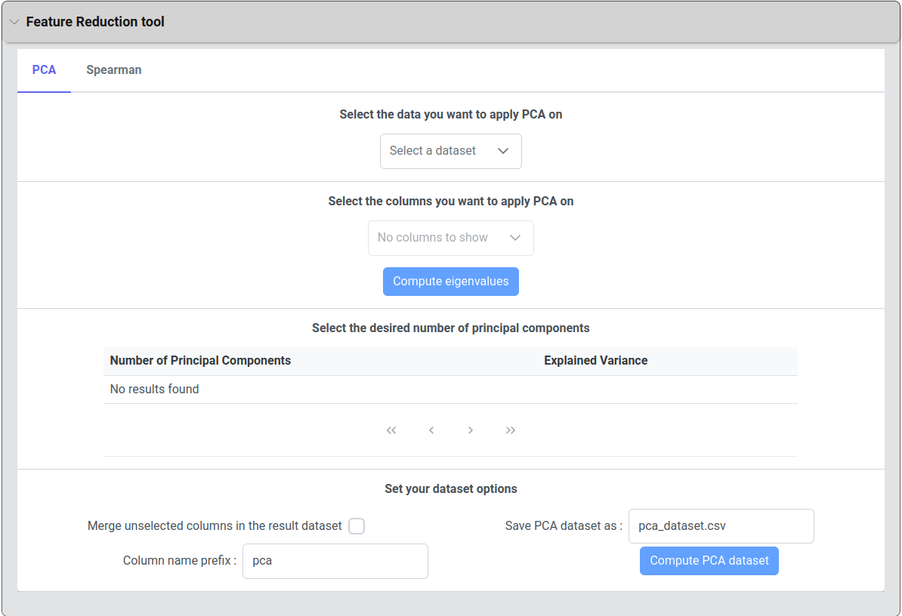
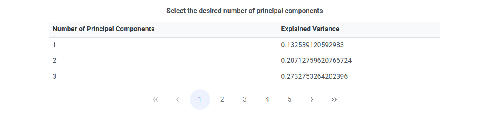
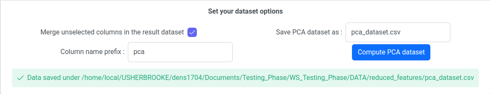
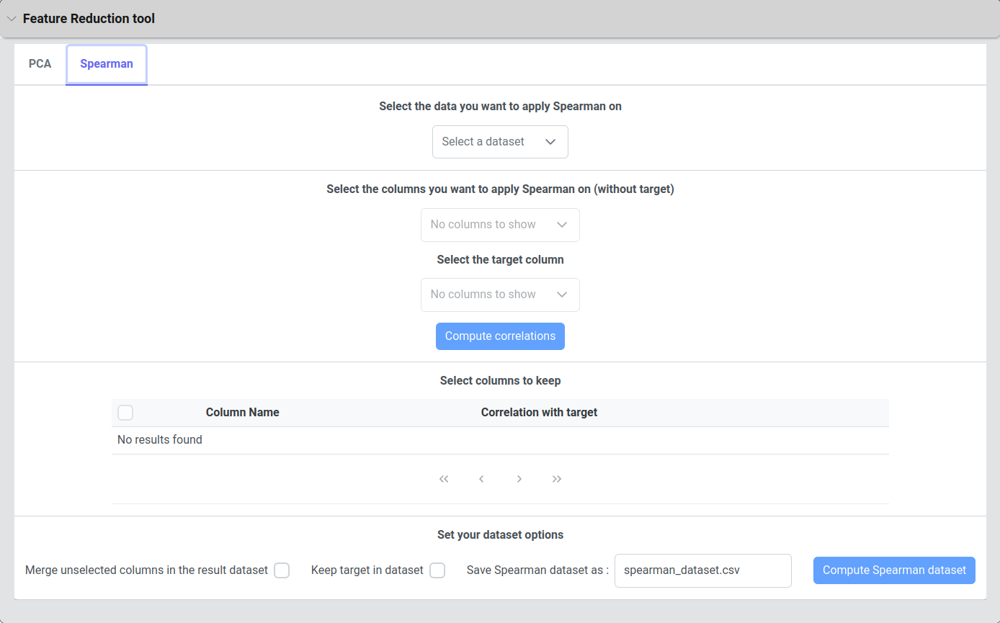
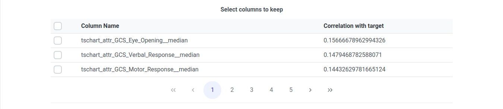
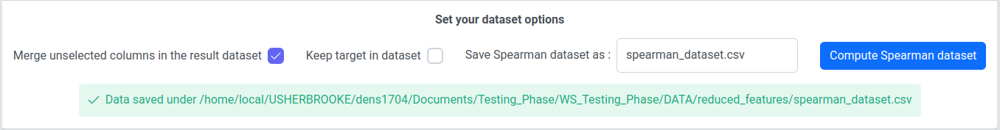

# Feature Reduction Tool

## 1. Principal component Analysis (PCA)

When you open the first tab of the Feature Reduction tool you should see this component:

<figure><figcaption>
PCA component
</figcaption></figure>

### 1.1. Select the data you want to apply PCA on

<figure><figcaption>
Select the data
</figcaption></figure>

In this component, all the CSV files present in your DATA folder are displayed. Simply select the dataset on which you want to apply PCA.


Once selected, the dataset may take a few seconds to upload the data for the next steps.


### 1.2. Select the columns you want to apply PCA on

<figure><figcaption>
Select the columns
</figcaption></figure>

In this component, all the columns of your selected dataset are displayed as checkboxes. Check the columns on which you want to apply PCA. Once the columns are selected, you can then click the 'Compute eigenvalues' button.

### 1.3.  Select the desired number of principal components

<figure><figcaption>
Select the desired number of principal components
</figcaption></figure>

After computing the eigenvalues (by clicking the 'Compute eigenvalues' button), a list will appear associating the number of principal components with the explained variance that your result dataset will contain if you choose this number. Simply click on the row containing the desired number of principal components.

### 1.4. Set your dataset options

<figure><figcaption>
Set your dataset options
</figcaption></figure>

After selecting your desired number of principal components, you will be able to compute your PCA dataset with several options:

* **Merge unselected columns in the result dataset** will compute the PCA with the selected columns and add your unselected columns at the beginning of your result dataframe.
* You can choose the name under which you want to **save your result dataset**. The default name is 'pca\_dataset.csv'. The name must adhere to filename conventions and end with the .csv extension.
* The **column name prefix** will be added in front of every PCA column. The resulting PCA columns will look like _YourPrefix\_attrX_, where X is the Principal Component number, from the one containing the most information to the one containing the least information.

Once your result dataset has been computed (after clicking the 'Compute PCA dataset' button), a success message will appear, indicating where your results have been saved.


If the "Compute PCA dataset" button is disabled, make sure you have selected a number of principal components in the previous step.


## 2. Spearman correlation

When you open the second tab of the Feature Reduction tool you should see this component:

<figure><figcaption>
Spearman Component
</figcaption></figure>

### 2.1. Select the data you want to apply Spearman on

<figure><figcaption>
Select data
</figcaption></figure>

In this component, all the CSV files present in your DATA folder are displayed. Simply select the dataset on which you want to apply Spearman. This dataset must contain a target column.

### 2.2. Select the columns you want to apply Spearman on

<figure><figcaption>
Select the columns
</figcaption></figure>

In this section, you have two fields to complete. In the first one, all your columns are displayed as checkboxes. Check the columns on which you want to apply Spearman correlation (excluding the target column). The second field corresponds to the target column. Select the target column from the list of columns. Once the columns are selected, you can then click the 'Compute correlations' button. It will calculate the correlation between all your selected columns and the target.

### 2.3. Select columns to keep

<figure><figcaption>
Select columns to keep
</figcaption></figure>

After computing the correlations (by clicking on the 'Compute correlations' button), the list of your selected columns will be displayed as checkboxes, associating their correlation with the selected target. The list will be displayed in decreasing order. Here, you will have to select the columns you want to keep in your result dataset.

### 2.4. Set your dataset options

<figure><figcaption>
Set your dataset options
</figcaption></figure>

After selecting the columns to keep in the result dataset, you will be able to compute the Spearman reduction tool with several options:

* **Merge unselected columns in the result dataset** will compute the result dataframe with the selected columns to keep and add your unselected columns from the first section (Select the data you want to apply Spearman on) at the beginning of this result dataframe.
* **Keep target in dataset** will add the target column at the end of your result dataframe.
* You can choose the name under which you want to save your result dataset. The default name is 'spearman\_dataset.csv'. The name must adhere to filename conventions and end with the .csv extension.

Once your result dataset has been computed (after clicking the 'Compute Spearman dataset' button), a success message will appear, indicating where your results have been saved.


If the 'Compute Spearman dataset' button is disabled, please ensure that you have selected columns to keep in the previous step.

