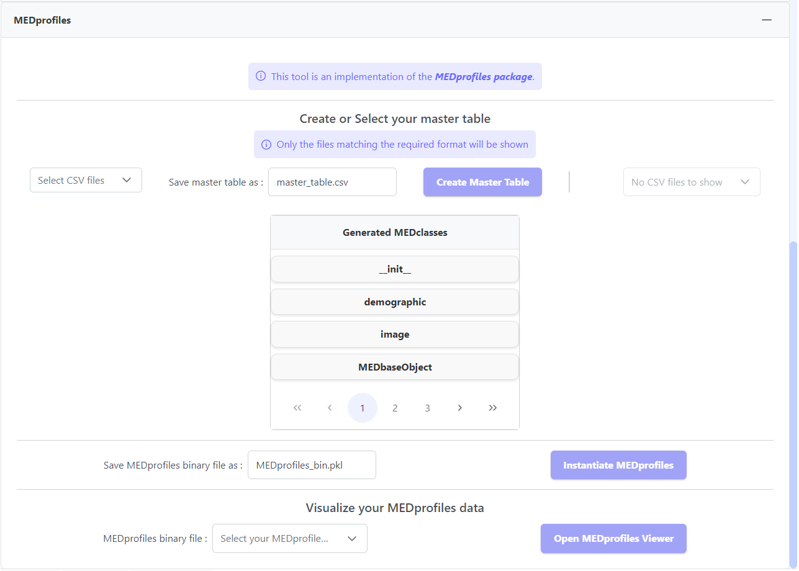
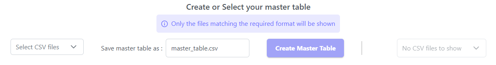
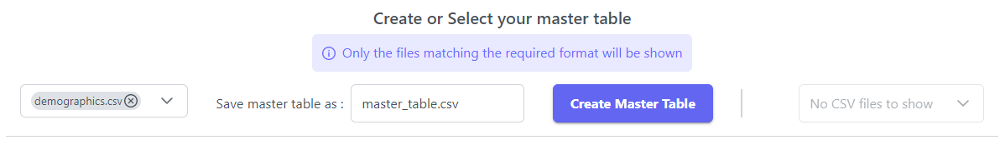
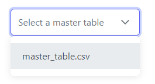
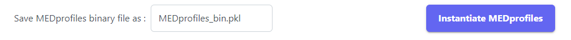
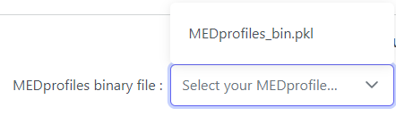

# MEDprofiles


MEDprofiles Video Tutorial


The _MEDprofiles 'Prepare Data' component_ is accessible on the [_Input Module_](../) page and looks like this:

<figure><figcaption>
MEDprofiles dashboard
</figcaption></figure>

## 2. Create or select your master table

The master table is the entry point of the _MEDprofiles_ process. It is a CSV file that must adhere to the following format:

* Column names must be 'PatientID', 'Date', 'Time\_point', and others must contain '\_'.
* The first line (after columns) must contain 'string' or 'num' in the first position, 'datetime.date' in the second, and 'num' in all others.
* The first column (excluding the first line) must contain strings or integers.
* The second column (excluding the first line) must contain datetime values.
* The third column (excluding the first line) must contain null or integer values.
* The other columns (excluding the first line) must contain numerical values.

If you have already created a master table, it will be automatically detected and you should be able to select it in the third input box (see figure below). If this is not the case, this component will allow you to create one. Depending on your actions in the application, different options will be available:

<figure><figcaption>
Create or select your master table
</figcaption></figure>

* _Select CSV files_: If you have generated embedding data using the extraction module, the generated files will appear in the list box and you can select the ones to use for master table creation.

<figure><figcaption></figcaption></figure>

* Otherwise, the input box list will be empty. In this case, if you want to use the _MEDprofiles prepare data component_, you will need to explore the[ extraction module](../../extraction-modules/) and generate data that adheres to the master table format (refer to the extraction pages tutorials for more information).

This section is divided into two subparts: one for master table creation and the other for master table selection.

### 2.1. Create your master table

You need to select the files you want to include in your master table. Afterward, you can choose the name under which you want to save your master table. The default name is 'master\_table.csv.' It's important that your chosen name ends with the CSV extension. If some of your selected files contain columns with type mismatches (for example, if your patient identifiers are numbers in some files and strings in another), a warning will appear, and you won't be able to proceed with master table creation. If this is the case, check your data types.

<figure><figcaption></figcaption></figure>

If everything is in order, you can press the '_Create Master Table_' button. Once the master table creation process is complete (which usually takes a few seconds), a message will appear at the bottom (see figure below), indicating that the master table has been generated and saved in the mongoDB database under DATA/MEDprofiles/master\_tables. This will also update the master table selection input box.

<figure><figcaption>
Master table created successfully
</figcaption></figure>

The '_Create Master Table_' button will also analyzes your selected master table and create the classes that will be associated with your MEDprofiles (i.e. the _MEDclasses_). The created classes will be registered under 'DATA/MEDprofiles/MEDclasses' and will be displayed in the application as follows :


The classes will be created based on the column names of the master table.



In the master table, the column names adhere to the format 'className\_attributeName'.


<figure><figcaption>
Generated MEDclasses
</figcaption></figure>

### 2.2. Select your master table

Here, you only need to select a master table from the list of available master tables in your chosen folder. If the selector indicates 'No CSV files to show,' it means that no CSV files matching the required format are available in your selected folder from the first part.

<figure><figcaption>
Available master tables selection
</figcaption></figure>

## 3. Instantiate MEDprofiles

Once a master table is selected, you can instantiate your master table data as [MEDprofiles](https://github.com/MEDomics-UdeS/MEDprofiles). You can choose the name under which you want your data to be registered. It is important that the filename ends with the '.pkl' extension.

<figure><figcaption>
Instantiate MEDprofiles
</figcaption></figure>

The process of instantiating MEDprofiles data may take a few minutes. While the process is running, a progress bar will be displayed, indicating the advancement of the process.


If the button "Instantiate MEDprofiles" is disabled, make sure you have selected a master table in the section 2 and the generated MEDclasses are displayed.


## 5. Visualize your MEDprofiles data

To open the MEDprofiles figure, you need to select the recently created MEDprofiles binary file (files with the right format are detected and added the list box automatically).&#x20;

<figure><figcaption>
MEDprofiles binary file selection
</figcaption></figure>

Once a binary file is selected, click 'open MEDprofiles Viewer' to access the data viewer:

<figure><figcaption>
Visualize you MEDprofiles data
</figcaption></figure>


If either of the two elements (MEDclasses folder and/or MEDprofiles binary file) doesn't contain elements to select, ensure that the previous steps have been completed successfully.


Check out the next page to learn more about the MEDprofiles viewer!


[medprofiles-viewer.md](medprofiles-viewer.md)

