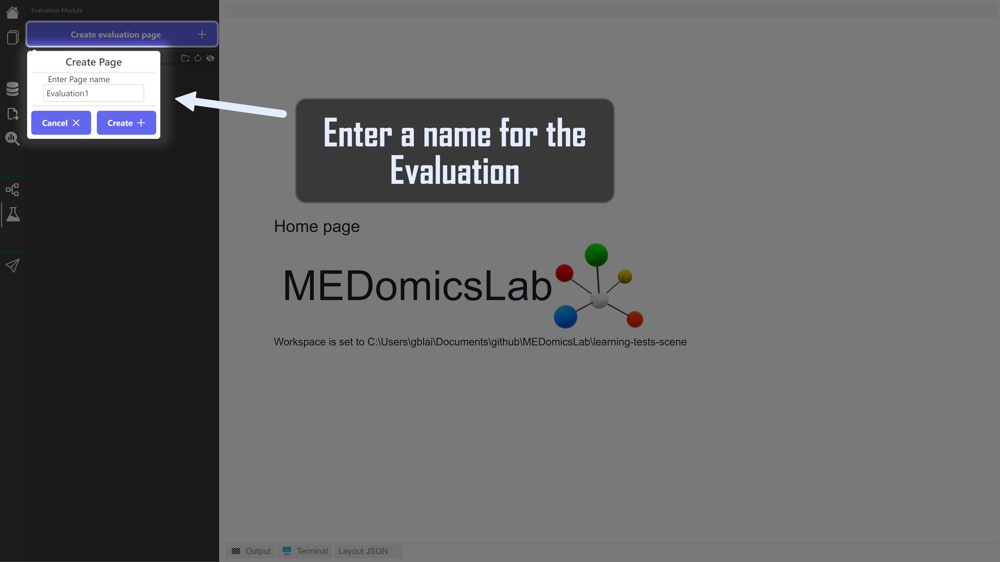
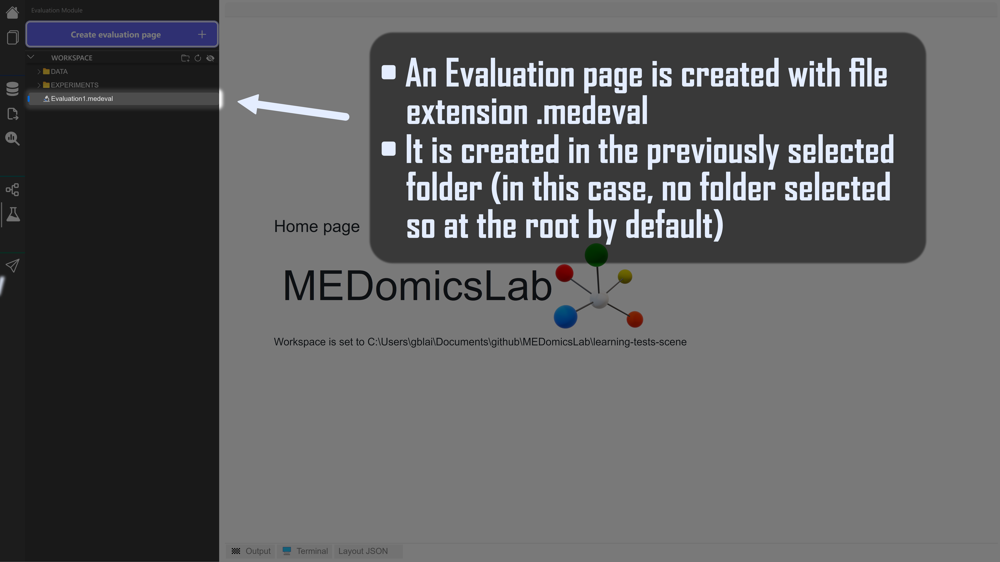
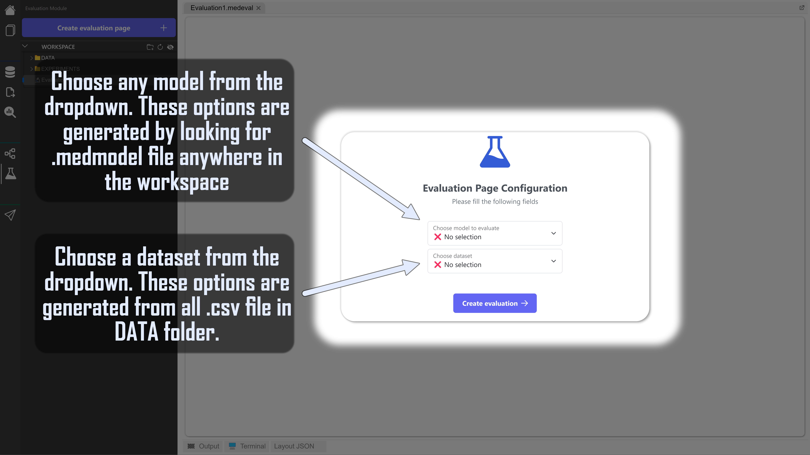

# Evaluation Module


At this point, you should have generated at least, one model from the [learning module](learning-module/)



Evaluation Module


## 1. Create an Evaluation

<figure><figcaption></figcaption></figure> <figure><figcaption></figcaption></figure>

## 2. Open and configure your Evaluation

Double click on the .medeval file

<figure><figcaption></figcaption></figure> <figure><figcaption></figcaption></figure>


The chosen dataset's columns must match the dataset's columns on which the model has been run. Otherwise, an error will explain it so you won't be able to run the evaluation&#x20;


## 3. Analyze results

<figure><figcaption></figcaption></figure>

Link to ExplainerDashboard : [here](https://explainerdashboard.readthedocs.io/en/latest/)
