# Learning Module

> **Good to know** : This module allows you to train models and it is powered by the python library [PYCARET](https://pycaret.gitbook.io/docs/). This module is built around this library

## Overview videos


Learning Module - Scene Creation



Learning Module - Understanding Pipelines and Results


## Create an experiment/scene

Before creating a scene, select the EXPERIMENTS folder or a subfolder where you want the scene to be saved

<div data-full-width="true">

<figure><figcaption></figcaption></figure>

 

<figure>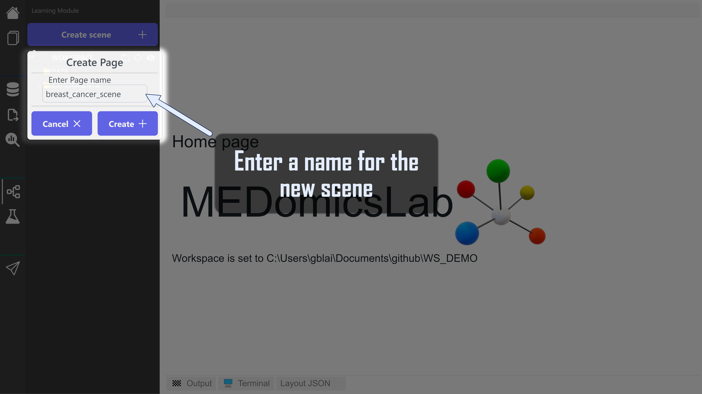<figcaption></figcaption></figure>

</div>

<div data-full-width="true">

<figure><figcaption></figcaption></figure>

 

<figure><figcaption></figcaption></figure>

</div>


```javascript
──experiment                         -> Can contains multiple scenes
  └───breast_cancer_scene            -> Scene folder
      │   breast_cancer_scene.medml  -> Scene file
      │
      ├───models                     -> folder where models are saved
      └───notebooks                  -> folder where notebooks are saved
```


## Module overview


Double click on the .medml to open the scene


<figure><figcaption><p>Empty scene</p></figcaption></figure>

### 1. Available Nodes

<figure>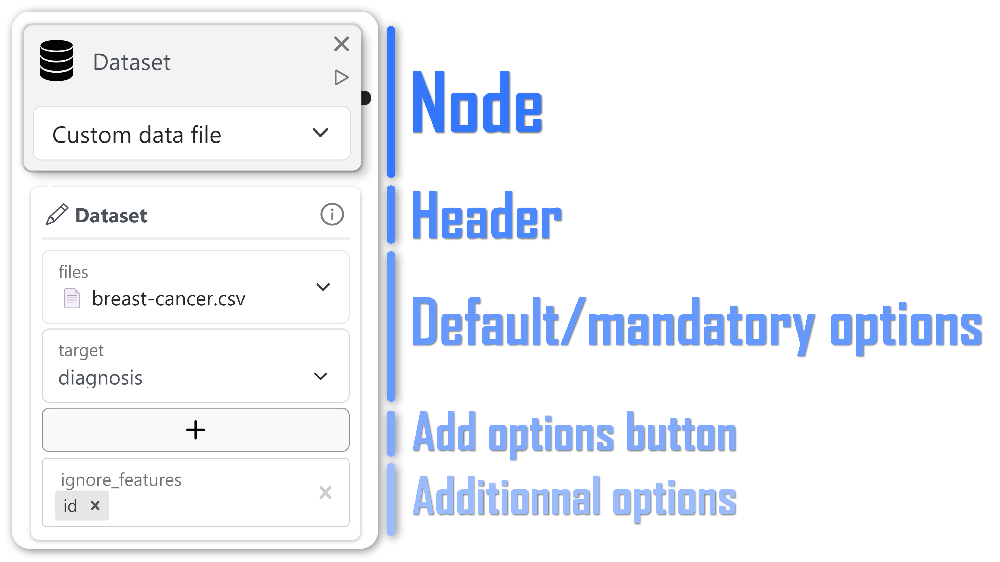<figcaption></figcaption></figure>


_Add options_ button open a panel where you can select additionnal options. These options are automatically generated from the online [documentation of PYCARET](https://pycaret.readthedocs.io/en/latest/).&#x20;


<table data-full-width="true"><thead><tr><th width="219">Image</th><th width="468.5">Description</th><th width="135">Input</th><th>Output</th></tr></thead><tbody><tr><td></td><td>This is the entry point of an experiment.<br>You have 2 options here:<br><strong>1. MEDomicsLab standard</strong>: you can select a master table and the associated target file<br><strong>2. Custom file</strong>: You can choose any csv file and then choose which column should be the target to predict</td><td>-</td><td>dataset</td></tr><tr><td></td><td>This node allows you to clean your dataset.</td><td>dataset</td><td>dataset</td></tr><tr><td></td><td>This node allows you to select a model and its associated parameters.</td><td>-</td><td>model_config</td></tr><tr><td>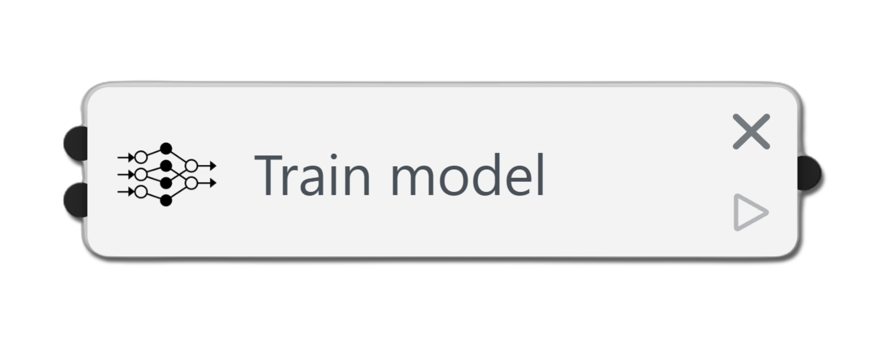</td><td>This node allows you to train a model.</td><td>model_config AND dataset</td><td>model</td></tr><tr><td></td><td>This node allows you to train multiple models and compare them.</td><td>dataset</td><td>model(s)</td></tr><tr><td></td><td>This node allows you to load a model from a file.</td><td>dataset</td><td>model</td></tr><tr><td></td><td>This node allows you to optimize a model. **</td><td>model</td><td>model</td></tr><tr><td>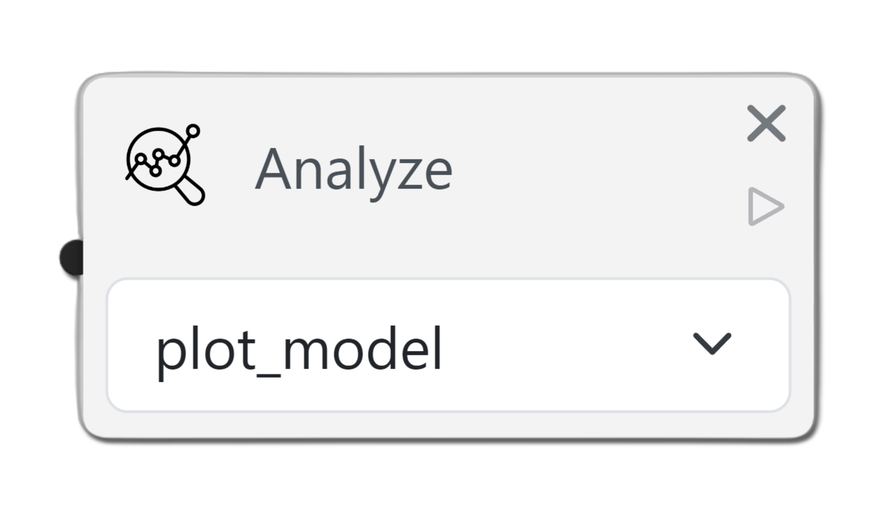</td><td>This node allows you to analyze a model.</td><td>model</td><td>-</td></tr><tr><td></td><td>This node allows you to finalize a model.</td><td>model</td><td>model</td></tr><tr><td></td><td>This node allows you to save a model.</td><td>model</td><td>-</td></tr></tbody></table>

#### \*\*Optimize node

When clicking on an _Optimize_ node, it opens a subflow like below where you can build pipelines for optimisation.

<figure>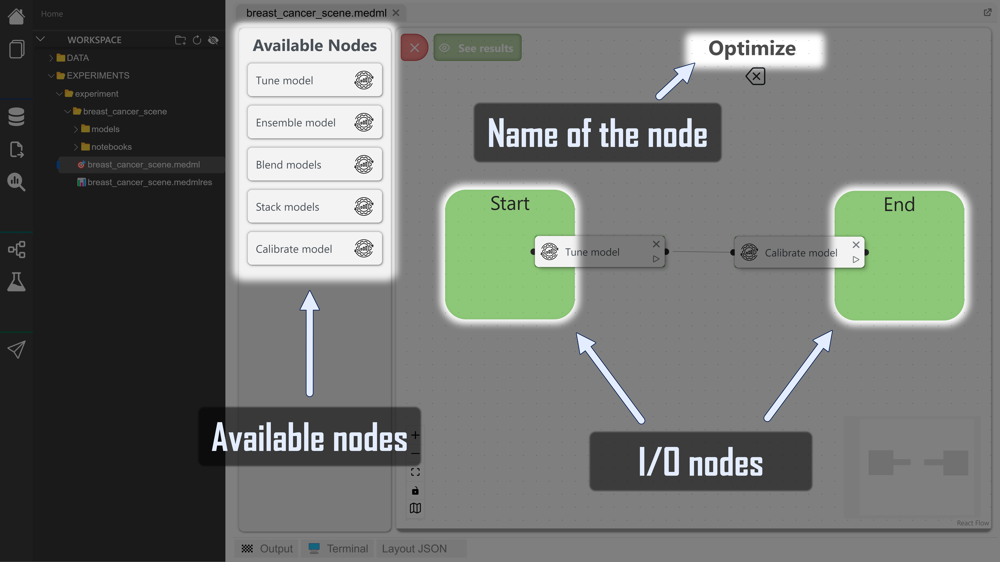<figcaption></figcaption></figure>

* Available nodes are different
* Name of the node is where you can edit the name
* Green block (I/O nodes) are input and output of the Optimize node. To connect them, simply intersect them with your nodes

### 2. Results button

This button is used to see the results of the experiment. More info [here](learning-module.md#3.-results-panel)

### 3. Utils menu

This menu contains different functionalities that can be used to help you build your scene.

* **Machine learning type dropdown**: This dropdown allows you to select the type of machine learning you want to do. When changing the type, all settings are reseted.
* **Play**: This button allows you to run the experiment. More info [here](learning-module.md#2.-run-the-experiment)
* **Garbage bin**: This button allows you to delete all nodes in the scene
* **Save**: This button allows you to save the scene
* **Load**: This button allows you to load a scene from a file

### 4. Minimap

This minimap allows you to navigate in the scene and to see the nodes that are in the scene.

### 5. Flow utils

This menu contains different functionalities that interact with the flow section.

* **Plus button**: This button allows you to zoom in the flow section
* **Minus button**: This button allows you to zoom out the flow section
* **square button**: This button allows you to fit the flow section in the view
* **lock button**: This button allows you to lock the flow section. When locked, you can't move the flow section
* **map button**: This button allows you to show/hide the minimap

## Example

### 1. Creation of your pipeline

Drag and drop nodes from the menu and create your own [pipeline(s)](learning-module.md#multiple-pipelines). Here is an example of a simple classification pipeline that takes a dataset, train a _gradient boosting classifier_ model and then, plot an AUC plot

<div data-full-width="true">

<figure>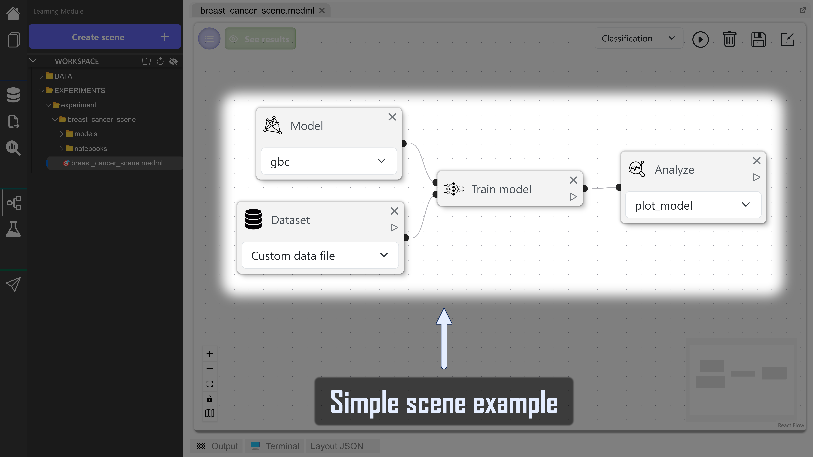<figcaption><p>Simple scene example</p></figcaption></figure>

 

<figure><figcaption><p>Parameters</p></figcaption></figure>

</div>

### 2. Run the experiment

You can run the experiment by clicking on the **run button**

<figure>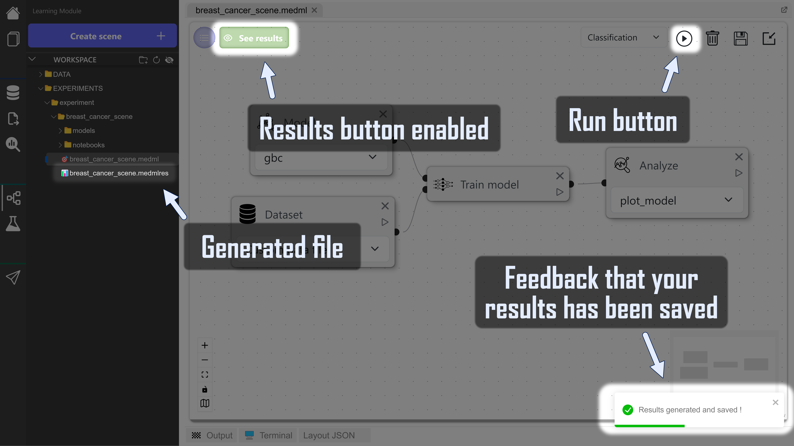<figcaption></figcaption></figure>

A progress bar will appear and **when the experiment finishes**,

* A toast will confirm that the results has been saved
* A new file will appear (.medmlres) containing results informations related to the .medml with the same name (you can't open this file)
* The _see results_ button will be enabled

### 3. Results panel

When clicking on the _see results_ button,

<figure>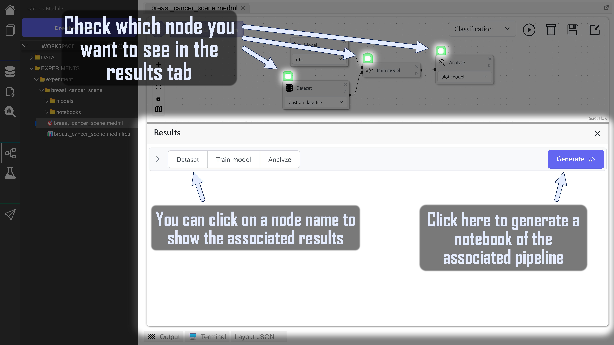<figcaption></figcaption></figure>

As you can see, a panel open from the bottom with different collapsible item :

<figure>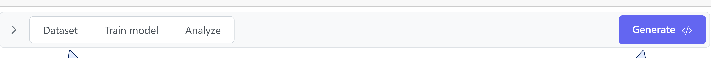<figcaption><p>P<strong>ipeline's results viewer</strong></p></figcaption></figure>

They are called **pipeline's results viewer.**\
On the **left**, you can see all the nodes in the pipeline. You can click on those to see associated results.\
On the **right**, you can see a button that [generates a notebook](learning-module.md#3.1-notebook-generation) for the associated pipeline


You can also filter which pipeline(s) you want to see in the results panel by checking node in the flow section. [More info here](learning-module.md#pipelines-selection-box)


#### 3.1 [Notebook ](https://docs.jupyter.org/en/latest/running.html)generation

The generated file is saved in the notebook folder of the associated scene. You can open it directly from the application by right clicking and selecting _open in..._ and then _VSCode_ for example.


You have to run an experiment to access this functionality



Default code editor is not implemented yet, but coming soon ! 😉


<figure><figcaption></figcaption></figure>

<figure>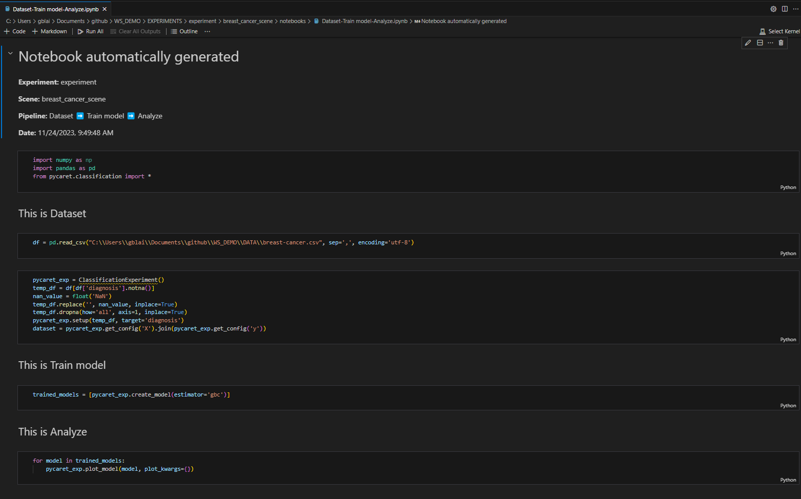<figcaption><p>Automatically generated notebook opened in <em>VSCode</em></p></figcaption></figure>

## Multiple pipelines

When building your scene, you can connect multiple nodes to each other creating multiple pipelines !

### Single vs multiple pipelines:



<figure>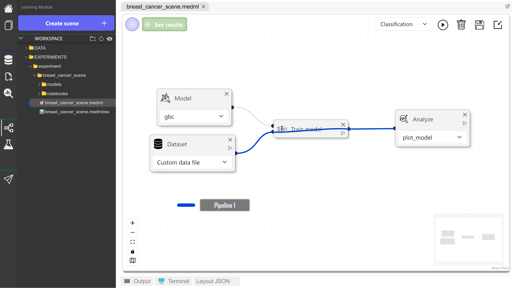<figcaption></figcaption></figure>



<figure><figcaption></figcaption></figure>

<figure><figcaption></figcaption></figure>



### Pipelines selection box

Each runnable node has this checkbox on top of the node in results mode. Checked ones or green ones will be displayed in the results panel.

<div>

<figure><figcaption><p>Selection box</p></figcaption></figure>

 

<figure><figcaption><p>Independent selection box</p></figcaption></figure>

</div>


**Independent selection box** (green ones) indicates that every pipeline go through this one, so in any case, its gonna show in the associated results


#### Pipelines selection example

<figure>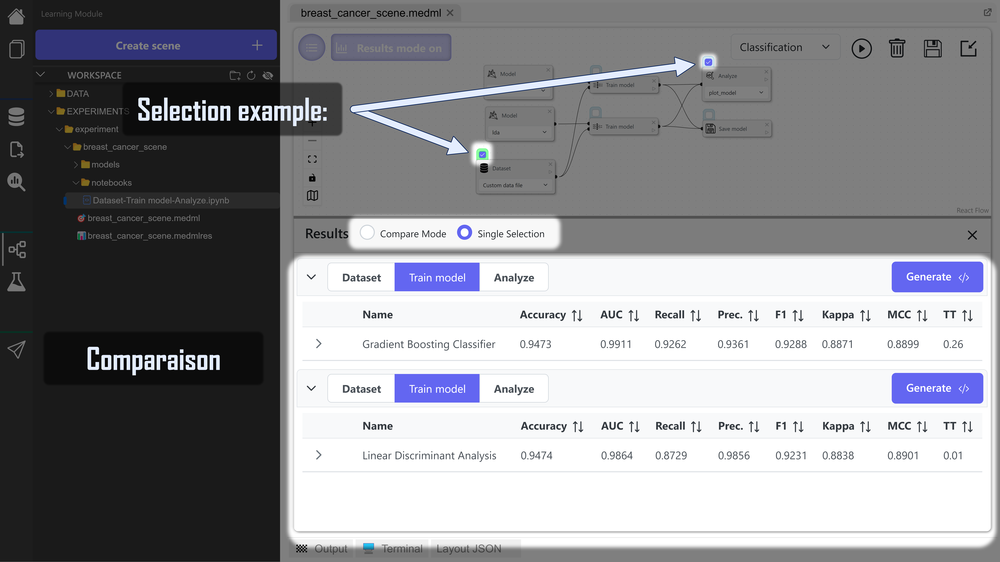<figcaption></figcaption></figure>
