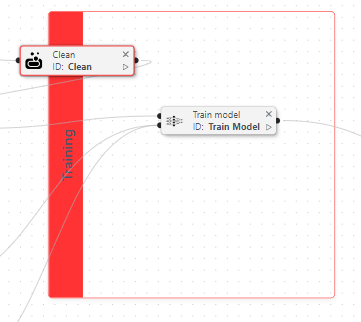
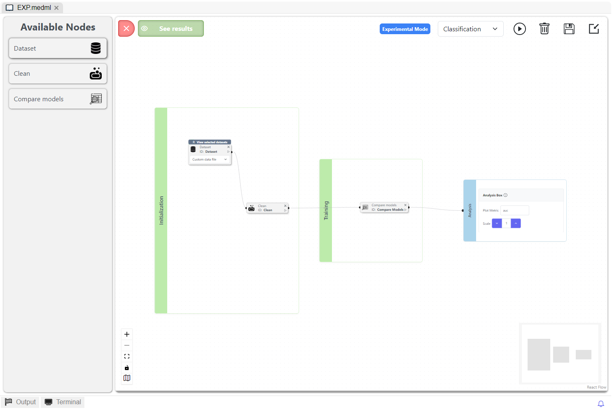

# Learning Module


If this is your first time reading the Learning Module documentation, we suggest starting from the [#overview-videos](./#overview-videos "mention").



The Learning Module is constructed using the open-source Python library [_PyCaret_](https://pycaret.gitbook.io/docs/). You can find valuable information about [_PyCaret_](https://pycaret.gitbook.io/docs/) at the following links:

* [_PyCaret_ Gitbook](https://pycaret.gitbook.io/docs/)
* [_PyCaret_ ReadTheDocs](https://pycaret.readthedocs.io/en/stable/)
* [_PyCaret_ GitHub](https://github.com/pycaret/pycaret)


## The Learning Module's architecture

The Learning Module has been redesigned with an updated architecture that adheres to machine learning practices, introducing external training/testing data separation to support multi-iteration model training. This enhanced approach provides more reliable performance estimation while specifically overcoming PyCaret's limitations in external data splitting. The following diagram presents the new architecture:

<figure><figcaption>
The new Learning Module workflow
</figcaption></figure>

#### Enhanced external training and validation

The updated workflow introduces flexible dataset partitioning through multiple validation methods (cross-validation, bootstrapping, etc.), resolving PyCaret's limitation in handling external data splitting. For clarity:

* **External splits** divide the learning set into training/testing data
* **Internal splits** further partition training data for hyperparameter tuning

The figure below illustrates this enhanced validation framework.

<figure><figcaption>
External and Internal splits illustration
</figcaption></figure>

## What relies on PyCaret, and what does not use it?


Refer to [this section](./#understand-pycarets-role-within-the-learning-module) for more details on PyCaret's role in the Learning Module.


The Learning Module is built on [PyCaret's ](https://pycaret.gitbook.io/docs/)open-source machine learning framework, enhanced with custom-coded components to enable new features, such as external data splitting —a capability not supported in PyCaret. The figure below highlights which elements leverage PyCaret's standard functionality versus our custom extensions, giving you a better understanding of the architecture.

<figure><figcaption>
Custom-coded and PyCaret based sections of the ML workflow
</figcaption></figure>

## A new design is here

The learning Module features a new redesigned interface aligned with the new architecture, which offers users a streamlined way to [create their scenes](./#how-to-create-a-scene) and experiments. The updated interface is organized into three boxes:

* **Initialization**: Users begin by selecting their machine learning resources and configuring key experiment parameters, including dataset selection, data preprocessing steps, model choices, and more.
* **Training**: This section enables users to define and manage the model training process, encompassing aspects such as hyperparameter tuning, optimization strategies, and additional features.
* **Analysis**: In the final stage, users can visualize and interpret their model’s performance through a variety of result plots and metrics.

<figure><figcaption>
The Learning Module: before and after
</figcaption></figure>

## A new color-code system

The intuitive box-based design simplifies pipeline creation by visually guiding users through each step. A color-coding system works alongside the boxes to prevent errors. For example, as illustrated below, if you accidentally attempt to drag a Train Model node into the Initialization box, both the node and box will turn red, immediately alerting you to the mismatch. Each box only accepts compatible node types, ensuring logical connections and reducing setup mistakes.

<figure><figcaption>
Misplaced Train Model node
</figcaption></figure> <figure><figcaption>
Misplaced Clean Node
</figcaption></figure>

<figure><figcaption>
Error message upon running the experiment
</figcaption></figure>

In Results or Analysis modes, a different color-coding is used; read more about it [here](analysis.md#highlighting-feature).

## A new scene for experimenting

The learning module includes a new [**Experimental Scene**](experimental-scene.md), a minimalistic scene designed for testing machine learning configurations (models, parameters, etc.) before finalizing them in the main production scene.

As shown in the figure below, the Experimental Scene’s minimalistic design focuses attention on core machine learning elements, with all required node types available. The scene serves as a testing ground where users can refine their pipelines before switching to the main scene.

<figure><figcaption>
Example of an Experimental scene
</figcaption></figure>

## A **Redefined Pipeline Structure**

In the previous design, a pipeline was defined as any sequence of connected nodes. The updated architecture now defines a pipeline as a **complete sequence of nodes that starts from an initial node and terminates at the Analysis Box**. This crucial change means that any disconnected node chain or incomplete workflow will not be recognized as a valid pipeline for execution or analysis. By enforcing this complete connection, the platform ensures that users adhere to machine learning best practices and that every pipeline will be analyzed. The figure below illustrates an example of valid and invalid pipelines under this new definition.

<figure><figcaption>
Example of valid and invalid pipelines
</figcaption></figure>

## Overview Videos


Learning Module - Scene Creation



Learning Module - Understanding Pipelines and Results


***

## How to create a scene



### Click on the Learning Module Icon.

On the left sidebar, click on the following icon: 



### Click on the "Create scene" button

The button can be located on top of the side panel.



### Enter a name for the new scene

Type your scene's name in the field "_Enter Page Name_":

&#x20;.png>)



### Select whether it's an Experimental scene or not

If you would like to create an Experimental scene, ensure the following switch is on: .png>)



### Click **Create**.



These steps are summarized in the figure below. Once your scene is created, a folder will be generated that includes the following:

* Your scene (._medml_ file): .png>)
* A folder for your scene models: .png>)
* A folder for your scene notebooks: .png>)

<figure><figcaption>
How to create a new scene
</figcaption></figure>

<figure><figcaption>
Your scene's folder in the application's workspace
</figcaption></figure>

***

## Module Overview


Double-click on the ._medml_ file to open the scene.


The following sections provide a comprehensive overview of the scene and its fundamental components. Each numbered element in the main scene figure corresponds to a detailed explanation in the subsequent subsections.

#### Main scene

<figure><figcaption>
Empty Main Scene
</figcaption></figure>

***

### 1. Scene folder breakdown

Every scene folder is organized as follows:


<pre class="language-javascript"><code class="lang-javascript"><strong>breast_cancer_analysis             -> Scene folder
</strong>    ├───models                     -> Folder where models are saved
    ├───notebooks                  -> Folder where notebooks are saved
    └───breast_cancer_scene.medml  -> Scene file
</code></pre>


### 2. Available Nodes

<figure><figcaption>
General structure of a node
</figcaption></figure>


The _Add options_ button opens a panel where you can select additional options. These options are retrieved from the online [ReadTheDocs documentation of _PyCaret_](https://pycaret.readthedocs.io/en/stable/).



The links used to explain the _PyCaret-specific_ functions refer to the [Classification section of the _PyCaret_ documentation](https://pycaret.readthedocs.io/en/latest/api/classification.html). However, these functions are also present in other machine learning types within _PyCaret_. For instance, you can find them in the [Regression documentation of _PyCaret_](https://pycaret.readthedocs.io/en/latest/api/regression.html) as well.


#### Available nodes summary table:

<table data-full-width="true"><thead><tr><th width="219">Node</th><th width="396.5">Description</th><th>Designated box</th><th width="135">Input</th><th>Output</th></tr></thead><tbody><tr><td></td><td>This acts as the initial point for all experiments and determines the data your pipeline will use. The available options for this node correspond to the <a href="https://pycaret.readthedocs.io/en/stable/api/classification.html#pycaret.classification.setup"><em>PyCaret</em> <code>setup()</code> function</a> options that are not directly related to data cleaning.</td><td><a href="initialization.md">Initialization</a></td><td>-</td><td>Dataset</td></tr><tr><td></td><td>This node enables you to clean and improve the quality of your dataset. The available options for this node correspond to the <a href="https://pycaret.readthedocs.io/en/latest/api/classification.html#pycaret.classification.setup"><em>PyCaret</em> <code>setup()</code> function options</a> that are directly related to data cleaning.</td><td><a href="initialization.md">Initialization</a></td><td>Dataset</td><td>Dataset</td></tr><tr><td></td><td>This uniquely custom-coded node (distinct from <em>PyCaret</em>’s standard functions) gives you precise control over how your dataset is divided for training and evaluation. It serves as the foundation for reliable model validation by ensuring appropriate data separation.</td><td><a href="initialization.md">Initialization</a></td><td>Dataset</td><td>Dataset</td></tr><tr><td></td><td>This node allows you to select a machine learning algorithm from <a href="https://pycaret.gitbook.io/docs/get-started/functions/train#model-library">PyCaret's model library</a> and set its associated parameters. It corresponds to the estimator parameter of the <a href="https://pycaret.readthedocs.io/en/latest/api/classification.html#pycaret.classification.create_model"><em>PyCaret</em> <code>create_model()</code> function</a>. </td><td><a href="initialization.md">Initialization</a></td><td>-</td><td>Model_config</td></tr><tr><td></td><td>This node allows you to train a model using the selected ML algorithm. The available options for this node correspond to the <a href="https://pycaret.readthedocs.io/en/latest/api/classification.html#pycaret.classification.create_model"><em>PyCaret</em> <code>create_model()</code> function options</a> (except the <em>estimator</em> parameter, which is defined through the Model node).</td><td><a href="training.md">Training</a></td><td>
Model_config + 

Dataset
</td><td>Model</td></tr><tr><td>
<figure><figcaption></figcaption></figure>
</td><td>This node allows you to combine multiple models using different techniques. It is based on <em>PyCaret</em>'s <a href="https://pycaret.readthedocs.io/en/stable/api/classification.html#pycaret.classification.blend_models"><code>blend_models()</code></a> and <a href="https://pycaret.readthedocs.io/en/stable/api/classification.html#pycaret.classification.stack_models"><code>stack_mdoels()</code></a> functions.</td><td><a href="training.md">Training</a></td><td>Model</td><td>Model</td></tr><tr><td></td><td>This node allows you to train and evaluate the performance of all estimators available in the <a href="https://pycaret.gitbook.io/docs/get-started/functions/train#model-library"><em>PyCaret</em> model library</a> using cross-validation. The available options for this node correspond to the <a href="https://pycaret.readthedocs.io/en/latest/api/classification.html#pycaret.classification.compare_models"><em>PyCaret</em> <code>compare_models()</code> function options</a>.</td><td><a href="training.md">Training</a></td><td>Dataset</td><td>Model(s)</td></tr><tr><td></td><td>This node allows you to load a model from a file. It takes as input a model from the ones you saved in your scene, displayed in a dropdown selector. The available options for this node are the ones available in the <a href="https://pycaret.readthedocs.io/en/latest/api/classification.html#pycaret.classification.load_model"><em>PyCaret</em> <code>load_model()</code> function</a>, except the model name, which is replaced by the selected file.</td><td><a href="training.md">Training</a></td><td>Dataset</td><td>Model</td></tr><tr><td></td><td>This box allows you to analyze a model. It gathers the <a href="https://pycaret.gitbook.io/docs/get-started/functions/analyze">analysis and model explainability functions of <em>PyCaret</em></a>. For now, only the <a href="https://pycaret.gitbook.io/docs/get-started/functions/analyze#plot_model"><code>plot_model()</code> function</a> is used in the Learning Module.</td><td>-</td><td>Model</td><td>-</td></tr></tbody></table>

### 3. Analysis Mode

The Analysis Mode button, called See Results in Experimental scenes, is used to view the results of the experiment. It is disabled until you run an experiment. After a successful run, a ._medmlres_ file is created in your scene folder, containing the generated results from the experiment. If you quit the app, your generated results will still be available the next time you open the app.


Refer to the [Analysis page](analysis.md) for more details.


### 4. Utils Menu

This menu contains different functionalities that can be used to help you build your scene.

| Element                                                                                                             | Description                                                                                                                                         |
| ------------------------------------------------------------------------------------------------------------------- | --------------------------------------------------------------------------------------------------------------------------------------------------- |
| Machine Learning type dropdown  | This dropdown allows you to select the type of machine learning you want for your experiment. When changing the type, all settings are reset.       |
| 
Play 

                        | This button allows you to run the experiment. You can find additional information about running the experiment [here](./#id-2.-run-the-experiment). |
| 
Garbage bin

                   | This button allows you to delete all nodes in the scene.                                                                                            |
| 
Save 

                        | This button allows you to save the scene.                                                                                                           |
| 
Load 

                        | This button allows you to load a scene from a file.                                                                                                 |

### 5. Minimap

This minimap allows you to navigate the scene and visualize the nodes present in it.

### 6. Flow Utils

This menu contains various functionalities that interact with the flow section.

| Element                                                                                                 | Description                                                                                    |
| ------------------------------------------------------------------------------------------------------- | ---------------------------------------------------------------------------------------------- |
| 
Plus Button 

     | This button allows you to zoom in the flow section.                                            |
| 
Minus Button 

   | This button allows you to zoom out the flow section.                                           |
| 
Square Button 

 | This button allows you to fit the flow section in the view.                                    |
| 
Lock Button 

     | This button allows you to lock the flow section. When locked, you can't move the flow section. |
| 
Map Button 

       | This button allows you to show/hide the minimap.                                               |

### 7. Scene Boxes

In the main scene, these boxes are part of the new design, helping guide the user through creating their scene and reducing errors when dragging and placing nodes. Read more about these boxes in the next sections of the documentation.

***

Understand PyCaret's role within the Learning Module

PyCaret primarily implements functions from the [_scikit-learn_ library](https://scikit-learn.org/stable/).

## 1. Initialization

At the beginning of a Machine Learning pipeline, you initialize your data using [_PyCaret_'s setup function](https://pycaret.readthedocs.io/en/stable/api/classification.html#pycaret.classification.setup), corresponding to the Dataset and Clean nodes in our _Learning Module_. The setup function requires a dataset and the name of the target column. _PyCaret_ then initializes elements for the pipeline.\

### 1.1. Test Data

_PyCaret_ divides your dataset into two parts: the training set and the test set (controlled by the `test_data` parameter in the [_PyCaret_ setup function](https://pycaret.readthedocs.io/en/stable/api/classification.html#pycaret.classification.setup)). The training data is employed to train and optimize your machine learning model, while the test data is reserved for evaluating the created model. The split is conducted using the [_scikit-learn_ train\_test\_split function](https://scikit-learn.org/stable/modules/generated/sklearn.model_selection.train_test_split.html) (useful explanations about this function can be found [here](https://github.com/mGalarnyk/Python_Tutorials/blob/master/Sklearn/Train_Test_Split/TrainTestSplitScikitLearn.ipynb)).

\*In the figure, "Full Dataset" refers to our Learning Dataset.

The random sampling step is executed with the aid of a random seed, and each split is linked to a specific seed. By default, _PyCaret_ randomly assigns a seed at the start of each pipeline execution. To ensure the replication of the same experiment with a consistent split, you can set this parameter in _PyCaret_ (using the `session_id` parameter in the Dataset node), as demonstrated in our experiments in the instructional video. This ensures that your test and train data will remain consistent across all executions.

Here, you also have the option to define the test data yourself and provide it to _PyCaret_. However, this capability is not currently available in our application when using the MEDomicsLab Standard format.

### 1.2. Folds

Then _PyCaret_ will define folds on the train data to use for the Cross-Validation part (which will be executed using the Train or Compare Models box). The definition of the folds will also be done using a random seed, which you can define through the `session_id` parameter of _PyCaret_. By default, _PyCaret_ uses the [_StratifiedKFold_ method from _sickit-learn_](https://scikit-learn.org/stable/modules/generated/sklearn.model_selection.StratifiedKFold.html) to define the folds. The stratified method ensures that each class from the target is represented equally across each fold.

## 2. Training

There are two functions related to training in _PyCaret_: [_compare\_models_](https://pycaret.readthedocs.io/en/stable/api/classification.html#pycaret.classification.compare_models) (corresponding to our Compare Models box) and [_create\_model_](https://pycaret.readthedocs.io/en/stable/api/classification.html#pycaret.classification.create_model) (corresponding to our Train node).

### 2.1. Compare Models

The [_compare\_models_ ](https://pycaret.readthedocs.io/en/stable/api/classification.html#pycaret.classification.compare_models)function is used to train all the available models from _PyCaret_ on the initialized data from the setup function of _PyCaret_ (our Dataset and Clean nodes). The resulting table displayed shows you the mean of the Cross-Validation results of all the folds for each model. For example, if we have five folds, for each model, we train the model five times, using a different fold as validation data at each iteration. Then, we apply the trained model to the validation fold and keep the resulting metrics to calculate the mean with the validation results of the four other iterations (purple data from the split in the image shown below).

The output of the [_compare\_model_ ](https://pycaret.readthedocs.io/en/stable/api/classification.html#pycaret.classification.compare_models)function is the best model found using a specified metric (Accuracy by default, AUC as we specified in our instruction video). If we set the `n_select` parameter (as shown in our instruction video), we return the specified number of models from the top of the list.

### 2.2. Create Model

The [_create\_model_ ](https://pycaret.readthedocs.io/en/stable/api/classification.html#pycaret.classification.create_model)function takes initialized data as an entry and a model (that you can define through our Model node). It works exactly the same way as the [_compare\_models_ ](https://pycaret.readthedocs.io/en/stable/api/classification.html#pycaret.classification.compare_models)function, except that we only test one model, and the results table shows the Cross-Validation results of each fold.

## 3. Analyzing

The analyses made using our Analyze node are showing the metrics resulting from our trained models on the test data defined at the initialization of the experiment.&#x20;

## 4. Finalize

The _finalize_ function in _PyCaret_ (represented by the Finalize node in our app) trains the model one last time on the entire dataset, which includes both the training data and the test data, without changing its parameters.

