# Analysis

## The Analysis Box

The Analysis Box (Figure below) is the final component in the learning module pipeline, positioned immediately after the Training Box. It serves as the dedicated component for model evaluation, accepting inputs from:

* Individual trained models (via [**Train Model** ](training.md#train-model-model-training-and-optimization-node)nodes)
* Model ensembles (via [**Combine Models**](training.md#combine-models-combine-models-trained-in-your-scene) nodes)

**Key Characteristics:**

1. **Node-Free Design**: Unlike other boxes, this is a preconfigured analysis terminal that cannot contain additional nodes.
2. **PyCaret Integration**: Implements `plot_model()` with the following parameter controls:
   * **Plot Metric** (`plot` parameter):
     * Sets the evaluation visualization type (default: 'auc')
     * Options include: confusion matrix, feature importance, ROC curve, etc.
   * **Scale** (`scale` parameter):
     * Adjusts output figure resolution (range: 0-1)
     * Higher values increase image quality and file size

<figure><figcaption>
The analysis box
</figcaption></figure>

The Analysis Box represents the "Analysis" section of the machine learning workflow:

<figure>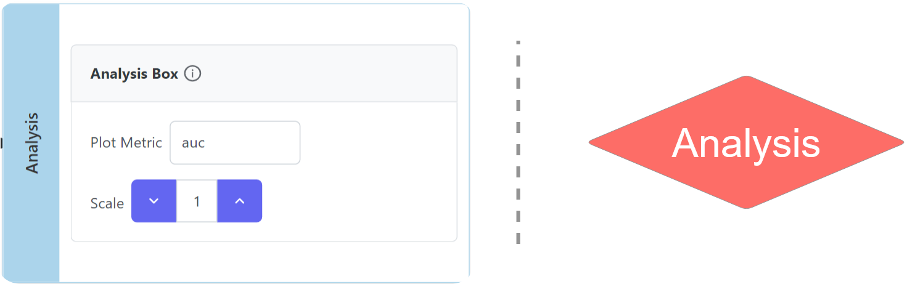<figcaption></figcaption></figure>

## The Analysis Mode


If you prefer a quick summary,  jump to the [following section](analysis.md#summary-of-the-analysis-mode).


The Analysis Mode becomes available after a successful experiment execution. When activated, a results panel appears at the bottom of the interface, displaying results for all pipelines in the current scene. This mode provides a detailed breakdown of results organized by pipeline and node.

### **Pipeline Results Structure:**

Each pipeline, identifiable by its customizable name, presents results through the following node-specific information:

* **Dataset Node**: Displays the training data table and all parameters applied through [PyCaret's setup function.](https://pycaret.readthedocs.io/en/stable/api/classification.html#pycaret.classification.setup)

<figure>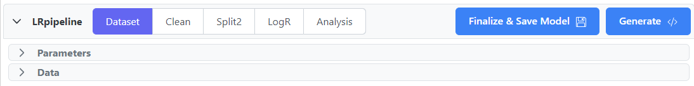<figcaption>
Results for Dataset node
</figcaption></figure>

* **Clean Node**: Shows the preprocessing parameters configured in [PyCaret's setup](https://pycaret.readthedocs.io/en/stable/api/classification.html#pycaret.classification.setup).

<figure>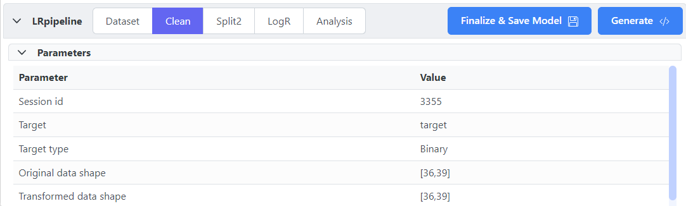<figcaption>
Results for Clean node
</figcaption></figure>

* **Split Node**: Presents detailed split statistics, including sample counts per fold/iteration and class distribution metrics.

<figure>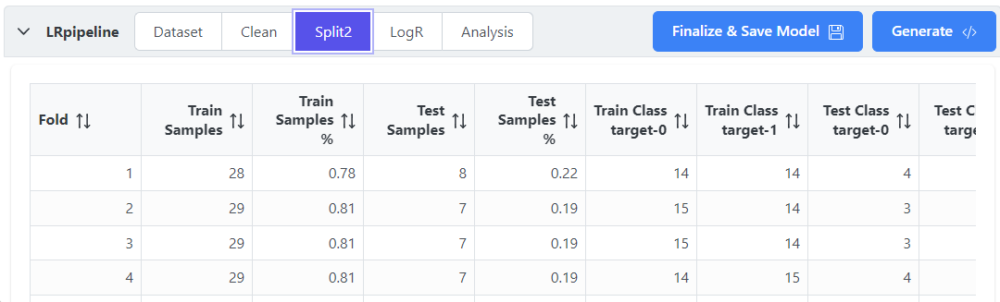<figcaption>
Results for Split node
</figcaption></figure>

* **Model Node**: Contains the complete set of performance metrics for the model.

<figure>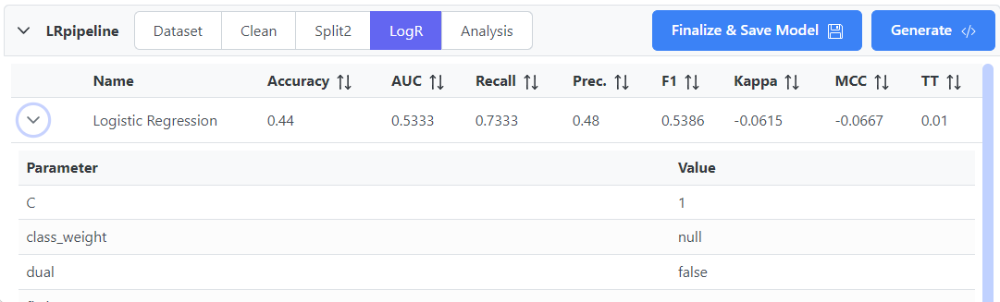<figcaption>
Results for Model node
</figcaption></figure>

* **Combine Models Node**: Provides evaluation metrics for the combined model output.

<figure><figcaption>
Results for Combine Models node
</figcaption></figure>

* **Analysis Node**: Displays the plot selected in the Analysis Box.

<figure>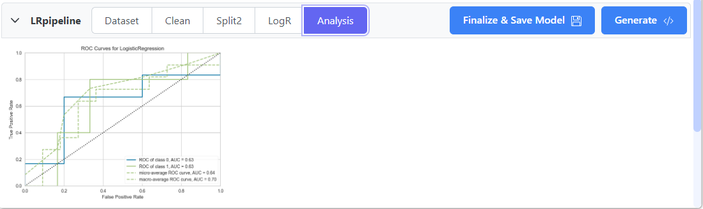<figcaption>
Results for Analysis node
</figcaption></figure>


_**PyCaret**_**&#x20;ROC (Receiver Operating Characteristic**)**/AUC (Area Under the Curve) plots**

The AUC plots generated by the [_PyCaret_ ](https://pycaret.gitbook.io/docs)library are derived from the [_YellowBrick_ Python package](https://www.scikit-yb.org/en/latest/api/classifier/rocauc.html), which extends the [_scikit-learn_](https://scikit-learn.org/stable/) API. By default, the plot displays multiple curves:

* The ROC curve per class for each class was computed using the one-vs-rest method (meaning that the considered class is treated as the positive class and all other classes as the negative class).
* The micro-average curve is calculated by summing up all true positives and false positives across all classes.
* The macro-average curve is the average of curves across all classes.&#x20;

We acknowledge that these curves can be a bit confusing, especially with binary classification.&#x20;

While using the[ _YellowBrick_ package](https://www.scikit-yb.org/en/latest/api/classifier/rocauc.html) directly, we can set parameters to display only the classic ROC curve. However, we haven't found a way to directly set these parameters through our application with [_PyCaret_ ](https://pycaret.gitbook.io/docs)yet. We are currently working on fixing this issue.


### **Finalize & Save Model**

This feature, used through the button '_Finalize & Save Model_' for a selected pipeline, performs two critical functions through PyCaret integration:

1. **Model Finalization**: Retrains the selected model on the complete dataset using [PyCaret's `finalize_model()` function](https://pycaret.readthedocs.io/en/stable/api/classification.html#pycaret.classification.finalize_model).
2. **Model Saving**: Saves the finalized model as a [pickle file](https://www.geeksforgeeks.org/python/understanding-python-pickling-example/) via [PyCaret's `save_model()` function](https://pycaret.readthedocs.io/en/stable/api/classification.html#pycaret.classification.save_model). The saved model appears in the experiment's `models` subfolder using the model's classname or the Model node's ID if it has been changed from the default one ('_Model_').

<figure><figcaption>
How to finalize and save a model in a given pipeline
</figcaption></figure>

The process requires no parameter configuration, automatically preserving all training parameters from the original experiment.

Additionally, this button represents the "Final Model" section of the machine learning workflow, as shown in the following figure:

<figure><figcaption></figcaption></figure>

### **The Generate Feature**

The Generate functionality exports the complete pipeline configuration as executable Python code in [Jupyter Notebook](https://www.dataquest.io/blog/jupyter-notebook-tutorial/) format. You can generate a Jupyter Notebook using the _Generate_ button next to a selected pipeline. The generated notebook, which mirrors the pipeline's structure and parameters, appears in the experiment's `notebooks` subfolder using the pipeline's current name as its file identifier.

<figure>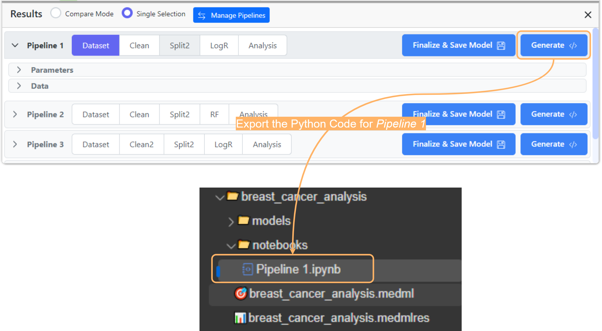<figcaption>
How to generate a Notebook for a given pipeline
</figcaption></figure>

This feature enables:

* Deeper investigation of the training process
* Custom code modifications for performance optimization
* Enhanced reproducibility

Additionally, you can also launch any generated notebook directly from the application by simply double-clicking the file. Conversely, you can right-click and select the **"Open in..."** option to open your notebook in VSCode.

<figure><figcaption>
Different options to open a generated Jupyter Notebook
</figcaption></figure>

An example of a generated notebook, opened in VS Code, is shown below.

<figure>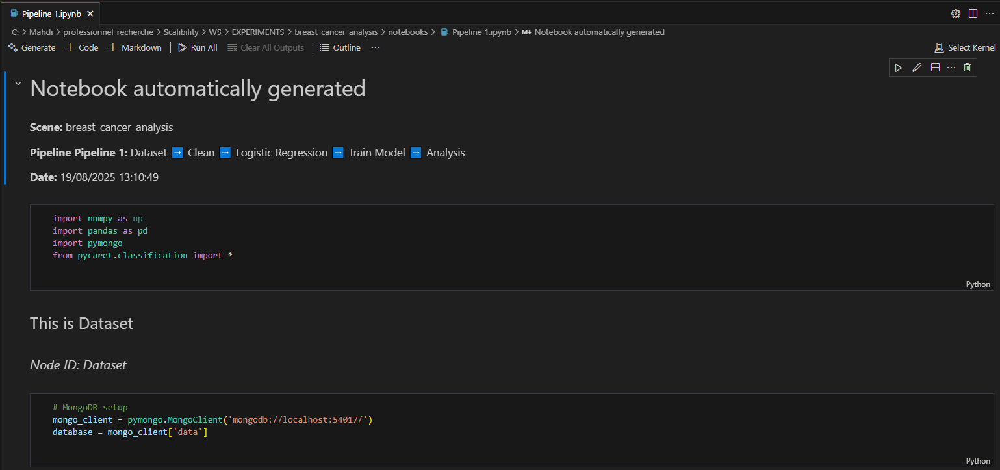<figcaption></figcaption></figure>

<figure>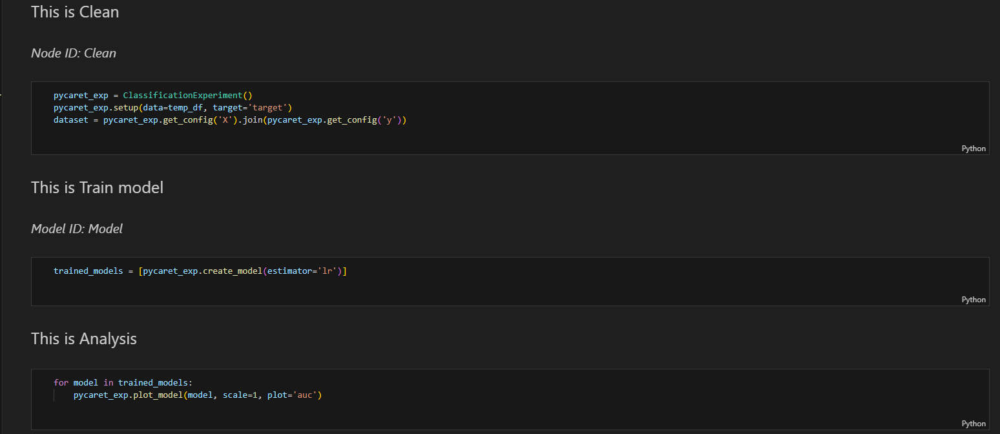<figcaption>
Example of a generated Jupyter Notebook
</figcaption></figure>


Pipeline naming conventions directly affect this feature. Check out the next section for more details.


### **Manage Pipelines**

The Manage Pipelines interface serves two primary purposes:

1. **Pipeline Overview**: Displays a structured summary of all nodes comprising each pipeline and their connections.
2. **Naming Control**: Allows pipeline renaming, which simultaneously updates:
   * The notebook filename in the Generate feature
   * All experiment tracking references

<figure>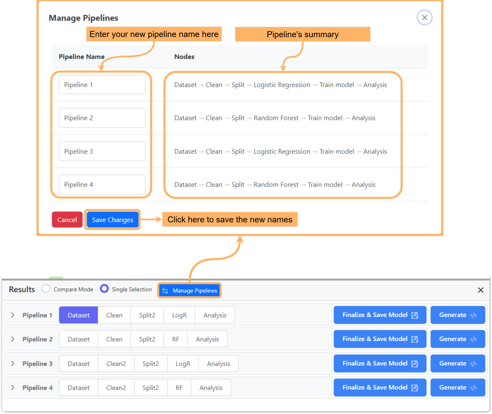<figcaption>
How to access and use the Manage Pipelines panel
</figcaption></figure>

### **The node's selection box**

In both Analysis and Results modes, a checkbox is available at the top of each runnable node. Use this control to selectively display results for specific nodes, hiding the output of others. A green checkbox indicates that the node is a mandatory component of all pipelines; consequently, its results will always be displayed.



In the following example, only the results of the checked node **Clean2** are displayed, while the other pipelines are hidden.

<figure>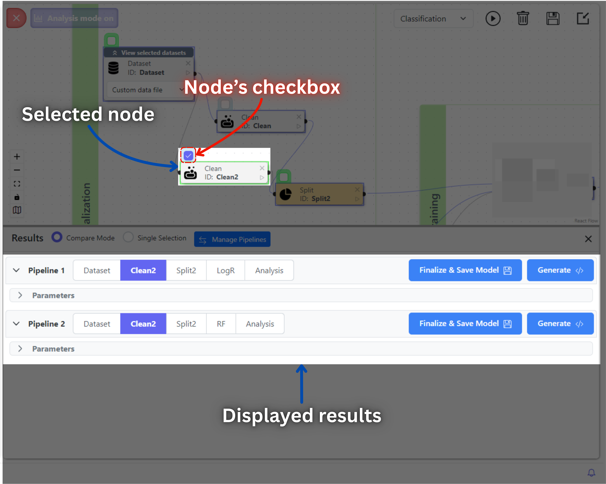<figcaption>
Illustration of the node's checkbox usage
</figcaption></figure>

### The highlighting feature

This feature enhances navigation in both Analysis and Results modes by dynamically applying distinct color codes to selected nodes and pipelines. It highlights the entire execution path of a chosen pipeline, making it easy to distinguish from others. The system uses the following color scheme to indicate status:

* **Orange**: Used for non-executed nodes and the connecting edges of a non-executed pipeline.
* **Green**: Indicates a selected and successfully executed node.
* **Blue**: Highlights all elements (nodes and edges) of the currently selected pipeline.

This functionality is particularly valuable in complex scenes with multiple pipelines, as it simplifies the process of tracking and comparing results. The following figure illustrates these color codes in the context of different user interactions.

<figure>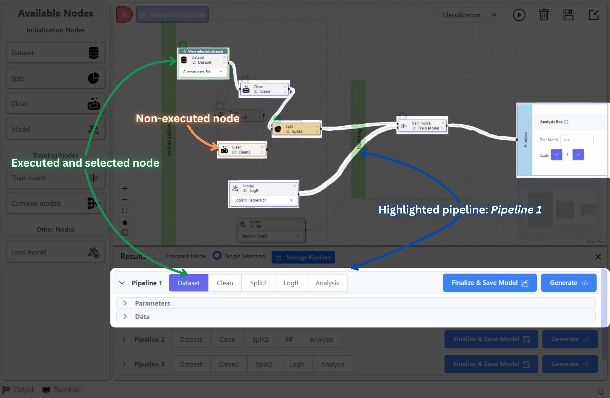<figcaption>
Illustration of the highlight feature for different interactions
</figcaption></figure>

### Summary of the Analysis Mode

A full breakdown of the Analysis Mode is presented in the following figure:

<figure>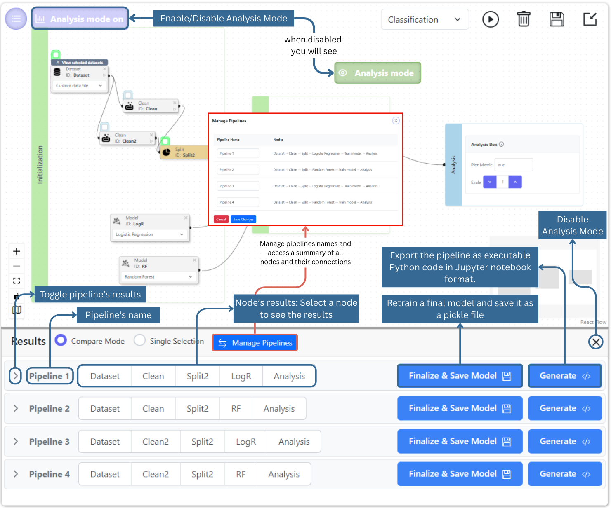<figcaption>
Breakdown of the Analysis Mode
</figcaption></figure>

On the next page, you will learn more about the new scene type '_Experimental_' and how you can use it as a testing environment for your machine learning experiments.
