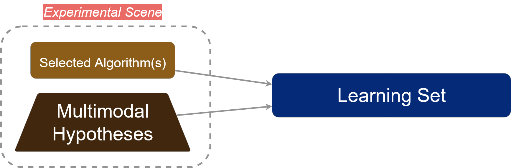
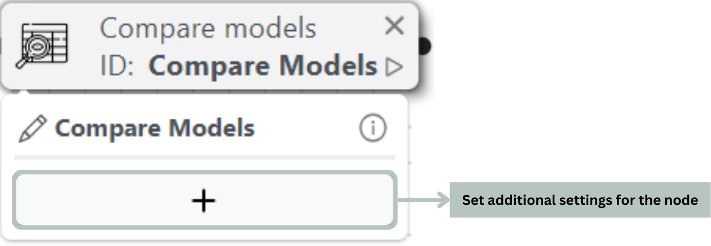

# Experimental Scene

This new scene type applies the same [new design](./#a-new-design-is-here) discussed earlier, but reduces the nodes available while maintaining full experimental capabilities:

* [**Dataset node**](initialization.md#dataset-node-your-experiments-starting-point) (previously discussed in Initialization).
* [**Clean node**](initialization.md#clean-node-tidy-and-transform-your-data) (previously discussed in Initialization).
* **Compare models node**: Train and evaluate the performance of all estimators available in the [model library](https://pycaret.gitbook.io/docs/get-started/functions/train#model-library).

<figure><figcaption>
Key differences between the Main and the Experimental scene
</figcaption></figure>

This setup provides a dedicated testing environment for machine learning experiments, allowing users to evaluate and select the optimal algorithm for their task while having initial performance estimates that can be leveraged to guide the main experiments, as illustrated in the new machine learning workflow.

<figure><figcaption></figcaption></figure>

### Compare Models Node:

Only available in Experimental Mode and used in the Training Box, the Compare Models node lets you efficiently train and evaluate multiple machine learning estimators simultaneously, making it easy to identify the best performer for your task. While offering numerous configuration options for advanced users, the node requires no mandatory settings, and you can start comparing different machine learning algorithms immediately after connecting the node.

Note that the Compare Models node is based on [PyCaret's function _`compare_models()`_](https://pycaret.readthedocs.io/en/stable/api/classification.html#pycaret.classification.compare_models).

<figure><figcaption>
Compare Models Node
</figcaption></figure>

The results of the Compare Models node contain the complete set of performance metrics for all the machine learning algorithms tested:

<figure><figcaption>
Example of Compare Models node results
</figcaption></figure>


Note that in Experimental mode, the models are trained and tested using a single iteration, resulting in a low bias but a high variance (uncertainty).


The final section outlines key practices to avoid for optimal performance and reliable execution within the learning module.
