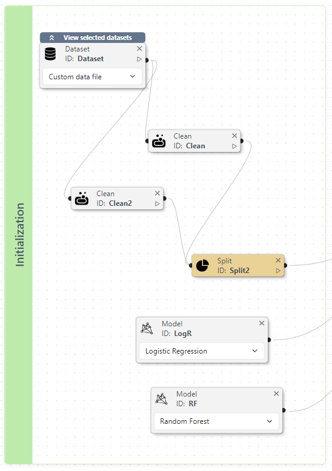
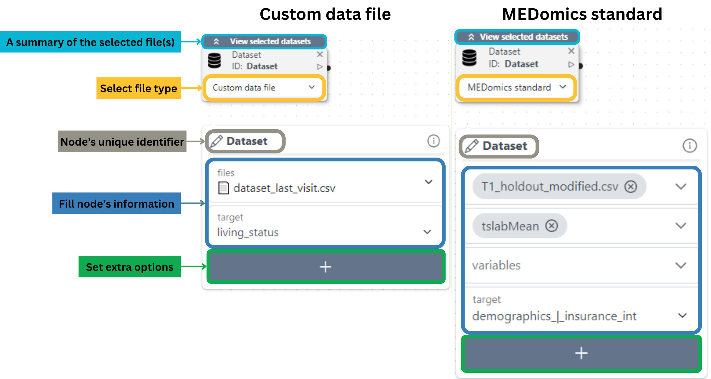
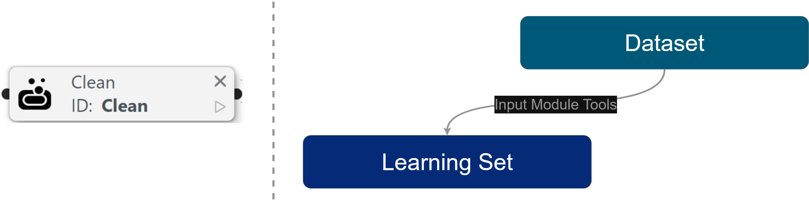
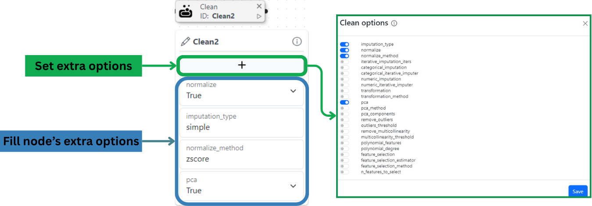
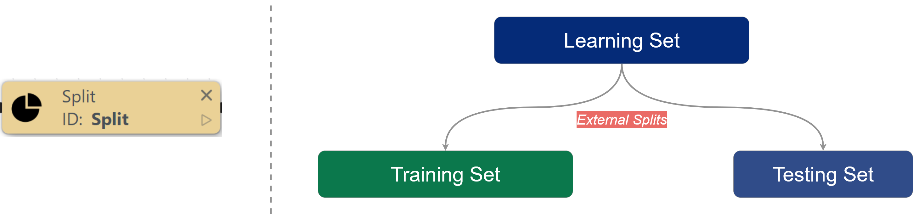
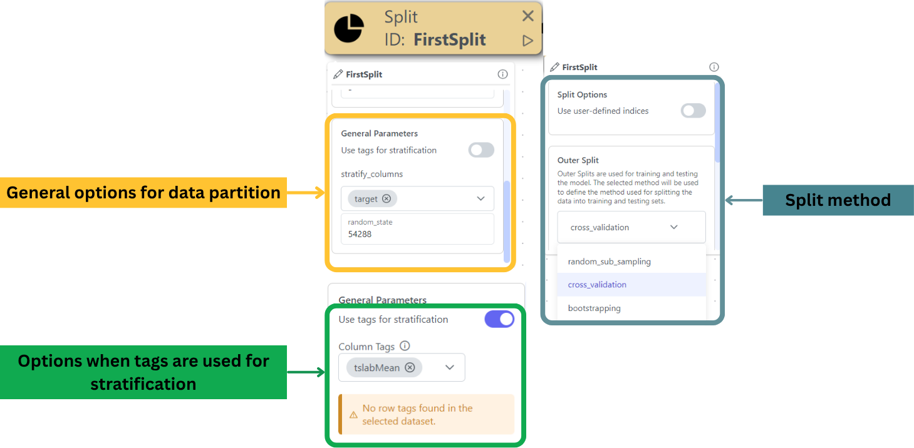
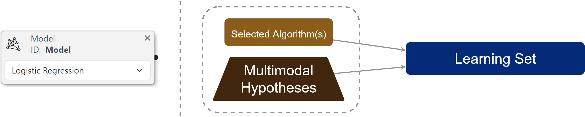
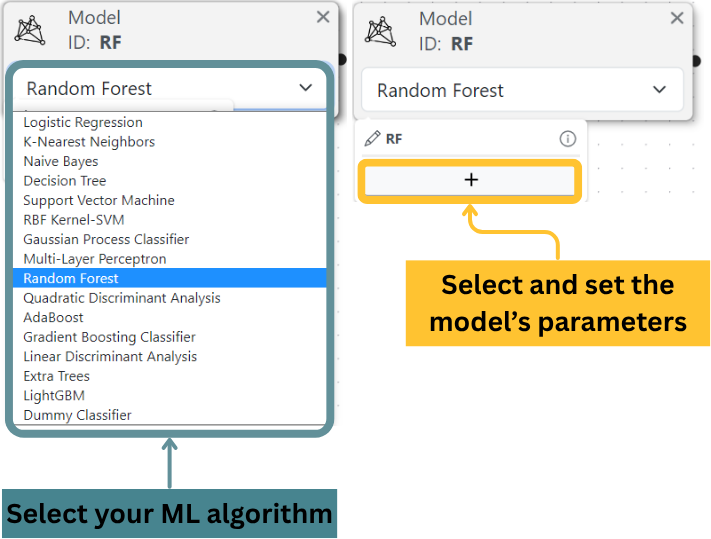

# Initialization

Think of the Initialization Box (see example below) as your starting point, which holds all the key components needed to set up your machine learning pipeline. Inside, can use four essential nodes:

* **Dataset**: Define your pipeline's data to get started.
* **Clean**: Tidy up your data for better results.
* **Split**: Divide your data into training and testing.
* **Model**: Select and configure your machine learning model.

<figure><figcaption>
Example of an Initialization Box
</figcaption></figure>

## **Dataset Node: Your Experiment's Starting Point**

The **Dataset** node marks the beginning of your experiment; here, you define the data that your pipeline will use. In the Machine Learning workflow, this represents the learning set as depicted below:

<figure><figcaption></figcaption></figure>

**Available Data Types**

You have two flexible options to load your data:

1. **MEDomics Standard**
   * Automatically pulls files from a designated learning folder (typically pre-processed `.csv` files from the [MEDprofiles](../../design/input-module/medprofiles/) workflow).
   * The node detects compatible files and lists them in a dropdown menu.
   * Select your file(s), then specify the **target column** (the variable you want to predict).
   * _Pro Tip:_ If selecting multiple files, ensure they all share the same target column.
2. **Custom File**
   * Upload any `.csv` file from your workspace using the dropdown selector.
   * Just like with MEDomics Standard, choose your **target column** to define the prediction goal.

**Node's options**

The options in this node mirror the non-cleaning-related parameters of [PyCaret’s `setup()` function](https://pycaret.readthedocs.io/en/latest/api/classification.html#pycaret.classification.setup).

<figure><figcaption>
Breakdown of the Dataset node
</figcaption></figure>

## Clean node: Tidy and transform your data

This node helps you tidy and transform your dataset before model training. Use it to handle common data issues, such as missing values, scaling, and more, so your model receives the best possible input. In the machine learning workflow, the Cleaning node is used to define the learning set step, as depicted below:

<figure><figcaption></figcaption></figure>

The available options for this node correspond to [_PyCaret's_ setu&#x70;_()_ function options](https://pycaret.readthedocs.io/en/latest/api/classification.html#pycaret.classification.setup) specifically designed for data cleaning.

<figure><figcaption>
Breakdown of the Clean node
</figcaption></figure>

## Split node: Define your train and test partitions

This node is essential for designing how your learning set will be divided for training and testing. Without it, models default to a single **random subsampling** **iteration**. In the new architecture, the Split node is used in the learning set partitioning step, as shown below:

<figure><figcaption></figcaption></figure>

Proper data partitioning prevents information leakage and gives reliable performance estimates—critical for trustworthy ML results. You can choose from these partitioning methods:

1. **Cross-Validation (K-Fold)**
   * Divides data into _K_ equal folds, using _K-1_ for training and 1 for testing in each iteration
   * Ideal for: Small-to-medium datasets, maximizing data usage
   * Common practice: 5-fold or 10-fold configurations
   * Options to set:
     * **num\_folds**: number of folds to use (_K_).
2. **Random Sub-Sampling**
   * Splits data randomly into fixed train/test percentages (e.g., 80%/20%)
   * Ideal for: Large datasets, quick prototyping
   * Tip: Stratified sampling maintains class proportions
   * Options to set:
     * **test\_size**: Proportion of the data to allocate for the testing set (must be between 0 and 1).
     * **n\_iterations**: Number of repetitions, i.e. number of splits to create. Increasing the repetitions can reduce the uncertainty in the performance estimates.
3. **Bootstrapping**
   * Creates multiple samples with replacement, then aggregates results
   * Ideal for: Very small datasets, estimating model stability
   * Advantage: Simulates having more data than available
   * Options to set:
     * **bootstrap\_train\_sample\_size**: The proportion of the dataset to resample with replacement.
     * **n\_iterations**: Number of bootstraps/splits to create. A higher number of iterations can reduce the uncertainty in the performance estimates.
4. **User-Defined**
   * Manually specify training/validation indices or custom splitting logic
   * Ideal for: Time-series data, special evaluation schemes
   * Flexibility: Import predefined splits or implement unique rules
   * Options to set:
     * **train\_indices**: List of training indices for the training set
     * **test\_indices**: List of testing indices for the testing set

#### **General Settings for the Split Node**

Before running your experiment, configure these essential settings to control how your data is partitioned:

**1. Random State (`random_state`)**

* **Purpose:** Ensures reproducible splits by initializing the random number generator with a fixed seed.
* **Usage:**
  * Enter an integer value (e.g., `42`) to make split results consistent across runs.
  * Leave blank for truly random splits (not recommended for reproducible experiments).

**2. Stratify Columns (`stratify_columns`)**

* **Purpose:** Maintains the original distribution of key variables (e.g., class labels) in both training and test sets and prevents skewed splits that could bias model evaluation.
* **Requirements:**
  * At least one column must be selected.
  * Common choices: Target variables or demographic columns (e.g., age groups, gender).

**3. Use Tags for Stratification**

* **Purpose:** Leverages predefined [_Column Tags_](../../design/input-module/#feature-or-column-tagging-tools) or [_Row Tags_](../../design/input-module/#sample-or-row-grouping-tools-subset-creation-tool) as stratification groups.
* **How It Works:**
  1. Toggle this option to activate tag-based stratification.
  2. Available tags from your dataset will auto-populate in a dropdown menu.
  3. Select one or more tags to use as stratification criteria.
* **Key Notes:**
  * Compatible with `stratify_columns` (can be used simultaneously).
  * If no tags exist, the system will display a warning, but it will not impact execution.
  * Tags are especially useful for complex stratification schemes (e.g., multi-label scenarios).


Unlike other nodes, the Split node has no extra options


<figure><figcaption>
Breakdown of the Split node
</figcaption></figure>

## Model node: **Select and configure your machine learning algorithm**

This node enables you to select and customize your machine learning model. The available models and their parameters directly correspond to:

* The `estimator` parameter in [PyCaret's `create_model()` function](https://pycaret.readthedocs.io/en/latest/api/classification.html#pycaret.classification.create_model)
* [Scikit-learn](https://scikit-learn.org/stable/)'s comprehensive model implementations

The Model node is used in the algorithm selection step, as shown below:

<figure><figcaption></figcaption></figure>

<figure><figcaption>
Breakdown of the Model node
</figcaption></figure>

**On the next page, you will learn about the Training Box, which will help you define the training process of your experiment.**&#x20;
