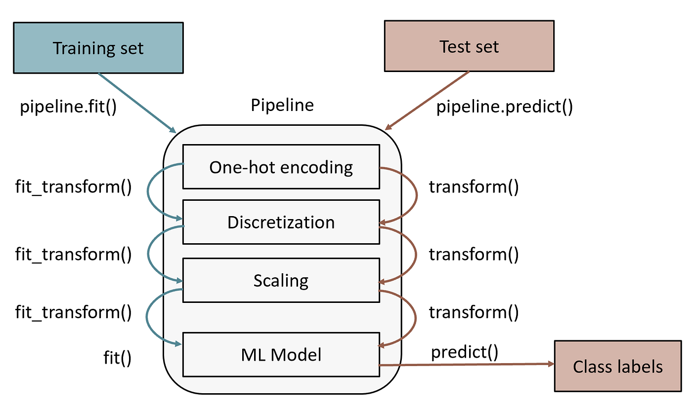

# medmodel

### **What is a MEDMODEL Object?**

A **`.medmodel`** file is a custom extension used within the **MEDomics** platform to represent serialized and saved machine learning models generated from the platform’s analytical scenes.

This object serves as a comprehensive container for all essential elements related to a trained model, including the model architecture, training parameters, preprocessing pipeline, selected features, and metadata.&#x20;

Its purpose is to ensure **traceability**, **reproducibility**, and **sharing** across different MEDomics modules or institutions, allowing seamless deployment, evaluation, and opening the doors to collaboration.

#### Key Advantages for the User

1. "Plug and Play" Inference: You don't need to remember if you normalized your data using `MinMaxScaler` or `StandardScaler`. The MEDMODEL object already knows.
2. No Manual Preprocessing: You can feed "messy" raw data into a MEDMODEL; the internal pipeline handles the cleaning automatically.
3. Consistency: Whether the model is running on your laptop or a hospital server, the internal logic remains identical, ensuring clinical reliability.

***

### Structure of a MEDMODEL Object

Each MEDMODEL object is a self-contained "brain" composed of two main components:

#### 1. Serialized Scikit-learn Pipeline

The core of the MEDMODEL is a [Scikit-learn Pipeline](https://scikit-learn.org/stable/modules/generated/sklearn.pipeline.Pipeline.html) that encapsulates the entire machine learning workflow. Think of this as a digital assembly line: once a raw patient data point enters at one end, it is automatically cleaned, refined, and analyzed before reaching the final prediction.

**Why use a Pipeline?**

For readers new to ML, the biggest risk is Data Leakage or Discrepancy. If you calculate the average value of a feature (like age) on your test data instead of using the average from your training data, your model is essentially "cheating" by looking at the future. A pipeline prevents this by "freezing" the logic learned during training.

**The pipeline includes:**

* **Preprocessing Steps** (The "Memory" of the Model): This includes normalization, feature scaling, and missing-value imputation.&#x20;
  * _The Advantage of Stored Statistics:_ Imagine your training data had missing values in the "Cholesterol" column. The pipeline calculates the Mean (Average) value from the training patients and stores it. When you use the model on a new patient months later who is also missing a Cholesterol value, you don't need to recalculate anything. The pipeline automatically applies that _previously stored mean_ to the new data. This ensures the new data is treated exactly like the data the model was built on.
* **Feature Selection and Transformation**: Any logic used to pick the "best" features (like the FDA or FSR methods discussed earlier) is saved. The model "remembers" which specific variables are important, so you don't have to manually filter your Excel sheets before feeding them to the model.
* **Trained Estimator**: The final classifier or regressor (e.g., XGBoost, RandomForest). Because it is inside the pipeline, the estimator only ever sees data that has been perfectly prepared by the previous steps.

<figure><figcaption><p>Example a Scikit-Learn Pipeline [<a href="https://medium.com/ai-made-simple/pipelines-in-scikit-learn-46c61c5c60b2">Source</a>]</p></figcaption></figure>

**Storage Details**

* If the serialized pipeline file (pickle format) is **≤ 16 MB**, it is stored **directly in MongoDB**.
* If it **exceeds 16 MB**, it is stored **locally on the server**, and the MEDMODEL entry in MongoDB references the **absolute file path**.

***

#### **2. Model Metadata Dictionary**

A companion dictionary holds detailed information describing the model, its inputs, and training context. This metadata ensures reproducibility and facilitates understanding of the model’s provenance and purpose.

The key metadata fields include:

* **`model_variables`** – The final list of dataset columns (features) used during training.
* **`target_variable`** – The dependent variable the model predicts.
* **`ml_type`** – Specifies whether the model is for **classification** or **regression**.

The following diagram summarizes the relationship between MEDMODEL components:

```
 ┌────────────────────┐
 │    MEDMODEL        │
 │ (.medmodel object) │
 └────────┬───────────┘
          │
          ├──► Scikit-learn Pipeline (Pickle)
          │     • Preprocessing
          │     • Feature selection
          │     • Trained model
          │
          └──► Metadata Dictionary
                • Features
                • Target
                • Model Type (Classification/Regression)
```

***

The following figure summarizes the creation process of a MEDMODEL object:

_For the original diagram view, click_ [_here_](../../../contributing/#the-medomics-platform-architecture)_._

<figure><figcaption><p>.medmodel handling in MEDomics</p></figcaption></figure>
