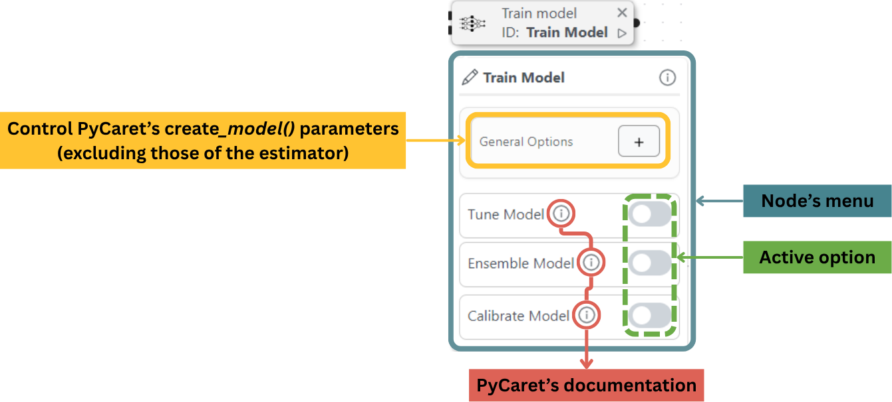
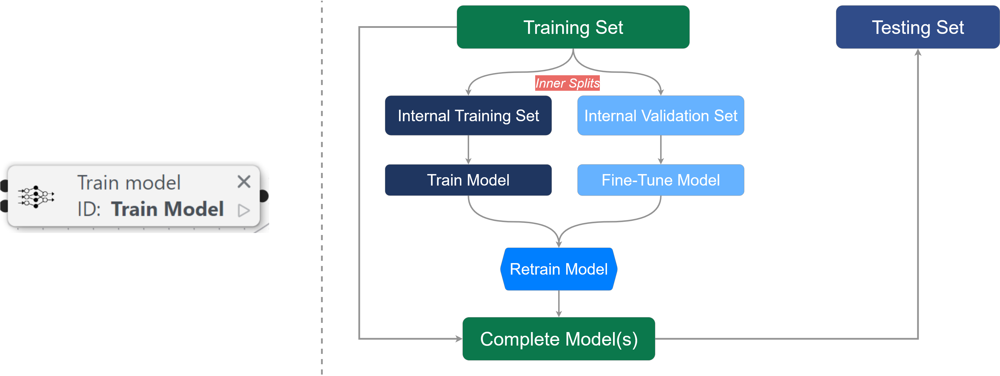
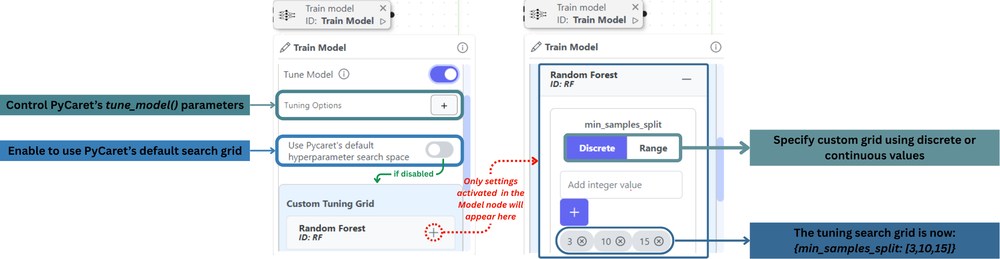
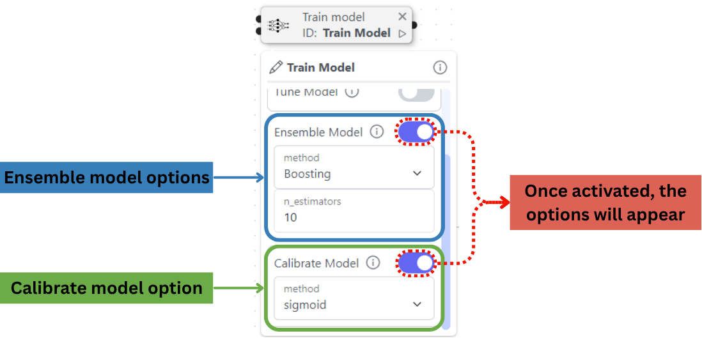
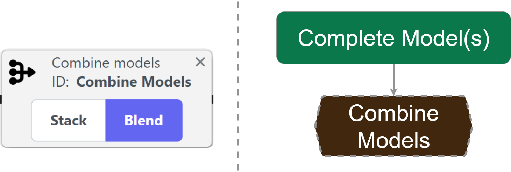
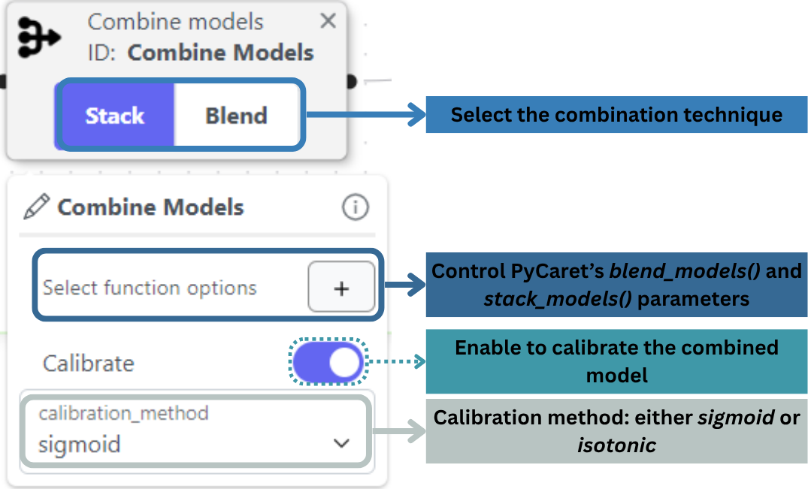

# Training

Now that you have initialized the main components of your experiment, it's time to define the training process for your experiment. Inside, can use two essential nodes:

* **Train Model**: Define your pipeline's learning process.
* **Combine Models**: Combine models from different pipelines.

<figure><figcaption>
Example of an initialization box
</figcaption></figure>

## **Train Model: Model Training and Optimization Node**

This node provides comprehensive control over model development through four key functions:

1. **Base Model Training**
2. **Hyperparameter Tuning**
3. **Model Ensembling**
4. **Probability Calibration**

The configuration options correspond to [PyCaret's `create_model()` function](https://pycaret.readthedocs.io/en/stable/api/classification.html#pycaret.classification.create_model) parameters (excluding the `estimator` parameters, which are defined in the [Model Node](initialization.md#model-node-configure-your-machine-learning-algorithm)).

<figure><figcaption>
Breakdown of the Train Model node
</figcaption></figure>

In the machine learning workflow, the Train Model node is used in the section shown below:

<figure><figcaption></figcaption></figure>

**Configuration Options:**

**1. Hyperparameter Tuning (Optional):** Enable this feature to optimize your model's performance. This functionality directly implements [PyCaret's `tune_model()` function](https://pycaret.readthedocs.io/en/stable/api/classification.html#pycaret.classification.tune_model). The function parameters can be set in the node.

**Tuning Options:**

* **Default PyCaret Tuning Grid**: The system will automatically:
  * Test optimal parameter ranges
  * Apply cross-validation
  * Return the best performing configuration
* **Custom Tuning Grid:** For advanced control:
  * Select parameters to tune from your model's options
  * Specify either:
    * Exact values to test (discrete)
    * Search ranges (continuous)

<figure><figcaption>
Tune model functionality breakdown
</figcaption></figure>

**2. Model Ensembling (Optional):** Activate to ensemble your trained model. This functionality directly implements [PyCaret's `ensemble_model()` function](https://pycaret.readthedocs.io/en/stable/api/classification.html#pycaret.classification.ensemble_model).

**Configuration:**

* **Select Ensemble Method (**`method`**):**
  * _Bagging_: Parallel training with bootstrap samples
  * _Boosting_: Sequential training with error correction
* **Select the number of estimators** `n_estimators`**:** Number of models to ensemble (default: 10)

**3. Probability Calibration (Optional)**

Improve classification probability reliability. This functionality directly implements [PyCaret's `calibrate_model()` function](https://pycaret.readthedocs.io/en/stable/api/classification.html#pycaret.classification.calibrate_model).

**To set up, choose Calibration Method:**

* _Logistic Regression_: Better for smaller datasets (<1,000 samples)
* _Isotonic Regression_: More flexible for complex distributions

<figure><figcaption>
How to control the Train Model's functionalities within the node
</figcaption></figure>

## Combine Models: Combine trained models

This node enables model combination techniques to improve predictive performance. Connect trained models from [**Train Model**](training.md#train-model-model-training-and-optimization-node) nodes to create either stacked ensembles or blended predictions. It represents the combination section of the machine learning workflow, as shown below:

<figure><figcaption></figcaption></figure>

**Combination Methods**

* **Model Stacking:** Implements [PyCaret's `stack_models()` function](https://pycaret.readthedocs.io/en/stable/api/classification.html#pycaret.classification.stack_models) to train a meta-model on the base models' outputs:
  * Requires at least 2 models
  * Meta-model (default: logistic regression) learns optimal combination weights
* **Model Blending:** Executes [PyCaret's `blend_models()` function](https://pycaret.readthedocs.io/en/stable/api/classification.html#pycaret.classification.blend_models) to average predictions:
  * No meta-model training (faster execution)
  * Ideal for models with similar performance profiles

Note that the final combined model can be calibrated using [PyCaret's `calibrate_model()` function](https://pycaret.readthedocs.io/en/stable/api/classification.html#pycaret.classification.calibrate_model) by simply turning on the Calibrate switch in the node.

<figure><figcaption>
Breakdown of the Combine Models node
</figcaption></figure>

This summarizes everything you need to know about the Training Box. Although it only uses one or two nodes, it is essential for your ML experiment. On the next page, you will learn about the Analysis Box as well as the Analysis Mode, which are essential to analyze your experiment's results.
