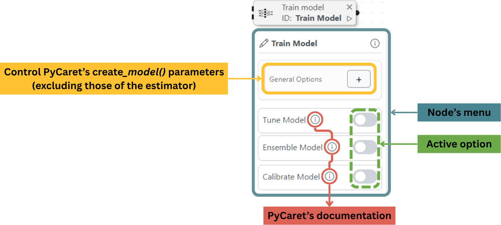
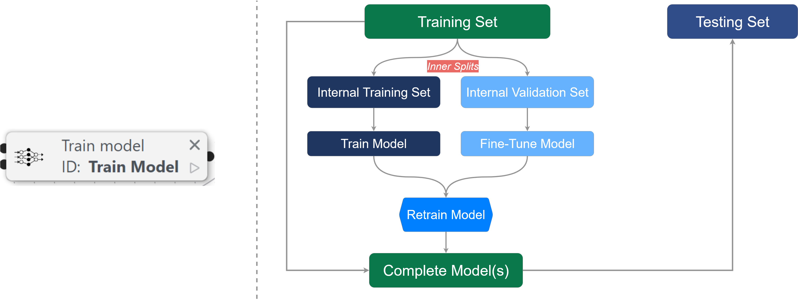
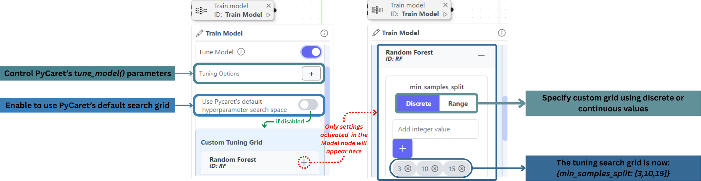
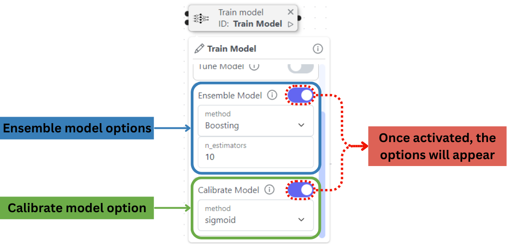
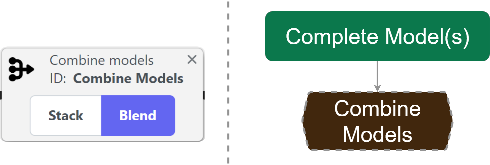
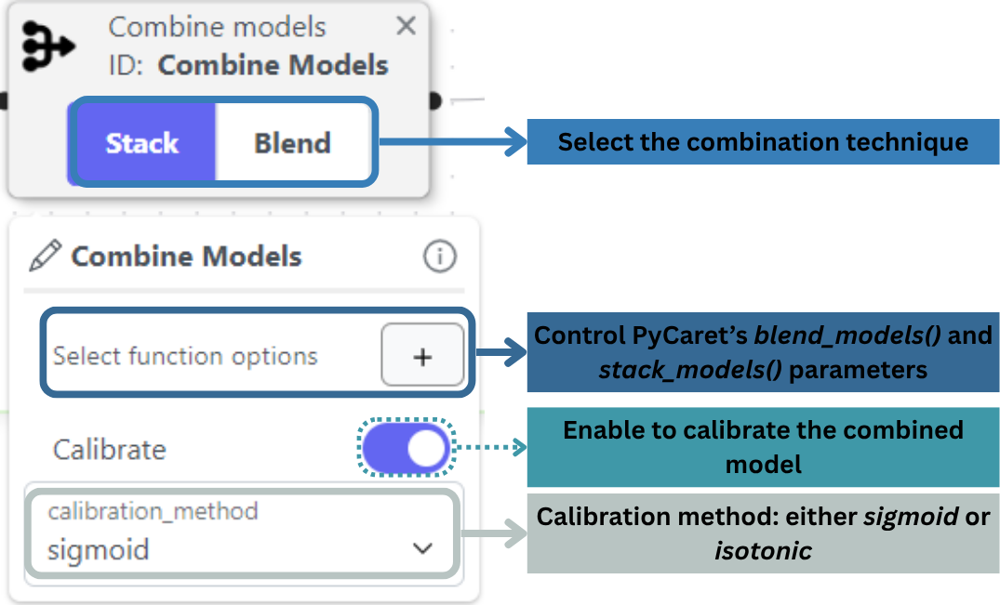

# Training

Now that you have initialized the main components of your experiment, it's time to define the training process for your experiment. Inside, can use two essential nodes:

* **Train Model**: Define your pipeline's learning process.
* **Combine Models**: Combine models from different pipelines.

<figure><figcaption>
Example of an initialization box
</figcaption></figure>

## **Train Model: Model Training and Optimization Node**

This node provides comprehensive control over model development through four key functions:

1. **Base Model Training**
2. **Hyperparameter Tuning**
3. **Model Ensembling**
4. **Probability Calibration**
5. **Threshold Optimization**

The configuration options correspond to [PyCaret's `create_model()` function](https://pycaret.readthedocs.io/en/stable/api/classification.html#pycaret.classification.create_model) parameters (excluding the `estimator` parameters, which are defined in the [Model Node](initialization.md#model-node-configure-your-machine-learning-algorithm)).

<figure><figcaption>
Breakdown of the Train Model node
</figcaption></figure>

In the machine learning workflow, the Train Model node is used in the section shown below:

<figure><figcaption></figcaption></figure>


Suggested [reading](https://remykarem.github.io/blog/evaluation-metrics.html) to understand how metrics work.


#### 1. Base model training:

In PyCaret, the base model training process acts as an automated bridge between clinical data and predictive insights. For computer scientists, this represents an abstraction layer over `scikit-learn` that manages the model selection lifecycle; for healthcare professionals, it is a standardized "diagnostic" for your data, identifying which mathematical approach best captures patient outcomes.

The process begins with the Dataset node, which establishes a reproducible pipeline by handling medical data challenges like missing values (imputation) and encoding categorical variables (e.g., patient demographics). Once initialized, the core objective is to identify a high-performing "base" architecture before further refinement.

The following options allow users to balance computational efficiency with clinical rigor:

* Comparing models (used in [Experimental Scene](experimental-scene.md)): This serves as a "top-to-bottom" evaluation, training all available algorithms (e.g., Logistic Regression, Random Forest, XGBoost) on the same dataset. It provides a scoring grid of metrics like AUC and F1-score, and identifies which models most accurately balance sensitivity (detecting true cases) and specificity (avoiding false alarms).
* Training: This is used when a specific algorithm is preferred—perhaps because it is highly interpretable, such as a Decision Tree, or known for high performance in clinical settings. It trains a single model using k-fold cross-validation, random subsampling or bootstrapping, a process that repeatedly reshuffles the data to ensure the results aren't just a statistical artifact of the current patient sample.
* Performance Metrics: Users can prioritize specific metrics based on the clinical objective. MEDomics uses the following metrics to assess model performance: AUC, Accuracy, Sensitivity (Recall), Specificity, F1 score, NPV, and PPV.
* Pipeline Reproducibility: Every transformation applied during base training is stored in a pipeline. This ensures that when a computer scientist deploys the model, it handles new "unseen" patient data with the same steps used during initial training. Refer [here](medmodel.md#id-1.-serialized-scikit-learn-pipeline) for more details.

#### 2. Hyperparameter Tuning:

Enable this feature to optimize your model's performance. This functionality directly implements [PyCaret's `tune_model()` function](https://pycaret.readthedocs.io/en/stable/api/classification.html#pycaret.classification.tune_model). The function parameters can be set in the node.

**Tuning Options:**

* **Default PyCaret Tuning Grid**: The system will automatically:
  * Test optimal parameter ranges
  * Apply cross-validation
  * Return the best performing configuration
* **Custom Tuning Grid:** For advanced control:
  * Select parameters to tune from your model's options
  * Specify either:
    * Exact values to test (discrete)
    * Search ranges (continuous)

<figure><figcaption>
Tune model functionality breakdown
</figcaption></figure>

#### 3. **Model Ensembling**:

Activate to ensemble your trained model. This functionality directly implements [PyCaret's `ensemble_model()` function](https://pycaret.readthedocs.io/en/stable/api/classification.html#pycaret.classification.ensemble_model).

**Configuration:**

* **Select Ensemble Method (**`method`**):**
  * _Bagging_: Parallel training with bootstrap samples
  * _Boosting_: Sequential training with error correction
* **Select the number of estimators** `n_estimators`**:** Number of models to ensemble (default: 10)

#### 2. **Probability Calibration**:

Improve classification probability reliability. This functionality directly implements [PyCaret's `calibrate_model()` function](https://pycaret.readthedocs.io/en/stable/api/classification.html#pycaret.classification.calibrate_model).

**To set up, choose Calibration Method:**

* _Logistic Regression_: Better for smaller datasets (<1,000 samples)
* _Isotonic Regression_: More flexible for complex distributions

<figure><figcaption>
How to control the Train Model's functionalities within the node
</figcaption></figure>

#### 5. Threshold optimization:


Threshold optimization is not supported for the following models: 'gbc', 'ada', 'et', 'catboost', and 'rf'. Using these models causes [this error](https://github.com/pycaret/pycaret/issues/3915), which has not been resolved yet.


Threshold optimization is the process of adjusting the "cutoff" point that turns a model's probability score into a final decision. This means shifting the decision boundary to maximize a specific metric; in other words, it is a way to calibrate the model to be either more "cautious" or more "sensitive" based on the clinical problem studied. It implements the [Pycaret's _optimize\_threshold()_ function](https://pycaret.readthedocs.io/en/stable/api/classification.html#pycaret.classification.optimize_threshold).

**Optimization Options:**


Suggested [reading](https://remykarem.github.io/blog/evaluation-metrics.html) to understand how metrics work.


* Metric Selection: You can instruct MEDomics to find the threshold that maximizes the best selected metric from the following options:&#x20;
  * Youden's Index
  * Accuracy
  * Balanced Accuracy (BAC)
  * F1-score
  * Matthews correlation coefficient (MCC)
* Sensitivity vs. Specificity: Clinicians can choose a threshold that prioritizes Recall to catch every potential progression, or Precision to minimize unnecessary follow-up procedures for patients who are actually stable.
* Cost-Function Tuning:  In healthcare, a False Negative (missing a disease) is often costlier than a False Positive; the threshold is optimized to minimize this total clinical risk.
* Probability Mapping: Instead of a default 0.5 cutoff, the system visualizes the "Discrimination Threshold" to show exactly how performance changes as you move the boundary across your patient cohort. See the following example:

<figure><figcaption>
Probability threshold distribution for a logistic regression model
</figcaption></figure>

## Combine Models: Combine trained models

This node enables model combination techniques to improve predictive performance. Connect trained models from [**Train Model**](training.md#train-model-model-training-and-optimization-node) nodes to create either stacked ensembles or blended predictions. It represents the combination section of the machine learning workflow, as shown below:

<figure><figcaption></figcaption></figure>

**Combination Methods**

* **Model Stacking:** Implements [PyCaret's `stack_models()` function](https://pycaret.readthedocs.io/en/stable/api/classification.html#pycaret.classification.stack_models) to train a meta-model on the base models' outputs:
  * Requires at least 2 models
  * Meta-model (default: logistic regression) learns optimal combination weights
* **Model Blending:** Executes [PyCaret's `blend_models()` function](https://pycaret.readthedocs.io/en/stable/api/classification.html#pycaret.classification.blend_models) to average predictions:
  * No meta-model training (faster execution)
  * Ideal for models with similar performance profiles

Note that the final combined model can be calibrated using [PyCaret's `calibrate_model()` function](https://pycaret.readthedocs.io/en/stable/api/classification.html#pycaret.classification.calibrate_model) by simply turning on the Calibrate switch in the node.

<figure><figcaption>
Breakdown of the Combine Models node
</figcaption></figure>

This summarizes everything you need to know about the Training Box. Although it only uses one or two nodes, it is essential for your ML experiment. On the next page, you will learn about the Analysis Box as well as the Analysis Mode, which are essential to analyze your experiment's results.
