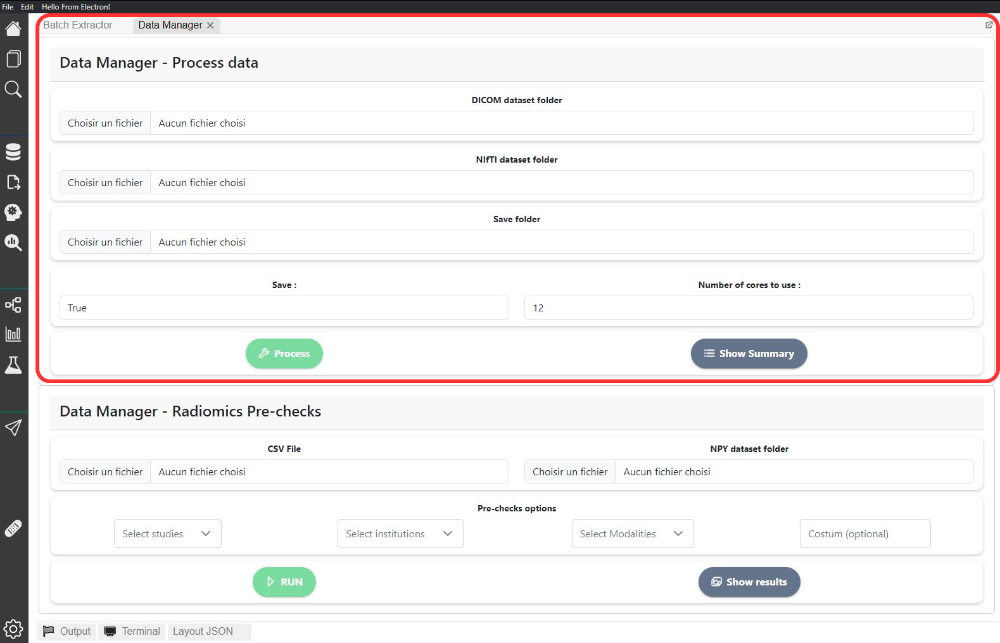
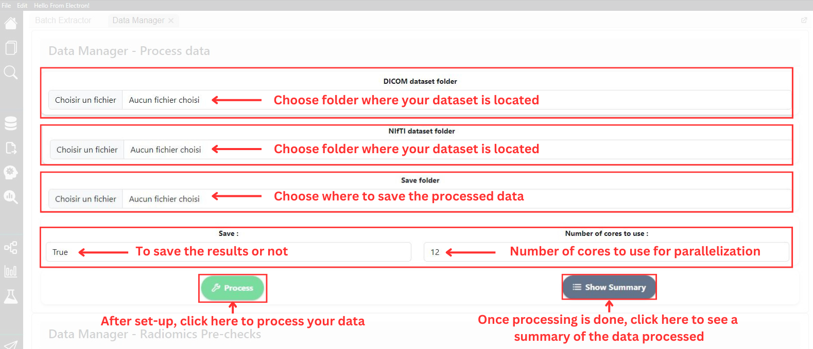

# Data Manager


A tutorial video is available at the bottom of the page


The `DataManager` class plays an important role in `MEDimage`. The class is capable of processing raw [DICOM](https://en.wikipedia.org/wiki/DICOM) and [NIfTI](https://brainder.org/2012/09/23/the-nifti-file-format/) data and converting it in into binary objects that will be used by `MEDimage`.

<figure><figcaption>
Data Manager Page - Processing section is outlined
</figcaption></figure>

The image below depicts the different steps to process your dataset, from options selection to results verification.

<figure><figcaption>
Data Manager Page - Setup steps
</figcaption></figure>

## Tutorial video


