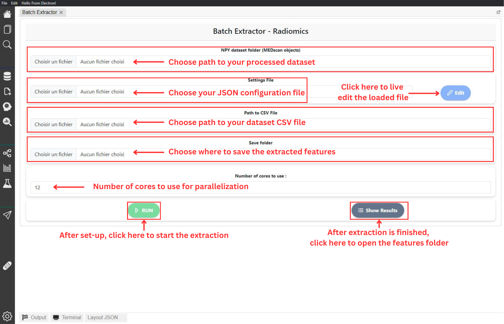

# Batch Extraction

In our software, batch extraction of features follows the workflow outlined in the[ initial chapter of the IBSI](https://pubs.rsna.org/doi/10.1148/radiol.2020191145). This approach limits user control over processing steps and feature selection, requiring any adjustments to be made in the back-end code. This limitation is implemented to ensure that Radiomics analysis of datasets aligns with international standards.

The _Batch Extraction_ page is dedicated to extracting features from datasets. This process involves a preprocessed dataset of [MEDscan objects](https://medimage.readthedocs.io/en/latest/tutorials.html#medimage-class), a [CSV file](https://medimage.readthedocs.io/en/latest/csv\_file.html) containing information about the regions of interest (ROIs) to be analyzed, and, lastly, a [JSON settings file](https://medimage.readthedocs.io/en/latest/configuration\_file.html).

<figure><figcaption>
Batch Extraction Page
</figcaption></figure>

The extraction process utilizes parallelization through the [Ray ](https://www.ray.io/)Python library. Users can control the number of cores allocated for this step; a higher number leads to faster extraction. However, extraction time is contingent on the size of the dataset.

Below are the steps to configure batch extraction for your dataset, assuming you have the necessary files:

1. Specify the path to your processed dataset.
2. Specify the path to your JSON configuration file. Once loaded, the Edit button will be activated for live editing on the page.
3. Specify the path to your dataset ROIs CSV file.
4. Specify the folder where you want to save the extracted features.
5. Click the Run button. If the button is inactive, ensure you have completed all the required steps.

The following image illustrates the setup process for your batch extraction:

<figure><figcaption>
Batch Extractor Page - Setup steps
</figcaption></figure>

