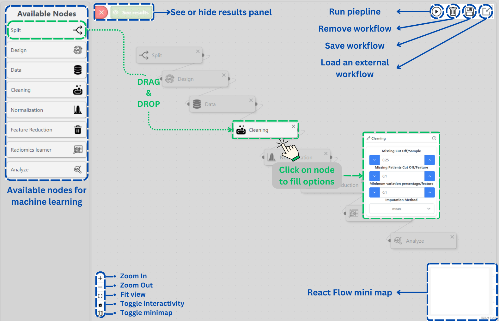

# Learning


A tutorial video is available at the bottom of the page


Like feature extraction, the learning module also utilizes a drag-and-drop design, allowing users to define their machine learning pipeline which incorporates feature processing steps such as cleaning, feature selection, and more.

The next sections explain how to use this module to train your models and analyze results.

The following image depicts the available resources in the leaning module interface:

<figure><figcaption>
Learning module interface
</figcaption></figure>

Having gained an understanding of the various components of the extraction interface, the following section illustrates the available nodes, highlighting their individual functionalities, inputs, and outputs:

<table><thead><tr><th width="302">Node</th><th width="217">Description</th><th width="116">In-Nodes</th><th>Out-Nodes</th></tr></thead><tbody><tr><td></td><td>Based on the chosen options, this node generates and stores a holdout set for subsequent model evaluation.</td><td>No inputs</td><td>Design</td></tr><tr><td></td><td>The design node allows you to configure various options for your machine learning experiment, including the experiment name, data splitting method, train and test portions, and more. Additionally, this node will create a separate folder to store all files related to the experiment.</td><td>Split</td><td>Data</td></tr><tr><td></td><td>This is employed to specify your feature set. After setting the features folder, you can choose the features file (CSV files) to use in your experiment.</td><td>Design</td><td>
Cleaning

Normalization

Feature Reduction

Radiomics Learner
</td></tr><tr><td></td><td>
Data cleaning consists of four parts:
<ul><li><strong>Remove missing features</strong></li><li><strong>Remove missing patients</strong></li><li><strong>Remove invariant features</strong></li><li><strong>Impute missing features</strong> </li></ul></td><td>Data</td><td>
Normalization

Feature Reduction

Radiomics Learner
</td></tr><tr><td></td><td>Normalizing radiomics features using ComBat method to mitigate batch effects arising from data from different sources.</td><td>
Data

Cleaning
</td><td>
Feature Reduction

Radiomics Learner
</td></tr><tr><td></td><td>Feature selection consists of selecting predictive features using the false discovery avoidance method. All the parameters are explained in the method's <a href="https://ieeexplore.ieee.org/document/8528467">paper</a>.</td><td>
Data

Cleaning

Normalization
</td><td>Radiomics Learner</td></tr><tr><td></td><td>This node sets all options to the model used. <a href="https://xgboost.readthedocs.io/en/stable/">XGBoost </a>is the only algorithm supported for now, and its settings can be tuned using an automatic approach: <a href="https://pycaret.org/">PyCaret </a>or using a random or a grid search.</td><td>

Data

Cleaning

Normalization

Feature Reduction
</td><td>Analyze</td></tr><tr><td></td><td>The final node is used for analyzing the results obtained from the experiment. You can utilize this node to select specific analysis methods, such as histograms, heatmap, or importance tree. Each method comes with its own set of options that need to be configured. For additional information, please refer to the <a href="https://medimage.readthedocs.io/en/latest/tutorials.html">documentation </a>available in <em>MEDimage</em>.</td><td>Radiomics Learner</td><td>No outputs</td></tr></tbody></table>

## Tutorial video



A detailed demonstration on renal cell carcinoma dataset can be found in the next page.
