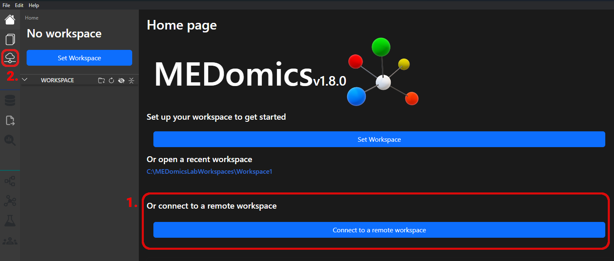
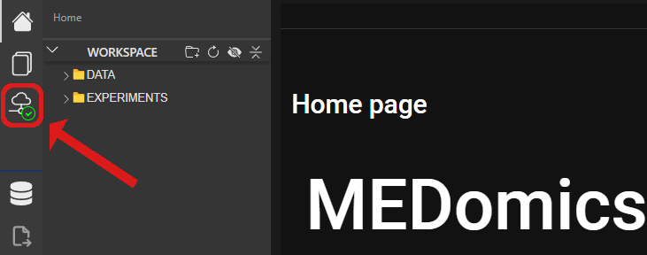

# 💻 Connection Tutorial

### Prerequisites

* The computer you will be installing and using the server on must be setup to be able to use SSH, and have a user ready for you to use.
* Make sure you know the IP address or domain name (e.g. in the case of a university workstation) of the computer you will be connecting to, as well as the credentials used to login to the SSH-compatible user.
* If running the server on a Linux device, there might be some connection issues due to firewall rules. Please refer to the troubleshooting section to attempt some fixes.

## Setting up a remote workspace:

### 1. Access the connection modal:

Open the connection menu using either the button near the bottom of the home page (only available if no workspace is selected) or the one on the sidebar (which is always available):

<figure><figcaption></figcaption></figure>

### 2. Connect to the remote computer:

Use page 1 of the connection modal to setup an SSH tunnel to the remote PC which will be running the server (or already is):

<figure><figcaption></figcaption></figure>

Enter the domain name or IP address to the computer you will be connecting to in the first field, then the username and password (if there is one) to the user you will be using in the corresponding fields.

The "Connect" button should be enabled once the first two fields have a valid value, and you can click it to attempt to connect to the server using the given credentials.

Toasts in the bottom right of your screen as well as some text below the connection info should pop-up to inform you of the status and result of the connection attempt. If a connection is successfully established, the modal should automatically switch to page 2. You can use the "Next/Previous" buttons near the bottom of the modal to navigate back to page 1 if you want to close the SSH connection later.

### 3. Install or update the server

Upon switching to page 2 of the connection modal, the status of the server on the computer you connected to in the previous steps will be checked automatically. The client will check whether:

* the server is installed and locatable (under \[home]/.medomics/medomics-server/versions/) using SSH
* the server is running using a test Express request on a default range of ports (5000-8000, starting lower as the default behavior is to launch it on 5010) on the remote computer

The result of the status check will be indicated in the top-right of the modal, and will unlock/change specific buttons accordingly. For example, here's how it should look when the server isn't installed on the remote computer:

<figure><figcaption></figcaption></figure>

Start by installing the server (or updating if needed), which will pull the latest "server" release from the MEDomics GitHub page and download it on the remote computer. Once ready, the top-right text indicator should become "Remote server located but unreachable."

### 4. Start the server and manage requirements

Once the server is installed and up-to-date, select the remote port you want it to start on using the input box (the "Check Port" button can be used to make sure nothing is already running there), and then click the "Start server" button. The UI should update to show the results of the launch, and should look like this if the server was correctly started:

<figure><figcaption></figcaption></figure>

The requirements should be checked automatically a few seconds after the server is launched. If it still shows Python and MongoDB as missing, click the "Install Missing" button to make the server install them on the remote computer.


You can get additionnal info regarding the server in the remote server panel located at the bottom of the connection modal or at the bottom of the app when any remote workspace is loaded:



Once the requirements are met, page 3 should unlock for the final step.

### 5. Select or create a the remote workpace

In page 3 of the connection modal, the remote directory browser is used for selecting the location for a remote workspace. Simply click on the folders to move between directories or the ".." option at the top to go back one.

<figure><figcaption></figcaption></figure>


A folder like shown above, with ".medomics", "DATA" and "EXPERIMENTS" folders, has already been used before as a workspace. If you select a location without those folders, it will generate them to allow that location to be used as a workspace.


Once in the desired location, click "Set as workspace" to make the remote server initiate a workspace and the required services using that location. This will take a few seconds, then close the connection modal if everything goes correctly. You are now in a remote workspace!

### 6. Leave or switch remote workpace

If a remote workspace is connected, you can come back to the connection modal using this button in the sidebar, in the top-right of the app:

<figure><figcaption></figcaption></figure>

Navigate to page 3 of the modal again and click the "Leave Workspace" button to clear the workspace and return to the app's base state. Alternatively, you can also navigate to a different workspace and click "Set as workspace" to switch to that workspace location.

<figure><figcaption></figcaption></figure>

## Remote workspace module availability:

Some modules will not be available yet if they have not been properly tested or refactored for online use. If you open a module and see this page:

<figure><figcaption></figcaption></figure>

Please switch back to a local workspace for now, and updates should come in later to unlock that module for remote use.

## Bug/issues reporting:

If you find new bugs or issues related to using a remote workspace and its modules, please [report the issue here](../../forms/report-an-issue.md), [contact us directly](../../forms/contact-us.md) or [open a GitHub discussion thread](https://github.com/MEDomicsLab/MEDomics/discussions).

