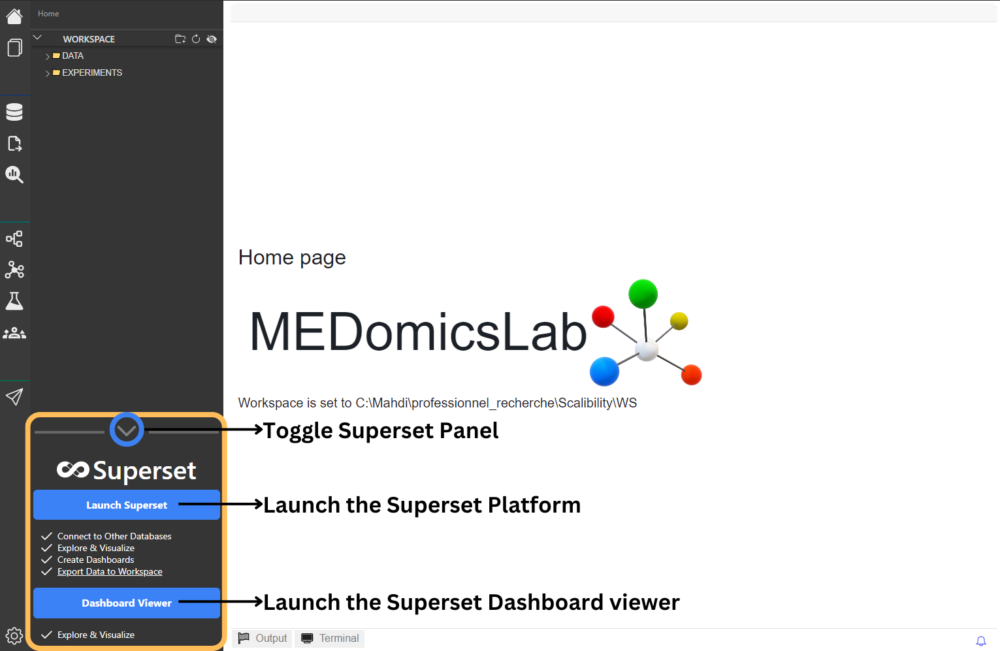
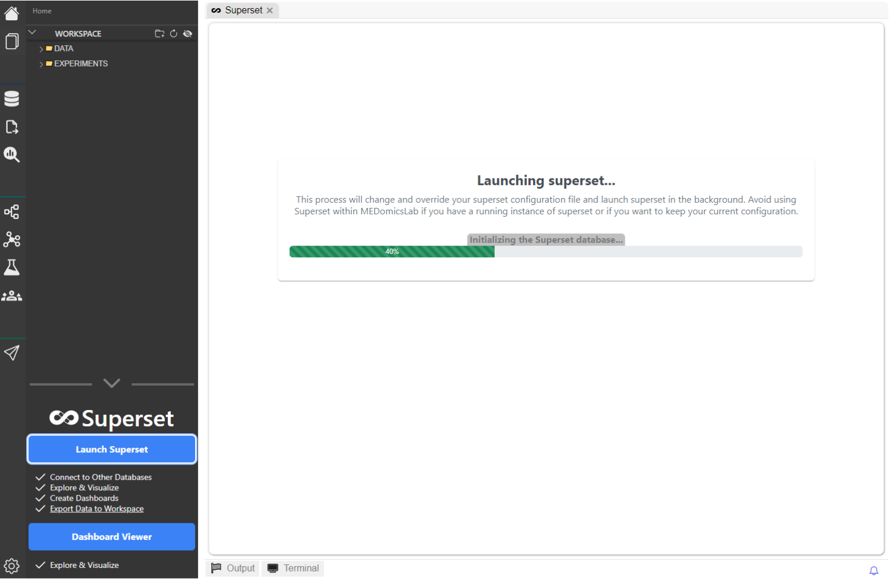
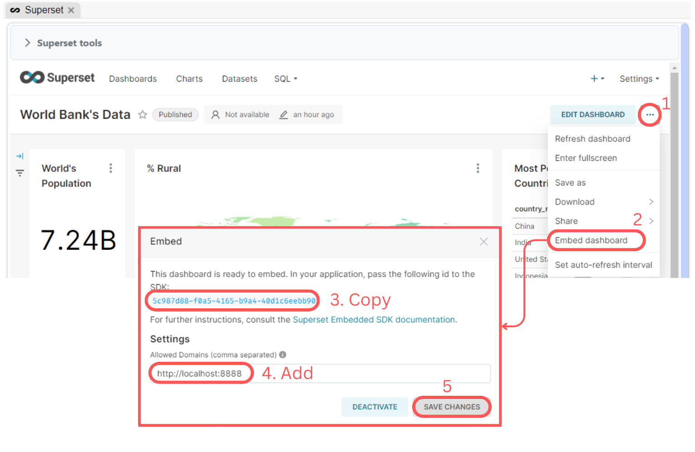
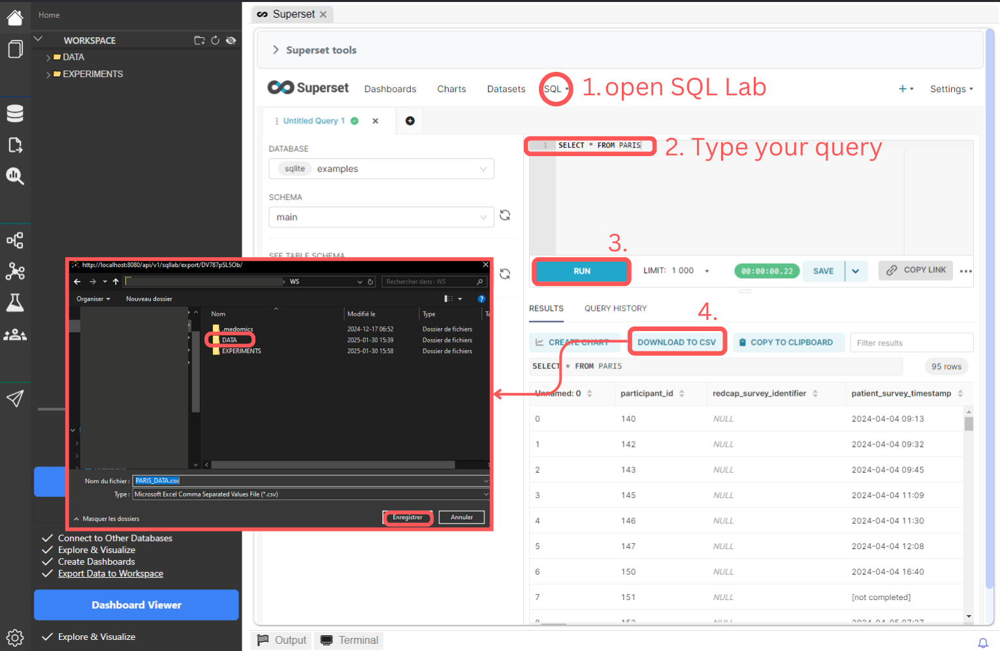

# Superset


Superset helps connect MEDomics to remote servers and databases (available from v1.7.0).


Apache Superset is an [open-source software](https://en.wikipedia.org/wiki/Open-source_software) application designed for data exploration and data visualization. If offers a wide range of features such as dashboard creation, diverse charting tools, and integration with various data sources.

Superset is now integrated into MEDomics, providing users with direct access to its powerful capabilities through a single click, eliminating the need for an external work environment (e.g. ). This integration allows users to launch and utilize Superset directly within MEDomics, enabling them to visualize data, design dashboards, export charts, and more—**all within a unified platform**.

On this page, we will provide a comprehensive guide on how to use Superset within MEDomics.

### The Superset Panel

When you launch MEDomics, you’ll notice a Superset panel located at the bottom left of the interface, as shown in the figure below. This panel provides two primary options: **Launch Superset** and **Dashboard Viewer**.

<figure><figcaption>
Superset Panel Explained
</figcaption></figure>

### _"Launch Superset"_ Button

Clicking the **Launch Superset** button initiates Superset in the background and embeds it within the MEDomics application. This feature handles all necessary configuration changes and initialization steps, such as creating a new admin user. Upon clicking the button, a progress bar will appear, indicating the status of each step in the launch process.

<figure><figcaption>
Superset initializing...
</figcaption></figure>

Once Superset is fully launched, you’ll be directed to the Superset login page. Use the following default credentials to log in:

* Username: **`admin`**
* Password: **`admin`**

<figure><figcaption>
Superset login page
</figcaption></figure>

After logging in, you can begin exploring Superset’s powerful data visualization and dashboard creation tools directly within MEDomics:tada:.

<figure><figcaption>
Superset dashboard inside MEDomic
</figcaption></figure>

### Superset Tools

MEDomics offers integrated tools to streamline platform management without requiring you to exit the MEDomics environment. These tools include:

* **Refreshing the page** to reload data or update dashboards.
* **Creating new users** for collaborative access.
* **Editing the Superset configuration file** to enable additional platform features.
* **Killing the Superset server** once your work is complete efficient resource management.

<figure><figcaption>
Superset tools
</figcaption></figure>

### _"Dashboard Viewer"_ Button

The **Dashboard Viewer** button opens a dashboard embedder, allowing you to visualize shared dashboards using their unique **Dashboard ID**. This feature ensures secure access to specific dashboards while protecting sensitive data from unauthorized access.

Before using the Dashboard Viewer, you’ll need a Dashboard ID. Follow these steps to retrieve it:

1. Open a dashboard (e.g., World Bank’s Data).
2. Click the three dots (`...`) next to **EDIT DASHBOARD**.
3. Select **Embed Dashboard**.
4. Copy the provided Dashboard ID.
5. Add the following address to the **Allowed Domains** in Superset’s settings: `http://localhost:8888`.

These steps are illustrated in the figure below.

<figure><figcaption>
Steps to get a dashboard's embedding ID
</figcaption></figure>

Once you’ve clicked the **Dashboard Viewer** button, an interface will prompt you to enter the Dashboard ID and the port of the Superset server. Since everything runs locally, Superset must also be running locally to access the dashboard. MEDomics conveniently displays the port of any active Superset instance in the background.

<figure><figcaption>
Dashboard Viewer Interface
</figcaption></figure>

After entering the required information, click **Connect** to start visualizing your dashboard. Enjoy visualizing your dashboards :clap:.

<figure><figcaption>
Dashboard Viewer Example
</figcaption></figure>

### Export data to your workspace

Superset allows users to export data directly from the platform to their local storage. This functionality enables you to transfer your data to MEDomics's workspace, where it can be utilized in various other tools (e.g. [input tools](../design/input-module/) for example) for further analysis or processing. Below are the steps to export your data to the workspace:

1. **Run an SQL Query**: Start by executing a simple SQL query, such as `SELECT * FROM YOUR_DATASET`, to retrieve the data you wish to export.
2. **Download to CSV**: Once the query results are displayed, click the **DOWNLOAD TO CSV** button.
3. **Save to Workspace**: Select your MEDomics workspace as the destination and save the file.

These steps are illustrated in the figure below.

<figure><figcaption>
Steps to export data from Superset to MEDomics's workspace
</figcaption></figure>

This feature ensures that your data is readily available for use across different tools within MEDomics.

### Useful resources

* [Apache Superset Documentation](https://superset.apache.org/docs/intro)
* [Creating your first  dashboard](https://superset.apache.org/docs/using-superset/creating-your-first-dashboard/)
* [https://superset.apache.org/community/](https://superset.apache.org/community/)
* [Superset _config.py_ guide](https://www.restack.io/docs/superset-knowledge-apache-superset-config-guide)

