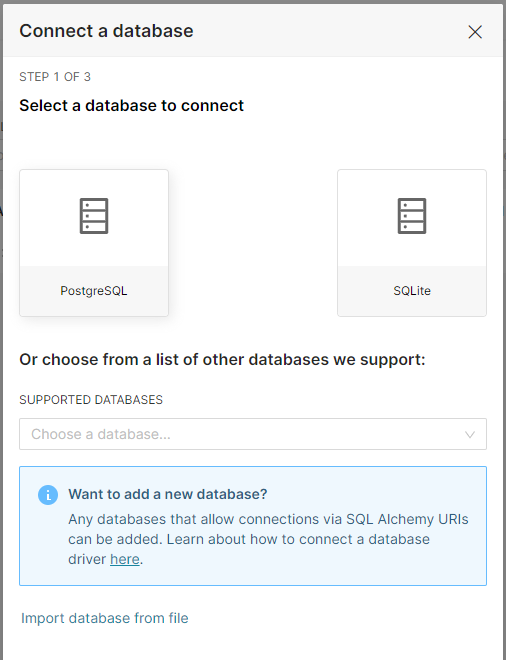
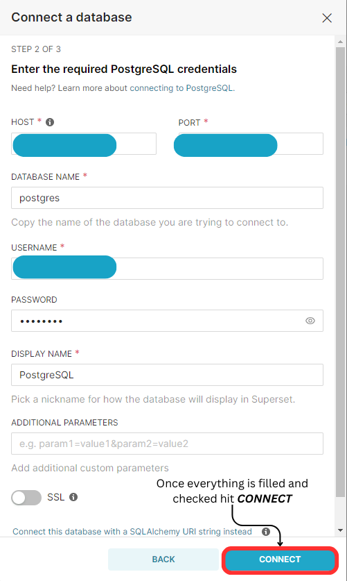
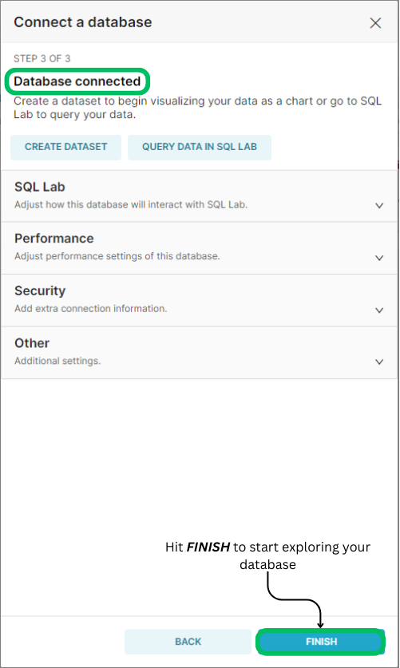
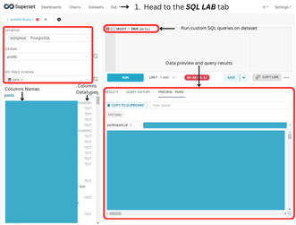
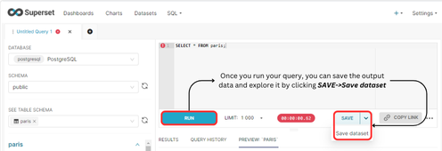
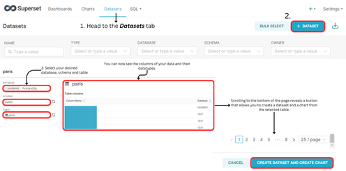
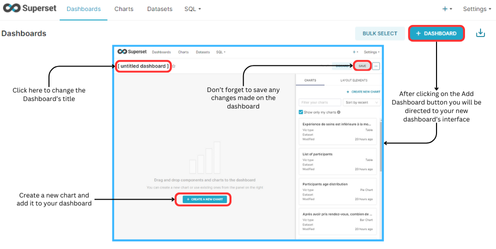
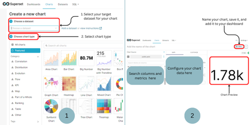
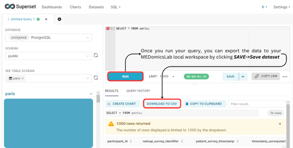

# Superset Features

### Connect to Other Databases


Pro Tip: Ensure you have installed the proper database driver(s) for your database before attempting to establish the connection. You can find more details [here](https://superset.apache.org/docs/configuration/databases).


Superset provides users with a streamlined way to connect to various remote databases, including SQLite, PostgreSQL, and more. This feature enables the integration of remote data for creating dashboards and visualizing charts.

In MEDomicsLab, after [launching Superset](./#launch-superset-button), you can easily connect to any remote database via the "Connect a Database" interface. To access this, navigate to _**Settings -> Database Connections**_

<figure><figcaption>
How to open Database Connections Interface
</figcaption></figure>

Once the interface is open (see image below), select your desired database—this tutorial uses PostgreSQL as an example.

<figure><figcaption>
Database Connections Interface
</figcaption></figure>

Then enter your database credentials, such as the host, port, username, and other required details. Refer to the image below for guidance.

<figure><figcaption>
Connection interface to PostgreSQL through Superset
</figcaption></figure>

Once you hit and _**CONNECT**_, you should  see a confirmation message as depicted below:

<figure><figcaption>
Successful connection to database
</figcaption></figure>

If you encounter an error, please refer to the [Superset documentation](https://superset.apache.org/docs/configuration/databases) for guidance on troubleshooting the issue. Should the problem persist, feel free to [reach out to us](../../forms/contact-us.md) for further assistance.

### Explore & Visualize

To explore data from your connected dataset, you can use either SQL Lab or the "Add Dataset" option, as illustrated in the figure below:

* _**SQL Lab**_: Provides a complete preview of the data, displays column data types, and allows for custom SQL queries on the dataset.

<figure><figcaption>
SQL Lab depiction
</figcaption></figure>

<figure><figcaption>
How to save the output data of your SQL query
</figcaption></figure>

* _**Add new dataset**_: Lets you explore the columns and their data types, with the ability to create charts based on the data if needed.

<figure><figcaption>
Steps to create a dataset and a chart from a connected database
</figcaption></figure>

### Create Dashboards

One of the main features of Superset is charts and dashboard creation. It offers a no-code procedure for building charts quickly. To do so:

* Create a new dashboard:

<figure><figcaption>
Create new dashboard steps
</figcaption></figure>

* Create a new chart and add it to the dashboard:

<figure><figcaption>
Create new chart and add it to a dashboard
</figcaption></figure>

### Export Data to Workspace

Superset enables data exportation through SQL Lab. This empowers users to further process and explore their data within MEDomicsLab by leveraging the different tools available.

<figure><figcaption>
Export data to your local workspace
</figcaption></figure>

### Useful resources

* How to [configure your Superset](https://superset.apache.org/docs/configuration/configuring-superset)?
* [Connect to a database](https://superset.apache.org/docs/configuration/databases).
* How to [use Superset](https://superset.apache.org/docs/using-superset/creating-your-first-dashboard) (dashboard creation, data exploration, etc.)
* [FAQ](https://superset.apache.org/docs/faq)

